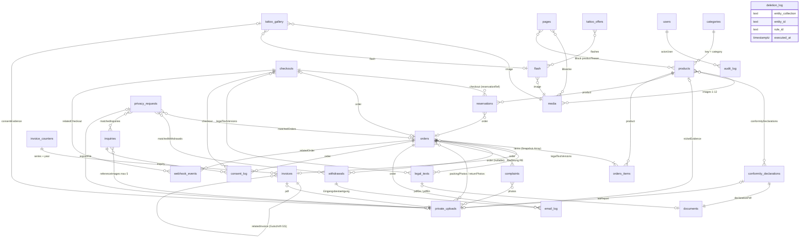
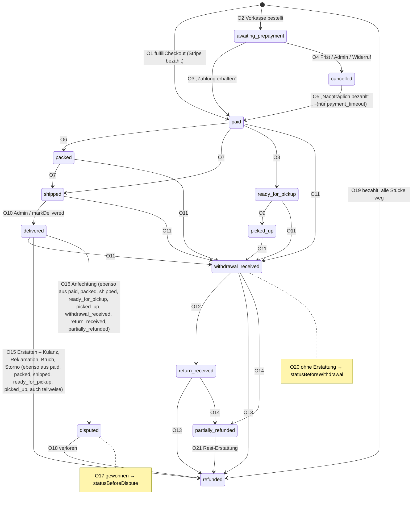

# Datenmodell (Payload CMS 3 + Postgres) – planetclairetattoos.com

> **Status:** verbindlich für P1–P10 · Stand 26.09.2026 · erstellt in P0
> **Rangfolge bei Widersprüchen:** `docs/ENTSCHEIDUNGEN.md` (E-xx) > dieses Dokument und die anderen Fachdokumente
> (`docs/KONZEPT.md`, `docs/ARCHITEKTUR.md`, Rechtsdokumente unter `docs/recht/`) > `PLAN.md` > `docs/research/`.
> **Geltungsbereich:** alle Payload-Collections und -Globals, Postgres-Objekte (Sequenzen, Constraints, Trigger),
> Transaktionsmuster, Jobs, Aufbewahrung, Seed. Adapter-Implementierung, Routen und UI stehen in `docs/ARCHITEKTUR.md`
> bzw. `docs/KONZEPT.md`; Gestaltung in `docs/design/DESIGN.md`.
> **Arbeitsregel (E-97):** Fehlt eine Angabe, gilt die konservativste Variante plus Eintrag in `docs/OFFENE-PUNKTE.md`.
> Schemaänderungen nur per Migration **und** Aktualisierung dieses Dokuments im selben PR.
> **Versionen:** Payload 3.90.2 (alle `@payloadcms/*` exakt gleich, kein Payload 4). Next.js 16.3.x – P1 hebt `next` und
> `eslint-config-next` auf den neuesten 16.3.x-Patch (≥ 16.3.7, für den 30.09.2026 angekündigtes Sicherheitsrelease; ARCHITEKTUR §1.1).
> Postgres 17 (lokal, CI, Produktion) und 16 (Cloud-VM) – eigenes SQL muss auf beiden laufen.
> **Namen im Code:** Umgebungsvariablen und Task-Slugs der Jobs-Queue gemäß `docs/ARCHITEKTUR.md` §5.2 und Anhang A.3;
> Fristen und Löschregeln gemäß `docs/recht/LOESCHKONZEPT.md` (L-xx); Abläufe und Statusmodelle gemäß `docs/KONZEPT.md`.

---

## 0. Kurzfassung

- **29 Collections + 2 Globals.** Commerce-Kern ist selbst gebaut (E-90): `products`, `checkouts`, `reservations`,
  `orders`, `invoices`, `invoice-counters`, `withdrawals`, `complaints`, `webhook-events`. Kein Payload-Ecommerce-Plugin.
  Rechtstexte und rechtliche Textbausteine sind versioniert (`legal-texts`, `legal-snippets`, R-012).
- **Kasse ≠ Bestellung** (KONZEPT §4, §5.2): Die Kasse (`checkouts`) hält Kassen-Token (nur als Hash), Reservierung,
  Snapshot und Eingaben. Eine Bestellung entsteht erst bei bestätigter Zahlung (`fulfillCheckout`) bzw. beim
  Vorkasse-Abschluss.
- **Nur Unikate** (E-10): kein Bestand, keine Varianten. Der Verkaufszustand steckt ausschließlich in
  `products.status` (`draft → available → reserved → sold`, `archived`). **Keine Payload-Drafts für Produkte.**
- **Doppelverkauf ist unmöglich:** atomares `UPDATE … WHERE status='available' RETURNING` plus partieller
  UNIQUE-Index „eine aktive Reservierung je Stück“ (§8).
- **Belege sind unveränderlich:** Rechnungs-/Gutschriftnummern lückenlos per Zählerzeile (Row-Lock), Datenbank-Trigger
  verhindert Änderungen und Löschen (§9).
- **Deny by default:** Jede Collection definiert alle Operationen. Öffentliche Schreibvorgänge (Kasse, Widerruf,
  Anfrageformular) laufen nie über Payload-REST, sondern über eigene Route-Handler/Server-Actions mit Validierung.
- **Alles ist offline testbar:** Speicher, Mail, Zahlung und Übersetzung laufen über Treiber (`STORAGE_DRIVER`,
  `EMAIL_DRIVER`, `PAYMENTS_DRIVER`, `TRANSLATION_DRIVER`) mit lokalen Mocks bis P11.
- **Beispielbestand** (E-63) ist über `seed = true` und `seedKey` gekennzeichnet, nutzt eigene Nummernbereiche und ist
  per Knopf entfernbar (§13).
- **Löschen nach Löschkonzept:** Fristen und `retention*`-Jobs folgen `docs/recht/LOESCHKONZEPT.md`; jede Löschung wird
  ohne Inhalte in `deletion-log` nachgewiesen; DSGVO-Anfragen mit Fristen stehen in `privacy-requests` (§12).
- **Zeit ist injiziert:** Services, Jobs und eigenes SQL bekommen die aktuelle Zeit als Parameter `$now`
  (ARCHITEKTUR A-08), nie die Uhr der Datenbank.

---

## 1. Grundsätze und Konventionen

### 1.1 Namen und Speicherung

| Ebene | Konvention | Beispiel |
|---|---|---|
| Collection-/Global-Slug | kebab-case, Plural außer bei Logs/Einzelbegriffen | `private-uploads`, `audit-log`, `flash` |
| Datei | `src/collections/<PascalCase>.ts`, `src/globals/<PascalCase>.ts` | `src/collections/PrivateUploads.ts` |
| Feldname | camelCase, englisch | `priceCents`, `showInArchiveAfterSale` |
| Postgres-Tabelle/-Spalte | Payload-Konvention: snake_case | `private_uploads`, `price_cents`, Gruppe `stripe.checkoutSessionId` → `stripe_checkout_session_id` |
| Lokalisierte Felder | Tabelle `<tabelle>_locales` mit `_locale`, `_parent_id` | `products_locales.title` |
| Arrays | Tabelle `<tabelle>_<feld>` mit `_parent_id`, `_order` | `orders_items` |
| hasMany-Relationen/-Uploads | `<tabelle>_rels` mit `path`, `order` | `products_rels` (`path = 'images'`) |
| Select-Felder | native Postgres-Enums `enum_<tabelle>_<feld>` | `enum_products_status` |
| Enum-Werte | vom Auftrag/Konzept vorgegebene Fachwerte bleiben **deutsch** (`keramik`, `deko`, `brief`, `versand-zahlung`); alle übrigen **englisch** (`available`, `paid`) | |

> Die exakten Tabellen-/Spaltennamen sind nach jedem `payload migrate:create` im generierten SQL zu prüfen, bevor
> eigenes SQL (§8, §9) darauf verweist. Abweichungen werden hier korrigiert.

- IDs: Payload-Standard (`serial`, Integer). Relationen speichern Integer-IDs.
- Zeitstempel: jede Collection hat `createdAt`/`updatedAt` (Payload, `timestamptz`). Alle Datumsfelder sind
  `timestamptz` (UTC gespeichert). **Anzeige, Monats-/Jahresgrenzen, Rechnungsjahr, Fristen: immer `Europe/Berlin`**
  (Konstante `APP_TIME_ZONE` in `src/lib/time.ts`).
- Geld: **immer Integer in Cent, Währung EUR** (`…Cents`). Keine Floats. Payload-`number` wird als `numeric`
  gespeichert; Ganzzahligkeit prüft die Feldvalidierung (`Number.isInteger`) und ein DB-CHECK (§9).
- Anzeige-Nummern: Objektnummer mit mindestens 3 Stellen (`17 → „Nr. 017"`, `1234 → „Nr. 1234"`, E-12).

### 1.2 Lokalisierung (E-60, E-61)

```ts
localization: {
  locales: [{ code: 'de', label: 'Deutsch' }, { code: 'en', label: 'English' }],
  defaultLocale: 'de',
  fallback: true, // fehlendes EN zeigt DE
}
```

- Spalte **L** in den Feldtabellen: `✓` = `localized: true`.
- Pflicht bei lokalisierten Feldern gilt für **DE** (`required: true` greift beim Speichern der DE-Fassung).
  EN-Pflichten werden ausschließlich über die Veröffentlichungsprüfung (Spalte „V“) geprüft, nie beim Speichern.
- Admin-Oberfläche auf Deutsch (`i18n.supportedLanguages: { de }`, `fallbackLanguage: 'de'`).
- „Übersetzen“-Knopf (E-61) nutzt den `TranslationAdapter` (`TRANSLATION_DRIVER=deepl|mock`). Der Mock liefert
  deterministisch `"[EN] " + Text` (ARCHITEKTUR §3.6, im Test erkennbar); der Knopf setzt den Status `machine`.

### 1.3 Pflicht-Kennzeichen in den Feldtabellen

| Zeichen | Bedeutung |
|---|---|
| **R** | Pflicht beim Speichern (`required: true` oder Hook-Validierung) |
| **V** | Pflicht für Veröffentlichung bzw. für den genannten Statuswechsel (zentrale Funktion `validateForPublish`) |
| **S** | vom System gesetzt, im Admin `readOnly` |
| – | optional |

**R bei Checkboxen** bedeutet „Wert muss gesetzt sein (`true` oder `false`)“, nicht „muss angehakt sein“. Wo ein
Häkchen gesetzt sein muss, steht es ausdrücklich als Regel (z. B. „V (`true`)“).

### 1.4 Zugriffsschutz (deny by default)

Zugriffsfunktionen liegen in `src/access/`:

| Name | Definition | Verwendung |
|---|---|---|
| `isAdmin` | `({ req }) => req.user?.collection === 'users'` | es gibt genau ein Konto (E-03), jede Anmeldung ist Admin |
| `none` | `() => false` | Operation nur für Server-Code via Local API mit `overrideAccess: true` |
| `publicRead(where)` | Admin → `true`; sonst Where-Query (+ Seed-Filter, s. u.) | öffentlich lesbare Collections |
| `adminField` | Feldzugriff `read/update: isAdmin` | interne Felder in öffentlich lesbaren Collections |

Regeln:

1. Jede Collection definiert `create`, `read`, `update`, `delete` explizit (auch `readVersions`, falls Versionen aktiv).
2. **Öffentliche Schreibvorgänge** (Kasse, Widerruf, Auftragsanfrage, Upload von Referenzbildern) laufen über eigene
   Route-Handler/Server-Actions mit zod-Validierung, Rate-Limit und Honeypot und schreiben per Local API
   (`overrideAccess: true`). Payload-REST/GraphQL `create` ist für diese Collections `none`.
3. **Frontend-Lesezugriffe** laufen über den Helfer `getPublicPayload()` (`src/lib/payload/public.ts`), der jede
   Abfrage mit `overrideAccess: false` und ohne `user` ausführt. Damit greifen Where-Queries und Feldzugriff.
   Ausnahme: `settings` wird nur über `getPublicSettings()` mit Feld-Whitelist gelesen (§7.1).
4. **Seed-Sichtbarkeit:** Ist `SEED_PREVIEW_MODE` nicht wirksam (Wert ≠ `'true'` **oder** `APP_ENV=production`,
   ARCHITEKTUR §4.2), hängt `publicRead` automatisch `{ seed: { equals: false } }` an. Die Go-live-Prüfung (§13.7)
   verlangt zusätzlich `SEED_PREVIEW_MODE=false`.
5. GraphQL ist abgeschaltet (`graphQL: { disable: true }`, ARCHITEKTUR §2.5).

### 1.5 Hooks und `req.context`

- Hooks, die weitere Operationen auslösen, geben **immer** `req` weiter (gleiche Transaktion).
- Kontext-Flags (Typ `AppContext` in `src/lib/payload/context.ts`):

| Flag | Wirkung |
|---|---|
| `system: true` | Aufruf aus Server-Code (Webhook, Job, Service); erlaubt Systemübergänge |
| `transition: '<name>'` | Statuswechsel über den zugehörigen Service; ohne dieses Flag lehnt `beforeChange` jede Änderung von `status` ab |
| `seed: true` | Seed-Import/-Entfernung (Grund-Seed und Beispielbestand); Ausnahmen siehe Tabelle unten (§13) |
| `skipAudit: true` | nur für Audit-/Log-Collections selbst (Endlosschleifen vermeiden) |
| `translation: true` | Schreibvorgang durch den Übersetzen-Knopf (setzt `enStatus = machine` statt `reviewed`) |

**Seed-Kontext-Ausnahmen** (`req.context.seed === true`, zusammen mit `skipAudit: true` und `overrideAccess: true`;
Quelle `content/seed/SEED-SPEC.md` §1.6). Ohne dieses Flag gilt immer die Spalte „Normal“:

| Collection | Normal | Mit `context.seed` |
|---|---|---|
| alle | Mails, Jobs, Revalidierung, Audit, Übernahme (§13.4) | **aus** – keine Mail, kein Job, kein Stripe/DeepL, keine Revalidierung |
| `products` | Status nur über Aktionen; `firstPublishedAt`, `soldAt` usw. vom System | Anlegen mit Endstatus, Verkaufsfeldern und vergangenen Zeitstempeln aus den Daten; `validateForPublish` läuft trotzdem für `available`/`reserved` |
| `checkouts`, `orders` | Status über Services, Nummer aus Sequenz, Zeitstempel = `$now` | Anlegen mit Endstatus, fester Nummer (§13.3), vergangenen Zeitstempeln und fertigem `tokenHash`/`statusTokenHash`/`statusTokenSealed` aus `seedToken(seedKey, 'checkout' \| 'status')` (SEED-SPEC §2.5); Sequenz bleibt unberührt |
| `invoices` | Nummer aus Zähler, `issueDate` = heute, danach Job `renderInvoicePdf` | Nummer aus dem Zähler der Serie `BSP-*`, `issueDate`/`deliveryDate` aus den Daten, **kein** Job (PDF laut SEED-SPEC §9) |
| `withdrawals` | `receivedAt` = Serverzeit, Auto-Zuordnung, sofortige Mail | `receivedAt`, `matchStatus`, `status` aus den Daten; keine Mail |
| `inquiries`, `complaints`, `privacy-requests` | Nummer aus Sequenz (`AA`, `DS`), Eingangszeit = `$now`, Statuswechsel und Zeitstempel über Services bzw. Hooks | Anlegen mit Endstatus, fester Nummer (§13.3; Reklamationen haben keine) und vergangenen Zeitstempeln aus den Daten (SEED-SPEC §10a, §11, §11a); berechnete Felder (`dueAt`, `carrierClaimDueAt`, `warrantyEndsAt`, `retainUntil`) rechnen die Hooks trotzdem aus diesen Werten; keine Mail, keine Erinnerung |
| `tattoo-gallery` | `published` nur mit Einwilligung bei `showsCustomer` | `published = true` ohne Einwilligung erlaubt, **nur** bei `seed = true`; öffentlich sichtbar nur bei wirksamem `SEED_PREVIEW_MODE`, nie in Produktion |
| `legal-texts` | `validFrom ≥ $now − 1 min` | `validFrom` in der Vergangenheit erlaubt (Grund-Seed `2026-01-01`) |
| `pages`, `faqs` | Speichern ohne `context.seed` setzt `seed = false` (Übernahme) | keine Übernahme |
| `revenue-entries` | echter Eintrag ersetzt Seed-Eintrag gleichen Monats/gleicher Quelle (§6.20) | Seed-Eintrag wird übersprungen, wenn ein echter existiert |
| `reservations`, `email-log`, `consent-log`, `audit-log` | `create: none` (nur Services) | Anlegen über Local API |

- Statuswechsel mit Nebenwirkungen (Produkte, Bestellungen, Widerrufe, Rechtstexte) sind **Services** in
  `src/lib/commerce/*.ts` bzw. `src/lib/legal/*.ts`. Collection-Hooks prüfen nur Invarianten, schreiben Audit-Einträge
  und reihen Mails ein; sie führen keine Geschäftslogik doppelt aus.
- Mails werden **im selben Transaktionskontext** als Job eingereiht (Outbox-Muster): `email-log`-Zeile (`queued`) +
  `payload.jobs.queue({ task: 'sendEmail', input: { emailLogId }, req })`.

### 1.6 Versionen und Entwürfe

| Collection/Global | Einstellung | Begründung |
|---|---|---|
| `products` | **keine** Versionen/Drafts | Payload-Drafts würden beim Veröffentlichen den Verkaufsstatus überschreiben; eigener `status` ersetzt Drafts (E-13); Änderungsverlauf über `audit-log` |
| `pages` | `versions: { drafts: true, maxPerDoc: 25 }` | Texte in Ruhe vorbereiten |
| `faqs`, `categories`, `flash`, `tattoo-offers`, `conformity-declarations` | `versions: { maxPerDoc: 10 }`, keine Drafts; Sichtbarkeit über eigenes Feld | einfache Bedienung am Handy |
| `tattoo-gallery` | **keine** Versionen/Drafts | Einwilligungsangaben und Kundenfotos sind Personendaten; ein Widerruf muss ohne Rest in Versions-Tabellen wirken (L-19, L-20) |
| `legal-texts`, `legal-snippets` | keine Payload-Versionen – **jede Fassung ist ein eigenes Dokument** | Unveränderlichkeit, Bestellungen verweisen auf Fassungen |
| `settings`, `site-texts` | `versions: { max: 50 }`, keine Drafts | Nachvollziehbarkeit |
| alle übrigen | keine | Logs/Belege sind selbst unveränderlich |

Kein Payload-Papierkorb (`trash`) in irgendeiner Collection. Collections mit personenbezogenen Daten (`orders`,
`checkouts`, `withdrawals`, `complaints`, `inquiries`, `privacy-requests`, `email-log`, `consent-log`,
`private-uploads`, `tattoo-gallery`) haben weder Versionen noch Drafts, damit Löschjobs wirklich löschen (R-154, LOESCHKONZEPT §1 Nr. 6); ein Unit-Test liest die
Payload-Konfiguration und prüft das.

### 1.7 Bewusst nicht modelliert

Varianten und Mengenbestand (E-10) · Kundenkonten (E-30) · Warenkorb-Tabelle (Warenkorb = Cookie `pc_cart` mit
Stück-IDs und Lieferart, erst nach erster Aktion, E-43, ARCHITEKTUR §8.7; ein Server-Warenkorb ist Kanzleifrage,
ARCHITEKTUR C-05) · Drops, `publishAt`, Countdown, Warteliste, Newsletter (E-13) · Gutscheine, Rabattcodes,
Streichpreise und Preishistorie für § 11 PAngV (keine Streichpreise) · Klarna, SEPA-Lastschrift (E-20) · Markt-Modus
(E-28) · Tattoo-Anfrageformular, Termine, Kautionen, Guest Spots (E-51, E-53) · DHL-API-Labels (nur `carrier` +
Adapter vorbereitet, E-26) · Produktvideos · Felder wie „spülmaschinenfest“/„geprüft“ (irreführend ohne Nachweis) ·
Telefonnummer der Kund:innen (die Kasse hat kein Telefonfeld, KONZEPT §4.4, DM-28) · Freitext-Anmerkung der Kund:innen
zur Bestellung (die Kasse hat kein solches Feld; Datensparsamkeit) · IBAN oder Zahlungsdaten von Kund:innen (V-23) ·
Feld „kein Widerrufsrecht“ an Stücken (R-096).

Die **Verpackungsmengen** (E-47, R-201) sind dagegen im Umfang: je Sendung Verpackungsart und -gewicht (§6.8.1
`packaging`), Standardwerte je Versandklasse in `settings.packaging` (§7.1), Jahres-CSV-Export je Material (§6.8.8).

---

## 2. Übersicht

| # | Slug | Admin-Label | Admin-Gruppe | Zweck | Öffentlich lesbar | Seed-Flag | Phase |
|---|---|---|---|---|---|---|---|
| 1 | `users` | Konto | System | ein Admin-Konto, Login-Sperre | nein | – | P1 |
| 2 | `media` | Bilder | Inhalte | öffentliche Bilder (Produkte, Seiten, Tattoo) | ja (außer `restricted`) | ✓ | P1 |
| 3 | `documents` | Dokumente | Inhalte | öffentliche PDFs (Rechtstexte, Konformitätserklärungen, Aftercare) | ja | ✓ | P1 |
| 4 | `private-uploads` | Private Dateien | System | Referenzbilder, Nachweise, Packfotos, Rechnungs-PDFs | nein | ✓ | P1 |
| 5 | `categories` | Kategorien | Shop | Anzeige-Daten der 6 festen Kategorien | ja | – | P1 |
| 6 | `products` | Stücke | Shop | Unikate | ja (gefiltert) | ✓ | P1 |
| 7 | `reservations` | Reservierungen | Shop | Reservierungen je Stück einer Kasse (30 min) bzw. Vorkasse (bis Zahlungsfrist) | nein | ✓ | P1 (Logik P4) |
| 8 | `orders` | Bestellungen | Shop | Gastbestellungen mit Snapshot | nein | ✓ | P1 (Logik P4/P5) |
| 9 | `invoices` | Rechnungen | Finanzen | Rechnungen und Gutschriften (unveränderlich) | nein | ✓ | P1 (Logik P4) |
| 10 | `invoice-counters` | Nummernkreise | System | lückenlose Belegnummern | nein | – | P1 |
| 11 | `withdrawals` | Widerrufe | Shop | § 356a-Widerrufserklärungen | nein | ✓ | P1 (Logik P6) |
| 12 | `legal-texts` | Rechtstexte | Inhalte | versionierte Rechtstexte | ja (aktive/abgelöste) | – | P1 (PDF-Erzeugung P4, Aktivierung/Versionierung P6) |
| 13 | `conformity-declarations` | Konformitätserklärungen | Shop | Glasur-Nachweise Keramik (E-15) | ja (aktive) | ✓ | P1 |
| 14 | `flash` | Flash | Tattoo | Flash-Motive (E-52) | ja | ✓ | P1 (UI P7) |
| 15 | `tattoo-offers` | Angebote | Tattoo | Flash-Days/Aktionen (E-53) | ja (laufende/künftige) | ✓ | P1 (UI P7) |
| 16 | `tattoo-gallery` | Galerie | Tattoo | Fresh & Healed mit Einwilligung (E-42) | ja (mit Einwilligung) | ✓ | P1 (UI P7) |
| 17 | `inquiries` | Anfragen | Anfragen | Auftragsarbeiten-Formular (E-11) | nein | ✓ | P1 (UI P7) |
| 18 | `faqs` | FAQ | Inhalte | Fragen & Antworten | ja | ✓ | P1 |
| 19 | `pages` | Seiten | Inhalte | Seiten aus Blöcken | ja (veröffentlicht) | ✓ | P1 (Blöcke P2/P7/P8) |
| 20 | `revenue-entries` | Umsätze (manuell) | Finanzen | Monatssummen Tattoo/Flohmarkt (E-45) | nein | ✓ | P1 (Wächter P5) |
| 21 | `audit-log` | Protokoll | System | Änderungsprotokoll | nein | ✓ | P1 |
| 22 | `email-log` | Mail-Protokoll | System | Versandnachweis | nein | ✓ | P1 |
| 23 | `consent-log` | Einwilligungen | System | Nachweis von Einwilligungen/Vereinbarungen | nein | ✓ | P1 |
| 24 | `webhook-events` | Webhook-Ereignisse | System | Idempotenz Stripe | nein | – | P1 (Logik P4) |
| 25 | `checkouts` | Kassen | System | Kasse: Kassen-Token (Hash), Zustand inkl. `confirming`, Reservierung, Snapshot, Eingaben bis zur Bestellung (KONZEPT §4, §5.2) | nein | ✓ | P1 (Logik P4) |
| 26 | `privacy-requests` | Datenschutz-Anfragen | System | DSGVO-Anfragen betroffener Personen mit Fristen (L-17, R-153) | nein | ✓ | P1 (Logik P6) |
| 27 | `deletion-log` | Löschprotokoll | System | Nachweis jeder Löschung/Anonymisierung/Einschränkung ohne Inhalte; Grundlage für `pnpm retention:replay` (L-18) | nein | – | P1 (Logik P6) |
| 28 | `legal-snippets` | Rechtsbausteine | Inhalte | versionierte kurze Rechtstexte (Schlüssel aus RECHT ANFORDERUNGEN §6, R-012) | ja (aktive) | – | P6 (Migration §10.1; bis dahin Konstanten) |
| 29 | `complaints` | Reklamationen | Shop | Reklamationsakte je Bestellung: Art, Eingang, Fotos, Abhilfe, Fristen (R-110, R-111) | nein | ✓ | P6 (Migration §10.1) |
| G1 | `settings` | Einstellungen | – | Betriebs-, Steuer-, Versand-, Verpackungs-, Aufbewahrungs-, Stamm- und Go-live-Daten | nur Whitelist | – | P1 |
| G2 | `site-texts` | Texte & Navigation | – | UI-Texte DE/EN, Navigation | ja | – | P1 |

Payload-interne Collections (`payload-preferences`, `payload-migrations`, `payload-locked-documents`, `payload-jobs`)
bleiben unverändert.

---

## 3. ER-Übersicht



Zustandsautomaten: Produkte §6.6.7, Bestellungen §6.8.5, Widerrufe §6.11, Rechtstexte und Rechtsbausteine §6.12/§6.28,
Kassen §6.25.3, Datenschutz-Anfragen §6.26, Reklamationen §6.29. `deletion-log` hat bewusst **keine** Relationen (Bezug
nur als Text-ID, damit Einträge das Löschen der Bezugsobjekte überleben). Die Versionen der Rechtsbausteine speichern
Kasse und Bestellung als Text-Snapshot (`legalSnippetVersions`, JSON), nicht als Relation (§6.8.1).

---

## 4. Enums (`src/lib/enums.ts`)

Einzige Quelle für Enum-Werte. Collections verwenden `options: X.map(value => ({ value, label: LABELS.X[value] }))`;
Labels (DE/EN) liegen in `src/lib/enumLabels.ts`. Keine TypeScript-`enum`-Deklarationen, sondern `as const`-Arrays.

```ts
export const LOCALES = ['de', 'en'] as const
export type Locale = (typeof LOCALES)[number]

// Shop
export const PRODUCT_CATEGORIES = ['keramik', 'textil', 'cap', 'zeichnung', 'schmuck', 'sonstiges'] as const
export type ProductCategory = (typeof PRODUCT_CATEGORIES)[number]
export const PRODUCT_STATUSES = ['draft', 'available', 'reserved', 'sold', 'archived'] as const
export type ProductStatus = (typeof PRODUCT_STATUSES)[number]
export const SOLD_CHANNELS = ['online', 'pickup', 'offline'] as const
export type SoldChannel = (typeof SOLD_CHANNELS)[number]
export const SHIPPING_CLASSES = ['brief', 'paket_klein', 'keramik', 'nur_abholung'] as const
export type ShippingClass = (typeof SHIPPING_CLASSES)[number]
export const SHIPPING_CLASS_RANK: Record<ShippingClass, number> = { brief: 1, paket_klein: 2, keramik: 3, nur_abholung: 99 }
export const SHIPPING_ZONES = ['DE', 'EU', 'CH'] as const
export type ShippingZone = (typeof SHIPPING_ZONES)[number]
export const FOOD_CONTACT = ['deko', 'lebensmittelecht'] as const
export type FoodContact = (typeof FOOD_CONTACT)[number]
export const VAT_CATEGORIES = ['standard', 'reduced_art'] as const
export type VatCategory = (typeof VAT_CATEGORIES)[number]
export const TEXTILE_CONDITIONS = ['like_new', 'very_good', 'good', 'worn'] as const
export type TextileCondition = (typeof TEXTILE_CONDITIONS)[number]
export const FIBER_COMPONENTS = ['main', 'lining', 'trim', 'other'] as const
export type FiberComponent = (typeof FIBER_COMPONENTS)[number]
export const TEXTILE_FIBERS = [/* siehe §6.6.5, 64 Werte */] as const
export type TextileFiber = (typeof TEXTILE_FIBERS)[number]
export const EN_TRANSLATION_STATUSES = ['missing', 'machine', 'reviewed'] as const
export type EnTranslationStatus = (typeof EN_TRANSLATION_STATUSES)[number]
export const DEVIATION_DECISIONS = ['none', 'described'] as const // R-048: ausdrückliche Entscheidung bei textil/cap
export type DeviationDecision = (typeof DEVIATION_DECISIONS)[number]

// Kasse & Bestellung
export const CHECKOUT_STATUSES = ['open', 'confirming', 'completed', 'expired', 'cancelled', 'failed'] as const // KONZEPT §5.2
export type CheckoutStatus = (typeof CHECKOUT_STATUSES)[number]
export const CHECKOUT_PAYMENT_CHOICES = ['stripe', 'prepayment'] as const // KONZEPT §4.4 `paymentChoice`
export type CheckoutPaymentChoice = (typeof CHECKOUT_PAYMENT_CHOICES)[number]
export const CHECKOUT_CLOSE_REASONS = ['reservation_expired', 'cart_changed', 'replaced', 'payment_failed',
  'checkout_error', 'sold_offline'] as const // sold_offline: KONZEPT §5.1 P10
export type CheckoutCloseReason = (typeof CHECKOUT_CLOSE_REASONS)[number]
export const RESERVATION_SOURCES = ['checkout_session', 'prepayment'] as const
export type ReservationSource = (typeof RESERVATION_SOURCES)[number]
export const RESERVATION_STATUSES = ['active', 'converted', 'released'] as const
export type ReservationStatus = (typeof RESERVATION_STATUSES)[number]
export const RESERVATION_RELEASE_REASONS = ['session_expired', 'payment_failed', 'customer_cancelled',
  'prepayment_overdue', 'order_cancelled', 'checkout_error', 'admin'] as const
export type ReservationReleaseReason = (typeof RESERVATION_RELEASE_REASONS)[number]
export const FULFILLMENT_METHODS = ['shipping', 'pickup'] as const
export type FulfillmentMethod = (typeof FULFILLMENT_METHODS)[number]
export const PAYMENT_METHODS = ['card', 'paypal', 'prepayment'] as const // card umfasst Apple Pay/Google Pay
export type PaymentMethod = (typeof PAYMENT_METHODS)[number]
export const PAYMENT_PROVIDERS = ['stripe', 'mock', 'bank_transfer'] as const
export type PaymentProvider = (typeof PAYMENT_PROVIDERS)[number]
// Bestellstatus exakt nach KONZEPT §5.3 (13 Werte). Vor der Zahlung gibt es keine Bestellung, nur die Kasse.
export const ORDER_STATUSES = ['awaiting_prepayment', 'paid', 'packed', 'shipped', 'ready_for_pickup', 'picked_up',
  'delivered', 'cancelled', 'withdrawal_received', 'return_received', 'refunded', 'partially_refunded',
  'disputed'] as const
export type OrderStatus = (typeof ORDER_STATUSES)[number]
export const ORDER_CANCEL_REASONS = ['payment_timeout', 'admin', 'withdrawn'] as const // KONZEPT §5.3 O4
export type OrderCancelReason = (typeof ORDER_CANCEL_REASONS)[number]
export const DELIVERED_SOURCES = ['manual', 'auto'] as const // O10: Admin bzw. Job markDelivered
export type DeliveredSource = (typeof DELIVERED_SOURCES)[number]
export const ORDER_ITEM_STATUSES = ['active', 'withdrawn', 'returned', 'refunded'] as const
export type OrderItemStatus = (typeof ORDER_ITEM_STATUSES)[number]
export const CARRIERS = ['dhl', 'deutsche_post', 'other'] as const
export type Carrier = (typeof CARRIERS)[number]
export const PACKAGING_MATERIALS = ['paper_cardboard', 'plastic', 'other'] as const // E-47, R-201
export type PackagingMaterial = (typeof PACKAGING_MATERIALS)[number]
// KONZEPT §5.3; breakage = Stück vor dem Versand beschädigt, admin_cancellation = Storno einer bezahlten Bestellung
// durch Jutta (beide O15, DM-39)
export const REFUND_REASONS = ['withdrawal', 'goodwill', 'complaint', 'breakage', 'admin_cancellation',
  'item_unavailable', 'dispute'] as const
export type RefundReason = (typeof REFUND_REASONS)[number]
export const REFUND_STATUSES = ['pending', 'succeeded', 'failed'] as const
export type RefundStatus = (typeof REFUND_STATUSES)[number]
export const DISPUTE_STATUSES = ['none', 'open', 'won', 'lost'] as const
export type DisputeStatus = (typeof DISPUTE_STATUSES)[number]
export const ATTENTION_REASONS = ['oversold', 'dispute_open', 'refund_failed', 'webhook_error',
  'payment_amount_mismatch', 'conformity_revoked', 'manual'] as const // conformity_revoked nur an `products` (§6.6.6)
export type AttentionReason = (typeof ATTENTION_REASONS)[number]
export const COUNTRY_CODES = ['DE', 'AT', 'BE', 'BG', 'CY', 'CZ', 'DK', 'EE', 'ES', 'FI', 'FR', 'GR', 'HR', 'HU',
  'IE', 'IT', 'LT', 'LU', 'LV', 'MT', 'NL', 'PL', 'PT', 'RO', 'SE', 'SI', 'SK', 'CH'] as const // nie GB/US (E-24)
export type CountryCode = (typeof COUNTRY_CODES)[number]

// Belege & Steuern
export const TAX_MODES = ['kleinunternehmer', 'regelbesteuert'] as const
export type TaxMode = (typeof TAX_MODES)[number]
export const INVOICE_TYPES = ['invoice', 'credit_note'] as const
export type InvoiceType = (typeof INVOICE_TYPES)[number]
export const INVOICE_SERIES = ['RE', 'GS', 'BSP-RE', 'BSP-GS'] as const // BSP-* nur Beispielbestand
export type InvoiceSeries = (typeof INVOICE_SERIES)[number]
export const INVOICE_STATUSES = ['pending_pdf', 'issued'] as const
export type InvoiceStatus = (typeof INVOICE_STATUSES)[number]
export const REVENUE_SOURCES = ['tattoo', 'flohmarkt', 'auftragsarbeiten', 'sonstiges'] as const // R-125, E-11
export type RevenueSource = (typeof REVENUE_SOURCES)[number]
export const REVENUE_GUARD_STAGES = ['U0', 'U1', 'U2', 'U3', 'U3a', 'U4', 'U5'] as const // KONZEPT §8.4, R-125
export type RevenueGuardStage = (typeof REVENUE_GUARD_STAGES)[number]
export const INVOICE_RETENTION_YEARS = [8, 10] as const // settings.retention.invoiceYears, Standard 10 (L-06)
export type InvoiceRetentionYears = (typeof INVOICE_RETENTION_YEARS)[number]

// Recht
export const LEGAL_TEXT_TYPES = ['impressum', 'datenschutz', 'agb', 'widerrufsbelehrung', 'widerrufsformular',
  'versand-zahlung'] as const
export type LegalTextType = (typeof LEGAL_TEXT_TYPES)[number]
export const LEGAL_TEXT_STATUSES = ['draft', 'scheduled', 'active', 'superseded'] as const
export type LegalTextStatus = (typeof LEGAL_TEXT_STATUSES)[number]
export const LEGAL_TEXT_SOURCES = ['manual', 'itrk_lti'] as const // itrk_lti nur vorbereitet (E-41)
export type LegalTextSource = (typeof LEGAL_TEXT_SOURCES)[number]
export const LEGAL_TEXT_ORIGINS = ['placeholder', 'draft', 'lawyer'] as const // R-002; auch für legal-snippets
export type LegalTextOrigin = (typeof LEGAL_TEXT_ORIGINS)[number]
// Schlüssel der Rechtsbausteine = Tabelle RECHT ANFORDERUNGEN §6 (Reihenfolge wie dort); Spalte „Kanzlei“ als
// Konstante LEGAL_SNIPPET_REQUIRES_LAWYER in src/lib/legal/snippets.ts
export const LEGAL_SNIPPET_KEYS = ['price.kleinunternehmerNote', 'price.shippingNote', 'price.tattooNote',
  'delivery.timeShipping', 'delivery.timePickup', 'cart.paymentAndDeliveryInfo', 'checkout.legalNotice',
  'checkout.dhlEmailConsent', 'checkout.deviationAgreement', 'checkout.vorkasseInfo', 'product.ceramicsDecorative',
  'product.ceramicsFoodSafe', 'product.jewelrySmallParts', 'product.jewelryNickel', 'product.textileSecondHand',
  'product.textileLabelMissing', 'product.noSpecialWarnings', 'product.glassFrame',
  'email.orderConfirmation.contractSentence', 'email.vorkasse.paymentInstructions', 'email.vorkasse.reminder',
  'email.vorkasse.cancellation', 'email.shipping.damageNotice', 'email.pickup.ready', 'withdrawal.intro',
  'withdrawal.receiptNotice', 'withdrawal.returnInfo', 'withdrawal.returnCostsNote', 'complaint.repairChoice',
  'dispute.vsbg37',
  'inquiry.privacyNotice', 'inquiry.autoReply', 'commission.offer', 'translation.disclaimer',
  'privacyRequest.accessResponse', 'privacyRequest.erasureResponse'] as const
export type LegalSnippetKey = (typeof LEGAL_SNIPPET_KEYS)[number]
export const WITHDRAWAL_STATUSES = ['received', 'goods_returned', 'partially_refunded', 'refunded', 'rejected',
  'closed'] as const
export type WithdrawalStatus = (typeof WITHDRAWAL_STATUSES)[number]
export const WITHDRAWAL_MATCH_STATUSES = ['auto_matched', 'needs_manual_match', 'manually_matched', 'no_order'] as const
export type WithdrawalMatchStatus = (typeof WITHDRAWAL_MATCH_STATUSES)[number]
export const WITHDRAWAL_CHANNELS = ['online_form', 'email', 'letter', 'other'] as const // R-094 manuelle Erfassung
export type WithdrawalChannel = (typeof WITHDRAWAL_CHANNELS)[number]
export const WITHDRAWAL_CLOSE_REASONS = ['unpaid_order_cancelled', 'duplicate', 'retracted', 'other'] as const // KONZEPT §5.4 W5
export type WithdrawalCloseReason = (typeof WITHDRAWAL_CLOSE_REASONS)[number]
export const COMPLAINT_KINDS = ['transport_damage', 'defect'] as const // R-110
export type ComplaintKind = (typeof COMPLAINT_KINDS)[number]
export const COMPLAINT_REMEDIES = ['repair', 'replacement', 'refund', 'price_reduction', 'none'] as const // R-110, R-111
export type ComplaintRemedy = (typeof COMPLAINT_REMEDIES)[number]
export const COMPLAINT_STATUSES = ['open', 'waiting_customer', 'resolved', 'rejected'] as const
export type ComplaintStatus = (typeof COMPLAINT_STATUSES)[number]
export const CONFORMITY_STATUSES = ['active', 'revoked'] as const
export type ConformityStatus = (typeof CONFORMITY_STATUSES)[number]
export const CONSENT_PURPOSES = ['carrier_email_forwarding', 'deviation_agreement', 'inquiry_privacy_notice'] as const
export type ConsentPurpose = (typeof CONSENT_PURPOSES)[number]

// Datenschutz & Löschung (LOESCHKONZEPT, R-150 bis R-154)
export const PRIVACY_REQUEST_TYPES = ['access', 'rectification', 'erasure', 'restriction', 'portability', 'objection',
  'consent_withdrawal'] as const
export type PrivacyRequestType = (typeof PRIVACY_REQUEST_TYPES)[number]
export const PRIVACY_REQUEST_STATUSES = ['received', 'identity_check', 'in_progress', 'answered', 'rejected'] as const
export type PrivacyRequestStatus = (typeof PRIVACY_REQUEST_STATUSES)[number]
export const PRIVACY_REQUEST_CHANNELS = ['email', 'letter', 'instagram_dm', 'oral', 'withdrawal_form', 'other'] as const
export type PrivacyRequestChannel = (typeof PRIVACY_REQUEST_CHANNELS)[number]
export const IDENTITY_CHECK_METHODS = ['stored_email', 'control_data', 'other'] as const // LOESCHKONZEPT §5.2
export type IdentityCheckMethod = (typeof IDENTITY_CHECK_METHODS)[number]
export const DELETION_ACTIONS = ['deleted', 'anonymized', 'restricted', 'files_deleted'] as const
export type DeletionAction = (typeof DELETION_ACTIONS)[number]
export const DELETION_TRIGGERS = ['job', 'privacy_request', 'admin', 'consent_withdrawn'] as const
export type DeletionTrigger = (typeof DELETION_TRIGGERS)[number]

// Tattoo & Anfragen
export const FLASH_STATUSES = ['available', 'claimed'] as const
export type FlashStatus = (typeof FLASH_STATUSES)[number]
export const TATTOO_OFFER_TYPES = ['flash_day', 'aktion'] as const
export type TattooOfferType = (typeof TATTOO_OFFER_TYPES)[number]
export const TATTOO_PHOTO_KINDS = ['fresh', 'healed'] as const
export type TattooPhotoKind = (typeof TATTOO_PHOTO_KINDS)[number]
export const CONSENT_SCOPES = ['tattoo_only', 'with_face'] as const
export type ConsentScope = (typeof CONSENT_SCOPES)[number]
export const INQUIRY_STATUSES = ['new', 'in_progress', 'offer_sent', 'accepted', 'declined', 'completed', 'closed'] as const
export type InquiryStatus = (typeof INQUIRY_STATUSES)[number]
export const INQUIRY_OBJECT_TYPES = ['cap', 'shirt', 'textil_sonstiges', 'teller', 'schale', 'tasse', 'fliese',
  'zeichnung', 'schmuck', 'sonstiges'] as const
export type InquiryObjectType = (typeof INQUIRY_OBJECT_TYPES)[number]

// Medien & Dateien
export const MEDIA_SOURCES = ['upload', 'instagram_seed', 'instagram_export', 'placeholder', 'generated'] as const
export type MediaSource = (typeof MEDIA_SOURCES)[number]
export const SHOWS_PERSON = ['none', 'jutta', 'customer'] as const
export type ShowsPerson = (typeof SHOWS_PERSON)[number]
export const DOCUMENT_KINDS = ['legal_text_pdf', 'conformity_declaration', 'aftercare_pdf', 'other'] as const
export type DocumentKind = (typeof DOCUMENT_KINDS)[number]
export const PRIVATE_UPLOAD_PURPOSES = ['commission_reference', 'packing_photo', 'return_photo', 'complaint_photo',
  'nickel_evidence', 'lab_report', 'consent_evidence', 'supplier_document', 'technical_file', 'invoice_pdf',
  'credit_note_pdf', 'monthly_export', 'data_export', 'processor_agreement'] as const
export type PrivateUploadPurpose = (typeof PRIVATE_UPLOAD_PURPOSES)[number]
export const PRIVATE_UPLOAD_STATUSES = ['pending', 'attached'] as const
export type PrivateUploadStatus = (typeof PRIVATE_UPLOAD_STATUSES)[number]

// Inhalte
export const PAGE_KEYS = ['home', 'about', 'contact', 'commissions', 'tattoo', 'tattoo_aftercare', 'shop', 'archive',
  'conformity', 'withdrawal', 'order_status', 'thanks', 'not_found'] as const
export type PageKey = (typeof PAGE_KEYS)[number]
export const FAQ_CATEGORIES = ['tattoo', 'aftercare', 'shop', 'shipping', 'commissions', 'general'] as const
export type FaqCategory = (typeof FAQ_CATEGORIES)[number]
export const COCO_POSES = ['run', 'sniff', 'sit', 'sleep', 'jump', 'head_tilt'] as const // E-80: min. 6 Posen
export type CocoPose = (typeof COCO_POSES)[number]
// Gespeichert werden nur diese CMS-Werte. Die Sprite-IDs der Zeichnungen (DESIGN §10.3: rennen, schnueffeln, sitzen,
// schlafen, springen, kopfschief) bildet allein `COCO_POSE_TO_SPRITE` in `src/leash/poses.ts` ab:
// run → rennen · sniff → schnueffeln · sit → sitzen · sleep → schlafen · jump → springen · head_tilt → kopfschief
export const INTERNAL_LINK_TARGETS = ['home', 'shop', 'archive', 'category', 'tattoo', 'tattoo_aftercare', 'about',
  'commissions', 'contact', 'conformity', 'instagram', 'email'] as const
export type InternalLinkTarget = (typeof INTERNAL_LINK_TARGETS)[number]

// Protokolle
export const ACTOR_TYPES = ['admin', 'system', 'webhook', 'job', 'customer', 'seed'] as const
export type ActorType = (typeof ACTOR_TYPES)[number]
export const AUDIT_ACTIONS = ['product_created', 'product_published', 'product_status_changed', 'product_price_changed',
  'product_offline_sold', 'product_adopted', 'product_deleted', 'reservation_conflict', 'order_created',
  'order_status_changed', 'order_address_changed', 'order_status_link_rotated', 'order_refund_created',
  'order_refund_failed', 'packing_photo_skipped', 'carrier_consent_withdrawn', 'complaint_changed', 'invoice_issued',
  'credit_note_issued', 'withdrawal_received', 'withdrawal_matched', 'withdrawal_status_changed',
  'legal_text_activated', 'legal_text_superseded', 'legal_snippet_activated', 'legal_snippet_superseded',
  'legal_review_confirmed', 'settings_changed', 'tax_mode_changed', 'gallery_published',
  'gallery_consent_withdrawn', 'inquiry_status_changed', 'inquiry_deleted', 'private_upload_deleted',
  'order_anonymized', 'data_exported', 'legal_hold_changed', 'processing_restricted', 'privacy_request_changed', 'retention_setting_changed',
  'seed_imported', 'seed_removed', 'login_succeeded', 'password_reset_requested'] as const
export type AuditAction = (typeof AUDIT_ACTIONS)[number]
// Mail-Vorlagen: einzige Quelle der Schlüssel; Zuordnung zu den KONZEPT-IDs M…/A… in der Tabelle unten und in
// src/lib/email/registry.ts
export const EMAIL_TEMPLATES = ['order_confirmation', 'prepayment_instructions', 'prepayment_reminder',
  'prepayment_cancelled', 'prepayment_received', 'order_shipped', 'pickup_ready', 'withdrawal_receipt',
  'refund_confirmation', 'oversold_apology', 'inquiry_receipt', 'complaint_repair_choice', 'dispute_vsbg',
  'privacy_access_response', 'privacy_erasure_response', 'consent_withdrawal_confirmation', 'admin_order_placed',
  'admin_prepayment_cancelled', 'admin_withdrawal_received', 'admin_inquiry_received', 'admin_oversold',
  'admin_dispute_opened', 'admin_refund_failed', 'admin_revenue_guard', 'admin_legal_review_due',
  'admin_monthly_close', 'admin_alert', 'admin_withdrawal_deadline', 'admin_password_reset',
  'admin_privacy_request_due', 'admin_legal_hold_review', 'admin_compliance_docs_review'] as const
export type EmailTemplate = (typeof EMAIL_TEMPLATES)[number]
export const EMAIL_STATUSES = ['queued', 'sent', 'failed', 'suppressed'] as const
export type EmailStatus = (typeof EMAIL_STATUSES)[number]
export const EMAIL_TRANSPORTS = ['file', 'smtp', 'memory', 'log'] as const // = EMAIL_DRIVER (ARCHITEKTUR §3.4)
export type EmailTransport = (typeof EMAIL_TRANSPORTS)[number]
export const WEBHOOK_EVENT_STATUSES = ['processing', 'processed', 'failed', 'ignored'] as const
export type WebhookEventStatus = (typeof WEBHOOK_EVENT_STATUSES)[number]
```

Wichtige Anzeige-Labels (Auszug, vollständig in `enumLabels.ts`):

| Enum | Wert → DE / EN |
|---|---|
| ProductCategory | keramik → Keramik / Ceramics · textil → Textil / Textiles · cap → Caps / Caps · zeichnung → Zeichnungen / Drawings · schmuck → Schmuck / Jewellery · sonstiges → Sonstiges / Other |
| ShippingClass | brief → Brief · paket_klein → Paket klein · keramik → Keramik-Paket · nur_abholung → nur Abholung |
| FoodContact | deko → „Deko – nicht für Lebensmittel“ / „Decorative – not for food use“ · lebensmittelecht → „lebensmittelecht (Konformitätserklärung)“ / „food-safe (declaration of conformity)“ |
| TextileCondition | like_new → wie neu · very_good → sehr gut · good → gut · worn → deutliche Gebrauchsspuren |
| OrderStatus (Admin / Kund:in, KONZEPT §5.3) | awaiting_prepayment → Vorkasse offen / Warten auf Überweisung · paid → bezahlt / Bezahlt · packed → gepackt / Wird verpackt · shipped → versendet / Unterwegs · ready_for_pickup → bereit zur Abholung / Abholbereit · picked_up → abgeholt / Abgeholt · delivered → zugestellt / Zugestellt · cancelled → storniert / Storniert · withdrawal_received → Widerruf eingegangen / Widerruf eingegangen · return_received → Ware zurück / Rücksendung angekommen · refunded → erstattet / Erstattet · partially_refunded → teilweise erstattet / Teilweise erstattet · disputed → angefochten / (Kund:in sieht `statusBeforeDispute`) |
| CheckoutStatus (nur Admin) | open → offen · confirming → Zahlung wird bestätigt · completed → abgeschlossen · expired → abgelaufen · cancelled → abgebrochen · failed → Zahlung gescheitert |
| PackagingMaterial | paper_cardboard → Papier/Pappe/Karton · plastic → Kunststoff · other → Sonstiges |
| DeviationDecision | none → „Geprüft: keine Abweichung“ · described → „Abweichung beschrieben“ |
| LegalTextOrigin | placeholder → Platzhalter · draft → Arbeitsfassung · lawyer → Kanzlei |
| WithdrawalChannel | online_form → Widerrufsfunktion · email → E-Mail · letter → Brief · other → Sonstiges |
| ComplaintKind | transport_damage → Transportschaden · defect → Mangel |

**Mail-Vorlagen: Schlüssel ↔ KONZEPT-ID** (KONZEPT §6 behält die IDs als Anzeige-/Referenznummern und nennt je Zeile
den Schlüssel; Inhalte und Betreffzeilen stehen in KONZEPT §6, Pflichtinhalte in RECHT R-080 bis R-084). Alle Mails
laufen über die Outbox (§1.5) und werden im `email-log` protokolliert.

| Schlüssel | KONZEPT-ID | Auslöser | Phase |
|---|---|---|---|
| `order_confirmation` | M01 | O1 | P4 |
| `prepayment_instructions` | M02 | O2 | P4 |
| `prepayment_reminder` | M03 | Task `prepaymentReminders` | P4 |
| `prepayment_cancelled` | M04 | O4 durch Task oder Admin (nicht bei Widerruf) | P4 |
| `prepayment_received` | M05 | O3, O5 | P4 |
| `order_shipped` | M06 | O7 | P5 |
| `pickup_ready` | M07 | O8 | P5 |
| `withdrawal_receipt` | M08 | Widerruf eingegangen (§6.11) | P6 |
| `refund_confirmation` | M09 | O13, O14, O15 (nicht O18) | P6 |
| `oversold_apology` | M10 | O19 | P4 |
| `inquiry_receipt` | M11 | Anfrage abgeschickt (§6.17) | P7 |
| `complaint_repair_choice` | M12 | „Reklamation beantworten“ (§6.29, R-111) | P6 |
| `dispute_vsbg` | M13 | Hinweis § 37 VSBG bei ungelöstem Streit (§6.29, R-112) | P6 |
| `privacy_access_response` | M14 | Antwort auf Auskunft/Übertragbarkeit mit Download-Link (§6.26, R-150) | P6 |
| `privacy_erasure_response` | M15 | Antwort auf Löschung/Einschränkung (§6.26, R-151) | P6 |
| `consent_withdrawal_confirmation` | M16 | Bestätigung eines Einwilligungswiderrufs (DHL, Portfolio; R-152, LOESCHKONZEPT §5.10) | P6 |
| `admin_order_placed` | A01 (bezahlt), A02 (Vorkasse) | O1, O2 | P4 |
| `admin_prepayment_cancelled` | A03 | O4 durch Task | P4 |
| `admin_withdrawal_received` | A04 | Widerruf eingegangen | P6 |
| `admin_inquiry_received` | A05 | Anfrage eingegangen – nur Referenz, Gegenstand, Anzahl Bilder, Admin-Link | P7 |
| `admin_oversold` | A06 | §8.4 (Stück schon weg) | P4 |
| `admin_dispute_opened` | A07 | O16 | P4 |
| `admin_refund_failed` | A08 | Erstattung gescheitert (§6.8.5) | P4 |
| `admin_revenue_guard` | A09 | Task `revenueGuardCheck` | P5 |
| `admin_legal_review_due` | A10 | Task `legalReviewReminder` | P6 |
| `admin_monthly_close` | A11 | Task `monthlyClose` | P5 |
| `admin_alert` | A12 | technischer Fehler (u. a. M08 ab dem 2. Fehlversuch und nach 24 h); auch „Konformitätserklärung widerrufen – Stücke offline“ (§6.6.6) | P4 |
| `admin_withdrawal_deadline` | A13 | Task `withdrawalDeadlines` | P6 |
| `admin_privacy_request_due` | A14 | Task `privacyRequestsDeadlineReminder` | P6 |
| `admin_legal_hold_review` | A15 | Task `legalHoldReview` | P6 |
| `admin_compliance_docs_review` | A16 | Task `complianceDocsReview` | P5 |
| `admin_password_reset` | A17 | „Passwort vergessen“ im Login (Payload, §6.1) | P1 |

Kund:innen-Mails DE/EN nach Sprache der Bestellung, Anfrage bzw. Erklärung; Admin-Mails immer Deutsch, ohne
Kund:innen-Freitexte und ohne Anfrage-Bilder. Fotoanforderung bei Bruch und Bitte um IBAN für eine Vorkasse-Erstattung
bleiben `mailto:`-Vorlagen der Verwaltung (keine Schlüssel).

---

## 5. Gemeinsame Feldbausteine (`src/fields/`)

| Baustein | Felder | Verwendung |
|---|---|---|
| `seedField()` | `seed`: checkbox, S, Default `false`, `index: true`, `admin.position: 'sidebar'`, readOnly, Label „Beispieldaten“ · `seedKey`: text, S, readOnly, `admin.hidden`, `index: true`, Regex `^[a-z-]+:[A-Za-z0-9:#._-]{1,80}$` (Format `<collection>:<schlüssel>`, SEED-SPEC §1.2), **eindeutig, wenn gesetzt** (partieller UNIQUE-Index §9.3); wird bei „Übernehmen“ (§13.4) **nicht** geleert | alle Collections mit Seed-Flag (§2) |
| `privacyFields()` | Gruppe `privacy`: `processingRestricted` (checkbox, Default `false`; Einschränkung nach Art. 18 bzw. Art. 17 Abs. 3 lit. b DSGVO – keine Mails, nur Pflichtzwecke, in Admin-Listen ausgeblendet), `restrictedAt` (date, S), `legalHold` (checkbox, Default `false`; sperrt gegen automatische Löschung), `legalHoldReason` (text, R bei `legalHold`, 10–300), `legalHoldSince` (date, S), `legalHoldReviewedAt` (date, S; Job `legalHoldReview`), `anonymizedAt` (date, S) | `orders`, `withdrawals`, `inquiries` (LOESCHKONZEPT §1 Nr. 2, §4 Regel 3); Änderungen → Audit `legal_hold_changed` bzw. `processing_restricted` |
| `addressFields(prefix)` | `name` (text R, 2–100), `addressLine1` (text R, 3–100), `addressLine2` (text –, ≤100), `postalCode` (text R; bei `DE` Regex `^\d{5}$`, sonst 3–10), `city` (text R, 2–60), `country` (select `CountryCode` R, nur Länder aus `settings.shipping.enabledCountries`, Default `DE`) | Kassen, Bestellungen |
| `internalLinkFields()` | `target` (select `InternalLinkTarget` R), `category` (select `ProductCategory`, nur bei `target = category`), `label` (text ✓ R) | Seitenblöcke, Navigation |
| `moneyField(name)` | number (Integer), Admin-Komponente `EuroInput` (Eingabe „45,00“ → speichert 4500) | alle `…Cents` im Admin |
| `sortOrderField()` | `sortOrder`: number, Default 100, Ganzzahl 0–9999, aufsteigend sortiert | Listen mit manueller Reihenfolge |

---

## 6. Collections im Detail

### 6.1 `users` – Konto

**Zweck:** genau **ein** Admin-Konto für Jutta (E-03), mit Login-Sperre (Konzept „Login-Schutz“). Keine Kundenkonten (E-30).

| Feld | Typ | Pfl. | L | Default | Validierung / Regel | Admin-Hinweis |
|---|---|---|---|---|---|---|
| `email` | email (Auth) | R | – | – | eindeutig (Payload) | Login-Adresse |
| `password` | Auth | R | – | – | ≥ 12 Zeichen, ≠ E-Mail, nicht nur Ziffern | Passwort-Manager empfohlen |
| `name` | text | R | – | „Jutta“ | 1–60 | Anzeigename |
| `role` | select `admin` | R | – | `admin` | nur `admin` zulässig; `saveToJWT: true` | ausgeblendet |
| `lastLoginAt` | date | S | – | – | – | – |

**Auth-Konfiguration:**

```ts
auth: {
  maxLoginAttempts: 5,
  lockTime: 15 * 60 * 1000,          // 15 Minuten
  tokenExpiration: 7 * 24 * 60 * 60, // 7 Tage (PWA am Handy)
  useAPIKey: false,
  verify: false,
  cookies: { secure: env.NEXT_PUBLIC_SITE_URL.startsWith('https://'), sameSite: 'Strict' }, // Secure außer http://localhost
  forgotPassword: { expiration: 60 * 60 * 1000 }, // Reset-Link 1 Stunde gültig, Mail auf Deutsch
}
```

**Hooks**
- `beforeValidate`: wenn `data.password` gesetzt → Passwortregel prüfen, sonst `ValidationError` „Passwort: mindestens 12 Zeichen …“.
- `beforeChange` (create): `payload.count({ collection: 'users', req })` ≥ 1 → Fehler „Es gibt genau ein Admin-Konto (E-03).“
- `afterLogin`: `lastLoginAt` = aktuelle Zeit der injizierten Uhr (`src/lib/time.ts`, mit `context.skipAudit`), Audit `login_succeeded`.
- `afterForgotPassword`: Audit `password_reset_requested`; Mail-Log `admin_password_reset`.
- Passwort-Reset setzt Fehlversuche und Sperre zurück (Payload-Standard; per Test absichern).

**Access:** `create`: nur wenn noch kein Konto existiert (Ersteinrichtung/Grund-Seed) · `read`/`update`: eigenes Konto ·
`delete`: `none` · `unlock`: `isAdmin` · `admin`: `isAdmin`.
Notfall-CLI (P10-Runbook): `pnpm admin:unlock` (setzt `loginAttempts = 0`, `lockUntil = null`).

**Indizes:** `email` UNIQUE (Payload). **Versionen:** keine.

**Akzeptanzkriterien**
- DM-USER-01: 5 falsche Passwörter → 6. Versuch mit richtigem Passwort wird mit „gesperrt“ abgelehnt; nach 15 min (Test mit Uhr-Mock) möglich.
- DM-USER-02: Anlegen eines zweiten Kontos per Local API und REST schlägt fehl.
- DM-USER-03: Passwort mit 11 Zeichen wird abgelehnt.

---

### 6.2 `media` – Bilder (öffentlich)

**Zweck:** alle öffentlich gezeigten Bilder: Produktfotos, Seitenbilder, Flash, Tattoo-Galerie, Kategorien.
Nur Rasterbilder; gezeichnete SVG-Linien (Tuschelinie, Coco, Stationen) sind Code-Assets (P2/P9), nicht CMS-Medien.

**Upload-Konfiguration**

| Einstellung | Wert |
|---|---|
| `mimeTypes` | `image/jpeg`, `image/png`, `image/webp` (kein HEIC; iOS wandelt beim `accept` ohne HEIC in JPEG) |
| Größenlimit | 20 MB je Datei; Admin-Upload-Komponente verkleinert **vor** dem Upload im Browser auf max. 2560 px, JPEG q 0,85 (bleibt < 4,5 MB, Vercel-Limit) |
| Normalisierung Original | `beforeOperation` (create/update mit Datei): `sharp(buffer).rotate().toColourspace('srgb')` (EXIF-Orientierung anwenden, in sRGB wandeln; DESIGN §12.2 Schritt 2) → danach verarbeitet Payload ohne Metadaten (`withMetadata: false`, Standard) |
| `resizeOptions` (Original) | `{ width: 2560, height: 2560, fit: 'inside', withoutEnlargement: true }` |
| `formatOptions` (Original) | `{ format: 'webp', options: { quality: 90 } }` – erzwingt Neukodierung ⇒ **EXIF/GPS entfernt** |
| `imageSizes` | `thumb` 400×500 cover · `card` 800×1000 cover · `detail` Breite 1600 · `zoom` Breite 2560 · `og` 1200×630 cover (JPEG q 85, Rückfall für Link-Vorschauen; das zusammengesetzte OG-Bild entsteht laut DESIGN §12.6) – alle außer `og` WebP (q 80/80/82/85), `withoutEnlargement: true`; Zuschnitt `thumb`/`card` am Fokuspunkt (4:5 wie Konzept), `detail`/`zoom` im Originalformat. **Diese Liste ist verbindlich** (DESIGN §12.2 Schritt 7 folgt ihr; kleine Karten nutzen `thumb`); weitere Größen nur durch Änderung dieses Abschnitts |
| `focalPoint` / `crop` | `true` / `true` |
| `adminThumbnail` | `thumb` |
| Speicher | `STORAGE_DRIVER=local` → Verzeichnis `.data/media` (nicht unter `public/`); `s3` → Bucket `S3_BUCKET`, Präfix `media/` |
| Auslieferung | über Payload-Dateiroute mit `Cache-Control: public, max-age=31536000, immutable` (Dateinamen enthalten Hash); Bilder mit `showsPerson = customer` und Seed-Medien dagegen `public, max-age=300` (auch `CDN-Cache-Control`) ohne `immutable`, damit ein Einwilligungswiderruf nach höchstens 5 Minuten wirkt (R-172 verlangt ≤ 24 h, L-20; ARCHITEKTUR §3.3); `clientUploads: false` (Server muss verarbeiten) |

**Felder**

| Feld | Typ | Pfl. | L | Default | Validierung / Regel | Admin-Hinweis |
|---|---|---|---|---|---|---|
| `alt` | text | R (de), V (en) | ✓ | – | 5–250 Zeichen; ≠ Dateiname; kein „Bild von“ am Anfang | „Was ist zu sehen? Objekt, Motiv, Farbe.“ Knopf „Vorschlag“ (Vorlage `„{Kategorie} {Titel} – Ansicht {n}“`, kein externer Dienst) und „Übersetzen“ |
| `caption` | text | – | ✓ | – | ≤ 200 | optional sichtbare Bildunterschrift |
| `showsPerson` | select `ShowsPerson` | R | – | `none` | – | `customer` = Haut/Tattoo von Kund:innen |
| `restricted` | checkbox | S | – | `true` wenn `showsPerson = customer` | wird durch `tattoo-gallery` gesteuert (§6.16) | nur Admin sichtbar, wenn gesetzt |
| `ownerApproved` | checkbox | – | – | `false` | nur bei `showsPerson = jutta` wirksam; ohne Häkchen ist das Bild öffentlich nicht abrufbar (R-181) | „Jutta hat dieses Foto von sich freigegeben“ · **Phase P8** (Migration §10.1); bis dahin gibt es keine Bilder mit `showsPerson = jutta` (§13.2) |
| `source` | select `MediaSource` | R | – | `upload` | – | Herkunft |
| `sourceRef` | text | – | – | – | ≤ 80, z. B. Instagram-Kürzel `DcrENrOjlGP` | – |
| `enhance` | select `auto`, `off` | R | – | `auto` | – | einheitlicher Bildlook (Weißabgleich/Helligkeit) ab P9 (E-80); vorher wirkungslos |
| `derivativesVersion` | number | S | – | 1 | Ganzzahl ≥ 1 | bei Pipeline-Änderung erhöhen, Skript `pnpm media:regenerate` erzeugt Größen neu |
| `placeholderDataUrl` | text | S | – | – | WebP 16 px, Base64, ≤ 2 KB | LQIP gegen Layout-Springen |
| `dominantColor` | text | S | – | – | `^#[0-9a-f]{6}$` | Hintergrund beim Laden |
| `seed` | checkbox | S | – | `false` | – | §13 |

Payload-Standardfelder (`filename`, `mimeType`, `filesize`, `width`, `height`, `focalX`, `focalY`, `sizes.*`, `url`) bleiben.

**Hooks**
- `beforeOperation`: Orientierung normalisieren (s. o.).
- `beforeChange`: `placeholderDataUrl` und `dominantColor` mit sharp berechnen; `restricted = true` erzwingen, wenn `showsPerson = customer` und kein veröffentlichter Galerie-Eintrag mit Einwilligung darauf verweist.
- `beforeDelete`: Löschen verweigern, wenn referenziert von: Produkten mit `status ≠ draft`, veröffentlichten `flash`, `tattoo-gallery`, `tattoo-offers`, `pages`, `categories`, `site-texts`. Meldung listet die Verweise.
- `afterChange`: `revalidateTag('media:<id>')` (außer `context.seed`).

**Access:** `read`: Admin → alles; öffentlich → `{ restricted: { not_equals: true } }` und ab P8 zusätzlich
`{ or: [ { showsPerson: { not_equals: 'jutta' } }, { ownerApproved: { equals: true } } ] }` (+ Seed-Filter). Payload
prüft diese Regel auch bei Dateiabrufen (`/api/media/file/...` inkl. Größen) – per Test absichern.
`create`/`update`/`delete`: `isAdmin`.

**Indizes:** `seed`, `restricted`, `source`.

**Akzeptanzkriterien**
- DM-MEDIA-01: Testbild mit GPS-EXIF und Orientation=6 → alle gespeicherten Dateien (Original + 5 Größen) enthalten keine EXIF-/GPS-Daten (`sharp().metadata()`: `exif` undefined) und sind richtig gedreht.
- DM-MEDIA-02: `thumb`/`card` sind 4:5 WebP, `og` 1200×630 JPEG; `detail`/`zoom` werden nicht hochskaliert.
- DM-MEDIA-03: Speichern ohne DE-Alt-Text schlägt fehl.
- DM-MEDIA-04: Datei eines `restricted`-Bildes ist ohne Login nicht abrufbar (403/404), mit Login schon.
- DM-MEDIA-05: Löschen eines Bildes, das ein veröffentlichtes Stück nutzt, wird verweigert.
- DM-MEDIA-06 (P8): Bild mit `showsPerson = jutta` ohne `ownerApproved` → Dateiroute für Anonyme 404, mit Login 200;
  Bild mit `showsPerson = customer` wird mit `max-age=300` ohne `immutable` ausgeliefert.

---

### 6.3 `documents` – öffentliche PDFs

**Zweck:** öffentlich abrufbare PDFs: Rechtstext-PDFs (für Bestellmails und Download), Konformitätserklärungen
Keramik (müssen online abrufbar sein), Aftercare-PDF.

Upload: `mimeTypes: ['application/pdf']`, max. 20 MB, keine Bildgrößen; Speicher `.data/documents` bzw. Präfix `documents/`.

| Feld | Typ | Pfl. | L | Default | Validierung / Regel | Admin-Hinweis |
|---|---|---|---|---|---|---|
| `title` | text | R | ✓ | – | 3–120 | – |
| `kind` | select `DocumentKind` | R | – | `other` | – | – |
| `language` | select `de`, `en` | – | – | – | – | Sprache des PDFs |
| `sha256` | text | S | – | – | `^[a-f0-9]{64}$`, beim Upload berechnet | – |
| `seed` | checkbox | S | – | `false` | – | – |

**Hooks:** `beforeChange` berechnet `sha256`. `beforeDelete` verweigert Löschen, wenn referenziert von `legal-texts`
mit Status `active`/`superseded` oder von `conformity-declarations` mit `status = active`, sowie bei `kind = legal_text_pdf`
immer (außer `seed`).
**Access:** `read`: öffentlich (+ Seed-Filter) · `create`/`update`: `isAdmin` · `delete`: `isAdmin` + Hook-Prüfung.
**Akzeptanz:** DM-DOC-01: PDF eines abgelösten Rechtstexts lässt sich nicht löschen.

---

### 6.4 `private-uploads` – private Dateien

**Zweck:** alle nicht öffentlichen Dateien: Referenzbilder aus dem Auftragsarbeiten-Formular (E-11), Packfotos,
Rückgabe- und Reklamationsfotos, Nickel-Nachweise (E-17), Laborberichte Keramik, Einwilligungsnachweise Tattoo-Fotos
(E-42), Lieferantenunterlagen und technische Unterlagen (GPSR, R-203), Rechnungs-/Gutschrift-PDFs, DSGVO-Exporte,
Auftragsverarbeitungsverträge (R-155).

**Upload-Konfiguration:** `mimeTypes`: `image/jpeg`, `image/png`, `image/webp`, `application/pdf`; max. 10 MB je Datei
aus der Verwaltung. Öffentliches Formular (ARCHITEKTUR §8.8): Auswahl bis 15 MB je Bild, der Browser verkleinert vor
dem Upload auf ≤ 2560 px und ≤ 4 MB (JPEG), ein Request je Bild; der Server lehnt Körper > 4,5 MB mit 413 und
verständlichem Text ab; Dateityp wird am Inhalt geprüft (`sharp(buf).metadata().format`), nicht an Endung/MIME.
Bilder: `sharp().rotate()`, `resizeOptions` max. 2560 px, `formatOptions` JPEG q 85 (EXIF/GPS entfernt);
`imageSizes`: nur `thumb` 400 px (WebP) für die Admin-Vorschau. Speicher: `.data/private` (lokal, außerhalb `public/`)
bzw. Bucket `S3_PRIVATE_BUCKET`, Präfix `private/` (Beleg-PDFs unter `private/invoices/`, ARCHITEKTUR §3.3);
**Download nur über signierte URLs** (`@payloadcms/storage-s3` `signedDownloads`, Gültigkeit 300 s) bzw. lokal über die
Payload-Dateiroute mit Admin-Sitzung.

| Feld | Typ | Pfl. | L | Default | Validierung / Regel | Admin-Hinweis |
|---|---|---|---|---|---|---|
| `purpose` | select `PrivateUploadPurpose` | R | – | – | nach Anlage unveränderlich | – |
| `status` | select `PrivateUploadStatus` | R | – | `attached` | `pending` nur für Formular-Uploads vor dem Absenden | – |
| `deleteAfter` | date | S | – | nach Tabelle unten | Admin darf nur **verkürzen** | „wird automatisch gelöscht am …“ |
| `retainUntil` | date | S | – | nur Beleg-PDFs | Löschen vorher unmöglich | – |
| `sha256` | text | S | – | – | `^[a-f0-9]{64}$` | – |
| `relatedInquiry` | relationship → `inquiries` | – | – | – | – | – |
| `relatedOrder` | relationship → `orders` | – | – | – | – | – |
| `relatedProduct` | relationship → `products` | – | – | – | – | – |
| `relatedGalleryItem` | relationship → `tattoo-gallery` | – | – | – | – | – |
| `relatedDeclaration` | relationship → `conformity-declarations` | – | – | – | – | – |
| `relatedInvoice` | relationship → `invoices` | – | – | – | – | – |
| `relatedPrivacyRequest` | relationship → `privacy-requests` | – | – | – | bei `data_export` Pflicht | – |
| `relatedComplaint` | relationship → `complaints` | – | – | – | bei `complaint_photo` Pflicht | Feld entsteht mit `complaints` (P6, §10.1) |
| `complianceCategory` | select `ProductCategory` | – | – | – | nur bei `nickel_evidence`, `lab_report`, `supplier_document`, `technical_file`; bei `technical_file` Pflicht | Ablage „Unterlagen je Kategorie“ (R-203) |
| `documentVersion` | text | – | – | – | ≤ 40; nur Nachweise/Unterlagen | z. B. „Datenblatt 2026-03“ |
| `documentDate` | date | – | – | – | ≤ heute; nur Nachweise/Unterlagen | Ausstellungsdatum der Unterlage |
| `note` | textarea | – | – | – | ≤ 500 | – |
| `seed` / `seedKey` | `seedField()` | S | – | `false` | – | – |

**Aufbewahrung je Zweck** (berechnet in `beforeChange`; der genannte `retention*`-Task löscht erst das Speicherobjekt,
dann den Datensatz und schreibt `deletion-log`, §11/§12). „Ende des Jahres + N“ bedeutet Ablauf am
01.01.(Jahr + N + 1) 00:00 Europe/Berlin (LOESCHKONZEPT §1 Nr. 3):

| `purpose` | `deleteAfter` / `retainUntil` | Regel · Task |
|---|---|---|
| `commission_reference` (`pending`) | `createdAt + 24 h` | Formular nie abgeschickt (KONZEPT §8.3) · `retentionTechnical` |
| `commission_reference` (`attached`) | `inquiry.createdAt + 6 Monate` | L-10, E-11 · `retentionCommissionInquiries` |
| `packing_photo` | `order.timestamps.shippedAt + 12 Monate` (bei Abholung `pickedUpAt + 12 Monate`); Legal Hold der Bestellung verschiebt | L-05 Stufe C · `retentionOrderMinimize` |
| `return_photo` | `order.timestamps.returnReceivedAt + 12 Monate`; Legal Hold der Bestellung verschiebt | L-05 Stufe C · `retentionOrderMinimize` |
| `complaint_photo` | mit der Reklamation, d. h. mit Stufe D der Bestellung (`orders.retainUntil`) | L-09 · `retentionOrders` |
| `nickel_evidence`, `lab_report`, `supplier_document`, `technical_file` | leer (keine Auto-Löschung) | L-24: 10 Jahre ab Inverkehrbringen des letzten Stücks, nur Erinnerung · `complianceDocsReview`; manuelles Löschen erlaubt, wenn kein Verweis mehr |
| `consent_evidence` | leer; nach Widerruf (`tattoo-gallery.consentWithdrawnAt`) bzw. Ende der Veröffentlichung des Galerie-Eintrags `+ 3 Jahre` | L-19 b · `retentionConsentEvidence` |
| `invoice_pdf`, `credit_note_pdf` | `retainUntil` = Ende des Belegjahres + `settings.retention.invoiceYears` (= `invoices.retainUntil`) | L-06 · `retentionInvoices` |
| `monthly_export` | `retainUntil` = Ende des Exportjahres + 10 Jahre | L-07 · `retentionInvoices` |
| `data_export` | `privacy-requests.answeredAt + 30 Tage` (bis zur Antwort leer) | L-17 · `retentionPrivacyRequests` |
| `processor_agreement` | leer (keine Auto-Löschung) | L-25 (Vertragsunterlage ohne Kundendaten); manuelles Löschen erlaubt, wenn `settings.processorAgreements` nicht mehr darauf verweist (DM-40) |

**Hooks:** `beforeChange` berechnet `sha256`, `deleteAfter`, `retainUntil`; verhindert Verlängerung von `deleteAfter`.
`beforeDelete`: verweigert bei Beleg-PDFs vor `retainUntil` (außer `seed`) und bei Nachweisen mit bestehendem Verweis
(`products.nickelEvidence`, `conformity-declarations.labReport`, veröffentlichte Galerie,
`settings.processorAgreements[].file`) sowie bei `legalHold` der
Bezugs-Bestellung. `afterDelete`: Audit `private_upload_deleted` (nur ID, Zweck, Datum); Löschungen durch Jobs oder
DSGVO-Anfragen zusätzlich `deletion-log`.

**Access:** alle Operationen `isAdmin`; öffentliche Uploads nur über den Formular-Route-Handler (Local API).
**Indizes:** `purpose`, `status`, `deleteAfter`, `seed`.

**Akzeptanzkriterien**
- DM-PRIV-01: Ohne Login liefert jede Dateiroute 401/403; mit `STORAGE_DRIVER=s3` (MinIO-Test) enthält die Admin-URL eine Signatur mit ≤ 300 s Gültigkeit.
- DM-PRIV-02: Referenzbild mit GPS → gespeicherte Datei ohne EXIF.
- DM-PRIV-03: Job löscht fällige Dateien inkl. Objekt im Speicher; Rechnungs-PDF vor `retainUntil` bleibt.

---

### 6.5 `categories` – Kategorien

**Zweck:** Anzeige-Daten der sechs festen Kategorien. Die Fachlogik hängt am Enum `products.category`; diese Collection
liefert nur Namen, Slugs, Texte, Bilder. Genau 6 Dokumente (Grund-Seed), nicht löschbar, nicht neu anlegbar.

| Feld | Typ | Pfl. | L | Default | Validierung / Regel | Admin-Hinweis |
|---|---|---|---|---|---|---|
| `key` | select `ProductCategory` | R | – | – | UNIQUE, unveränderlich | – |
| `name` | text | R | ✓ | Label aus §4 | 2–40 | – |
| `slug` | text | R | ✓ | de: `keramik`, `textil`, `caps`, `zeichnungen`, `schmuck`, `sonstiges` · en: `ceramics`, `textiles`, `caps`, `drawings`, `jewellery`, `other` | `^[a-z0-9-]+$`, UNIQUE je Locale | Teil der URL |
| `intro` | textarea | – | ✓ | – | ≤ 500 | Text über dem Raster |
| `coverImage` | upload → `media` | – | – | – | – | – |
| `sortOrder` | number | R | – | 10, 20 … 60 | – | – |
| `showInNavigation` | checkbox | R | – | `true` (außer `sonstiges`: `false`) | – | – |
| `seo.metaTitle` / `seo.metaDescription` | text | – | ✓ | – | ≤ 60 / ≤ 160 | – |

**Access:** `read`: öffentlich · `update`: `isAdmin` · `create`/`delete`: `none` (nur Grund-Seed).
**Hooks:** `afterChange`: `revalidateTag('categories')`. **Versionen:** `maxPerDoc: 10`.
Routen und Links lesen die Slugs **nur** aus dieser Collection, nie hart codiert (EN-Slug für Schmuck: `jewellery`).

---

### 6.6 `products` – Stücke (Unikate)

**Zweck:** jedes verkaufbare Unikat (E-10). Bestand immer 1, keine Varianten; Größe ist Eigenschaft des Stücks.
Auftragsarbeiten sind nie Produkte (E-11). Sofort online nach Veröffentlichung (E-13).

**Admin:** Gruppe „Shop“, Labels „Stück“/„Stücke“, `useAsTitle: 'adminTitle'` (virtuell: „Nr. 017 · Schale mit Hund“),
`defaultColumns: ['images', 'adminTitle', 'category', 'priceCents', 'status', 'updatedAt']`, Suche über `itemNumber`
und `title`. Formular in Tabs „Basis“, „Pflichtangaben“, „Bilder“, „Verkauf“, „Intern“. Die Handy-Ansicht „Neues Stück“
(P5) nutzt dieselben Felder und dieselbe Validierung.

#### 6.6.1 Felder

**Tab „Basis“**

| Feld | Typ | Pfl. | L | Default | Validierung / Regel | Admin-Hinweis |
|---|---|---|---|---|---|---|
| `itemNumber` | number | R | – | Vorschlag §6.6.4 | Ganzzahl 1–99 999; UNIQUE; unveränderlich sobald `firstPublishedAt` gesetzt (E-12) | „Deine Objektnummer. Anzeige: Nr. 017“ |
| `title` | text | R (de) | ✓ | – | 2–80, getrimmt | EN optional (Fallback DE, Badge „EN fehlt“) |
| `slug` | text | S | ✓ | `<Nr. 3-stellig>-<slugify(title)>` | `^\d{3,}-[a-z0-9-]+$`, UNIQUE je Locale | readOnly; Frontend löst über die führende Nummer auf und leitet auf den aktuellen Slug um (308) |
| `category` | select `ProductCategory` | R | – | – | änderbar nur bei `status = draft` | – |
| `description` | textarea | V (de) | ✓ | – | 20–4000 Zeichen, Absätze per Leerzeile | „Übersetzen“-Knopf |
| `juttaSays` | textarea | – | ✓ | – | ≤ 280 | optionale „Jutta sagt“-Notiz |
| `priceCents` | number | R | – | – | Ganzzahl 100–1 000 000; gesperrt bei `reserved`/`sold` | Eingabe in Euro |
| `vatCategory` | select `VatCategory` | R | – | `standard` | `reduced_art` nur bei `category = zeichnung` | nur bei Regelbesteuerung relevant (E-02) |
| `vatReducedReason` | text | V (bei `reduced_art`) | – | „Originalzeichnung, vollständig von Hand (Anlage 2 Nr. 53 UStG)“ | ≥ 10 | – |

**Tab „Pflichtangaben“** (Felder mit `admin.condition` je Kategorie; siehe §6.6.6)

| Feld | Typ | Pfl. | L | Default | Validierung / Regel | Admin-Hinweis |
|---|---|---|---|---|---|---|
| `materials` | text | V (de) | ✓ | – | 3–200 | z. B. „Steinzeug, Unterglasurfarbe, Transparentglasur“, „Aquarell auf Papier 300 g“ |
| `dimensions.widthCm` / `heightCm` / `depthCm` / `diameterCm` | number | V: ≥ 1 der 4 (nicht textil/cap) | – | – | > 0, ≤ 300, max. 1 Nachkommastelle | in cm |
| `dimensions.note` | text | – | ✓ | – | ≤ 120 | z. B. „Brustweite 52 cm, Länge 70 cm“ |
| `weightGrams` | number | V | – | – | Ganzzahl 1–31 500 | ohne Verpackung |
| `shippingClass` | select `ShippingClass` | R | – | nach Kategorie §6.6.3 | Warnung (nicht blockierend), wenn `keramik` nicht `keramik`/`nur_abholung` | E-25 |
| `sizeLabel` | text | V (textil, cap) | ✓ | – | 1–60 | „M“, „EU 38“, „Einheitsgröße, verstellbar 54–60 cm“ |
| `isSecondHand` | checkbox | – | – | `true` bei textil/cap | – | Anzeige „Second-Hand/Vintage“ (E-16) |
| `condition` | select `TextileCondition` | V (textil, cap) | – | – | – | E-16 |
| `conditionNote` | textarea | – | ✓ | – | ≤ 300 | z. B. „winziger Fleck am Saum“ |
| `fiberComposition` | array | V (textil, cap) – auch bei `labelMissing` | – | `[]` | Regeln §6.6.5 | „laut Etikett“ bzw. bei fehlendem Etikett „nach bestem Wissen“ (R-043) |
| ↳ `component` | select `FiberComponent` | R | – | `main` | – | Hauptstoff/Futter/Besatz/Sonstiges |
| ↳ `fiber` | select `TextileFiber` | R | – | – | nur amtliche Bezeichnungen (VO (EU) 1007/2011 Anhang I) | – |
| ↳ `percent` | number | R | – | – | Ganzzahl 1–100 | – |
| `labelMissing` | checkbox | – | – | `false` | – | „Etikett fehlt“ (E-16); zeigt Baustein `product.textileLabelMissing` |
| `fiberFreeText` | text | V (bei `labelMissing`) | ✓ | – | 3–200 | „Material nach bestem Wissen“, ergänzt die Faserangabe und wird mit Hinweis „Etikett fehlt“ angezeigt |
| `careInstructions` | textarea | – | ✓ | Vorlage `settings.careTemplates[category]` (textil/cap) | ≤ 500 | Text statt GINETEX-Symbolen |
| `blankBrandVisible` | checkbox | R (textil, cap) | – | `false` | `true` sperrt die Veröffentlichung, solange `settings.legal.allowVisibleBlankBrands = false` (R-047) | „Auf dem Rohling ist ein fremdes Hersteller-Logo sichtbar“ |
| `foodContact` | select `FoodContact` | V (keramik) | – | `deko` (keramik) | `lebensmittelecht` nur mit gültigen Erklärungen (E-15); geprüft bei **jedem** Speichern (§6.6.6) | – |
| `conformityDeclarations` | relationship → `conformity-declarations`, hasMany | V (bei `lebensmittelecht`) | – | – | ≥ 1; jede `status = active` und `validFrom ≤ heute` | „alle verwendeten Glasuren“ |
| `metalPartsMaterial` | text | V (schmuck) | ✓ | – | 3–120 | z. B. „Edelstahl 316L“ |
| `nickelFreeConfirmed` | checkbox | V (schmuck: `true`) | – | `false` | – | „Metallteile nickelfrei, Nachweis liegt vor“ (E-17) |
| `nickelEvidence` | upload → `private-uploads` | V (schmuck) | – | – | `purpose = nickel_evidence` | Foto/PDF der Lieferantenerklärung |
| `leadFreeGlazeConfirmed` | checkbox | V (schmuck: `true`) | – | `false` | – (DM-24) | „Glasur bleifrei laut Hersteller-Datenblatt“ (R-045); Datenblatt als `supplier_document` ablegen |
| `smallPartsWarning` | checkbox | V (schmuck: `true`) | – | `true` bei schmuck | – | fügt Baustein `product.jewelrySmallParts` an, nicht entfernbar |
| `framed` | checkbox | R (zeichnung) | – | `false` | – | „Gerahmt“ (R-046); Technik und Papier/Träger stehen in `materials` |
| `frameHasGlass` | checkbox | V (bei `framed`: gesetzt) | – | `false` | nur bei `framed = true`, sonst `false` | `true` ⇒ Baustein `product.glassFrame` wird automatisch an `safetyWarnings` (DE/EN) angefügt und ist nicht entfernbar (R-046) |
| `safetyWarnings` | textarea | V (de) | ✓ | Vorlage `settings.safetyTemplates[category]` | 3–600 | GPSR Art. 19 lit. d (Warn- und Sicherheitshinweise) |
| `deviationDecision` | select `DeviationDecision` | V (textil, cap) | – | – (leer = nicht entschieden) | `none` ⇒ `hasDeviation = false`, `described` ⇒ `hasDeviation = true` (Hook setzt `hasDeviation`; DM-25) | ausdrückliche Entscheidung zur Abweichung (R-048); bei anderen Kategorien optional |
| `hasDeviation` | checkbox | – | – | `false` | bei textil/cap aus `deviationDecision` abgeleitet | abweichende Beschaffenheit (§ 476 Abs. 1 S. 2 BGB) |
| `deviationDescription` | textarea | V (bei `hasDeviation`) | ✓ | – | 10–300 | wird in der Kasse gesondert bestätigt |
| `ownDesignConfirmed` | checkbox | V (`true`) | – | `false` | – | „Das Motiv zeigt nur eigene Figuren – keine geschützten fremden Figuren, Marken, Logos oder Schriftzüge Dritter“ (E-18, R-047) |
| `isCustomCommission` | checkbox | R | – | `false` | muss `false` sein (DB-CHECK) | ausgeblendet; Auftragsarbeiten sind Anfragen |
| `customs.hsCode` | text | – | – | – | `^\d{6,10}$` | vorbereitet für CH (E-24), aus |
| `customs.countryOfOrigin` | select `CountryCode` | – | – | `DE` | – | – |
| `customs.descriptionEn` | text | – | – | – | ≤ 80 | Zollinhaltserklärung |

**Tab „Bilder“**

| Feld | Typ | Pfl. | L | Default | Validierung / Regel | Admin-Hinweis |
|---|---|---|---|---|---|---|
| `images` | upload → `media`, `hasMany` | R: max. 12 · V: ≥ 1 | – | – | V: jedes Bild mit Alt-Text DE **und** EN; keine `restricted`-Bilder | erstes Bild = Titelbild, Reihenfolge per Drag&Drop; empfohlen 2–12 Fotos im Hochformat 4:5 |

**Tab „Verkauf“**

| Feld | Typ | Pfl. | L | Default | Validierung / Regel | Admin-Hinweis |
|---|---|---|---|---|---|---|
| `status` | select `ProductStatus` | R | – | `draft` | nur über Aktionen/Services (§6.6.7) | readOnly, Aktionsknöpfe |
| `showInArchiveAfterSale` | checkbox | R | – | `true` | jederzeit änderbar | „Nach Verkauf mit sold-Stempel im Archiv zeigen“ (E-14) |
| `firstPublishedAt` | date | S | – | – | einmalig gesetzt | – |
| `soldAt` | date | S | – | – | – | – |
| `soldChannel` | select `SoldChannel` | S | – | – | gesetzt genau dann, wenn `status = sold` | `online` = Bestellung mit Versand, `pickup` = Bestellung mit Abholung, `offline` = außerhalb des Shops (Flohmarkt, Studio) |
| `offlineSaleNote` | text | – | – | – | ≤ 120 | z. B. „Flohmarkt Mauerpark“ (kein Preis; Flohmarkt-Umsatz kommt als Monatssumme, E-45) |
| `archivedAt` | date | S | – | – | – | – |
| `reservedUntil` | date | S | – | – | gesetzt genau dann, wenn `status = reserved` | öffentlich: „gerade reserviert“ |
| `reservationRef` | text | S | – | – | UUID; nur Admin lesbar | – |
| `currentOrder` | relationship → `orders` | S | – | – | nur Admin lesbar | – |

**Tab „Intern“**

| Feld | Typ | Pfl. | L | Default | Validierung / Regel | Admin-Hinweis |
|---|---|---|---|---|---|---|
| `storageLocation` | text | – | – | – | ≤ 60; nur Admin | „Lagerort“ für den Packzettel |
| `internalNote` | textarea | – | – | – | ≤ 1000; nur Admin | – |
| `seo.metaTitle` / `seo.metaDescription` | text | – | ✓ | – | ≤ 60 / ≤ 160 | sonst aus Titel/Beschreibung |
| `i18n.enStatus` | select `EnTranslationStatus` | S | – | `missing` | Hook-gesteuert | Badge „EN fehlt/maschinell/geprüft“ |
| `i18n.translatedAt` | date | S | – | – | – | – |
| `adminAttention.flag` | checkbox | – | – | `false` | – | roter Hinweis im Dashboard |
| `adminAttention.reason` | select `AttentionReason` | – | – | – | Pflicht bei `flag`; hier nur `conformity_revoked` oder `manual` | – |
| `adminAttention.note` | textarea | – | – | – | ≤ 500 | – |
| `seed` | checkbox | S | – | `false` | – | §13 |

#### 6.6.2 Virtuelle Felder
`adminTitle` („Nr. 017 · {title}“), `displayNumber` („017“), `isPublic` (status ∈ available/reserved oder sold+Archiv),
`characteristics` (DE/EN-Zeile der wesentlichen Eigenschaften, z. B. „Keramik · Ø 14 cm · Steinzeug · Deko – nicht für
Lebensmittel“; Funktion `buildCharacteristics(product, locale)` – wird in Kasse und Bestell-Snapshot verwendet).

#### 6.6.3 Kategorie-Voreinstellungen (beim Anlegen/Kategoriewechsel in `beforeValidate`, nur leere Felder)

| Kategorie | `shippingClass` | weitere Defaults |
|---|---|---|
| keramik | `keramik` | `foodContact = deko` |
| textil | `paket_klein` | `isSecondHand = true`, `careInstructions` aus Vorlage |
| cap | `paket_klein` | `isSecondHand = true`, `careInstructions` aus Vorlage |
| zeichnung | `brief` | – |
| schmuck | `brief` | `smallPartsWarning = true` |
| sonstiges | `paket_klein` | – |

Alle Kategorien: `safetyWarnings` aus `settings.safetyTemplates` (DE und EN). Bei Kategoriewechsel (nur im Entwurf)
werden die kategoriefremden Pflichtangaben geleert.

#### 6.6.4 Nummernvorschlag (E-12)
Endpoint `GET /api/products/next-item-number` (nur Admin) liefert
`suggestion = (MAX(item_number) über alle Produkte mit seed = false) + 1`, mindestens 1; ist die Zahl belegt oder
gesperrt, die nächste freie Zahl darüber. Das Formular füllt `itemNumber` beim Anlegen vor; Jutta darf jede
freie Zahl eintragen. Eindeutigkeit prüft der UNIQUE-Index (Fehlermeldung „Nr. 017 ist schon vergeben – nächste freie:
Nr. 018“). Seed-Stücke nutzen **901–930**, E2E-Fixtures **980–999** (nur Test-DB). Solange Beispieldaten existieren
(`settings.seed.exampleDataPresent = true`), lehnt `beforeValidate` bei Anlage durch die Verwaltung (`req.user`, ohne
`context.seed`/`context.system`) Nummern **901–999** ab („Nr. 901–999 sind für Beispieldaten reserviert, bis sie
entfernt sind“); der Vorschlag überspringt den Bereich (§13.3).

#### 6.6.5 Faserzusammensetzung (E-16, VO (EU) 1007/2011)
- Pro `component` muss die Summe von `percent` **genau 100** sein; keine Faser doppelt je Komponente; Reihenfolge der
  Anzeige absteigend nach Anteil. Mindestens eine Zeile mit `component = main`.
- Bei `labelMissing = true` bleibt die Faserangabe Pflicht („nach bestem Wissen“, gleiche Regeln) **und** zusätzlich
  `fiberFreeText` (DE Pflicht) – strengste Lesart von R-043.
- `other_fibres` („sonstige Fasern“) höchstens 15 % je Komponente (Admin-Hinweis: nur für Fasern, deren Anteil sich
  nicht bestimmen lässt).
- Anzeige vor „In den Korb“ (nicht eingeklappt), Format „60 % Baumwolle, 40 % Polyester“; bei 100 %: „100 % Baumwolle“.

`TEXTILE_FIBERS` (Wert → amtliche DE-Bezeichnung / EN-Bezeichnung; Liste vor Umsetzung gegen den EUR-Lex-Text
von Anhang I prüfen und Abweichungen hier korrigieren):

| Nr. | Wert | DE | EN |
|---|---|---|---|
| 1 | `wool` | Wolle | wool |
| 2 | `alpaca`, `llama`, `camel`, `cashmere`, `mohair`, `angora`, `vicuna`, `yak`, `guanaco`, `cashgora`, `beaver`, `otter` | Alpaka, Lama, Kamel, Kaschmir, Mohair, Angora, Vikunja, Yak, Guanako, Kaschgora, Biber, Otter | alpaca, llama, camel, cashmere, mohair, angora, vicuna, yak, guanaco, cashgora, beaver, otter |
| 3 | `animal_hair`, `horsehair` | Tierhaar, Rosshaar | animal hair, horsehair |
| 4–18 | `silk`, `cotton`, `kapok`, `flax`, `hemp`, `jute`, `abaca`, `alfa`, `coir`, `broom`, `ramie`, `sisal`, `sunn`, `henequen`, `maguey` | Seide, Baumwolle, Kapok, Leinen (Flachs), Hanf, Jute, Abaca (Manila), Alfa, Kokos, Ginster, Ramie, Sisal, Sunn, Henequen, Maguey | silk, cotton, kapok, flax (linen), hemp, jute, abaca (Manila), alfa, coir (coconut), broom, ramie, sisal, sunn, henequen, maguey |
| 19–43 | `acetate`, `alginate`, `cupro`, `modal`, `protein`, `triacetate`, `viscose`, `acrylic`, `chlorofibre`, `fluorofibre`, `modacrylic`, `polyamide`, `aramid`, `polyimide`, `lyocell`, `polylactide`, `polyester`, `polyethylene`, `polypropylene`, `polycarbamide`, `polyurethane`, `vinylal`, `trivinyl`, `elastodiene`, `elastane` | Acetat, Alginat, Cupro, Modal, Protein, Triacetat, Viskose, Polyacryl, Chlorofaser, Fluorfaser, Modacryl, Polyamid, Aramid, Polyimid, Lyocell, Polylactid, Polyester, Polyethylen, Polypropylen, Polycarbamid, Polyurethan, Vinylal, Trivinyl, Elastodien, Elasthan | acetate, alginate, cupro, modal, protein, triacetate, viscose, acrylic, chlorofibre, fluorofibre, modacrylic, polyamide, aramid, polyimide, lyocell, polylactide, polyester, polyethylene, polypropylene, polycarbamide, polyurethane, vinylal, trivinyl, elastodiene, elastane |
| 44–45 | `glass_fibre`, `metal_fibre`, `paper_fibre` | Glasfaser, Metallfaser, Papierfaser | glass fibre, metal fibre, paper fibre |
| 46–50 | `elastomultiester`, `elastolefin`, `melamine`, `pp_pa_bicomponent`, `polyacrylate` | Elastomultiester, Elastolefin, Melamin, Polypropylen/Polyamid-Bikomponentenfaser, Polyacrylat | elastomultiester, elastolefin, melamine, polypropylene/polyamide bicomponent, polyacrylate |
| – | `other_fibres` | sonstige Fasern | other fibres |

#### 6.6.6 Veröffentlichungsregeln (`validateForPublish`, `src/lib/products/validate.ts`)

Geprüft bei `draft → available` (P2), `sold → available` (P11) und bei **jedem** Speichern, solange `status ∈
{available, reserved}` (ungültige Änderung wird abgelehnt). Fehler werden gesammelt zurückgegeben (deutsche Meldung je
Feld). Die Regel „`lebensmittelecht` nur mit gültigen Erklärungen“ gilt zusätzlich bei **jedem** Speichern im Status
`draft` (AK-7-01, R-044); bei `sold`/`archived` nur, wenn `foodContact` oder `conformityDeclarations` geändert werden.

| Regel | keramik | textil | cap | zeichnung | schmuck | sonstiges |
|---|---|---|---|---|---|---|
| `itemNumber`, `title.de`, `description.de`, `priceCents`, `materials.de`, `weightGrams`, `shippingClass`, `safetyWarnings.de`, `ownDesignConfirmed = true` | ✓ | ✓ | ✓ | ✓ | ✓ | ✓ |
| `images` 1–12, alle mit `alt` DE + EN, keines `restricted` | ✓ | ✓ | ✓ | ✓ | ✓ | ✓ |
| ≥ 1 Maß (`widthCm`/`heightCm`/`depthCm`/`diameterCm`) | ✓ | – | – | ✓ | ✓ | ✓ |
| `sizeLabel.de`, `condition` | – | ✓ | ✓ | – | – | – |
| Faserzusammensetzung gültig; bei `labelMissing` zusätzlich `fiberFreeText.de` | – | ✓ | ✓ | – | – | – |
| `deviationDecision` gesetzt (R-048) | – | ✓ | ✓ | – | – | – |
| `blankBrandVisible = false` oder `settings.legal.allowVisibleBlankBrands = true` (R-047) | – | ✓ | ✓ | – | – | – |
| `foodContact` gesetzt; bei `lebensmittelecht`: gültige `conformityDeclarations` | ✓ | – | – | – | – | – |
| `framed` gesetzt; `frameHasGlass` ⇒ Baustein `product.glassFrame` in `safetyWarnings` (R-046) | – | – | – | ✓ | – | – |
| `metalPartsMaterial.de`, `nickelFreeConfirmed = true`, `nickelEvidence`, `leadFreeGlazeConfirmed = true`, `smallPartsWarning = true` | – | – | – | – | ✓ | – |
| `hasDeviation` ⇒ `deviationDescription.de` | ✓ | ✓ | ✓ | ✓ | ✓ | ✓ |
| Freitexte (`title`, `description`, `juttaSays`, `materials`, `conditionNote`, `deviationDescription`, DE und EN) ohne Begriffe aus RECHT V-13 (Aussagen nur über Bausteine mit Nachweis; R-044, R-045) und ohne fremde Marken-/Figurennamen aus der Lint-Liste V-16 (R-047) | ✓ | ✓ | ✓ | ✓ | ✓ | ✓ |
| `vatCategory = reduced_art` ⇒ `category = zeichnung` und `vatReducedReason` | ✓ | ✓ | ✓ | ✓ | ✓ | ✓ |
| `settings.business` (GPSR-Herstellerangaben) vollständig | ✓ | ✓ | ✓ | ✓ | ✓ | ✓ |

EN-Texte sind **nicht** blockierend (Fallback DE, Badge „EN fehlt“) – außer Alt-Texte (s. o.). Die Lint-Listen V-13 und
V-16 liegen als Konstanten in `src/lib/legal/forbidden.ts` (dieselbe Quelle wie die Verbotsprüfung aus RECHT §5).

**Widerruf einer Konformitätserklärung** (`conformity-declarations.status → revoked`, R-044): in derselben
Transaktion wird jedes verknüpfte Stück mit `foodContact = lebensmittelecht`, das keine andere gültige Erklärung mehr
hat, so behandelt: `available` → Systemübergang `available → draft` (`unpublish`, Akteur `system`, §6.6.7); in jedem
Status `adminAttention = { flag: true, reason: 'conformity_revoked' }`. Eine Mail `admin_alert` („Konformitätserklärung
widerrufen – N Stücke offline“) wird eingereiht. Reservierte und verkaufte Stücke behalten ihren Status; Jutta
entscheidet (DM-35). Ein Entwurf lässt sich danach erst wieder speichern, wenn `foodContact = deko` oder eine gültige
Erklärung verknüpft ist.

#### 6.6.7 Statusautomat

Verhalten laut KONZEPT §5.1 (P1–P15, AK-5-01), Namen laut diesem Dokument; Service
`src/lib/commerce/productTransitions.ts` mit der Tabelle `PRODUCT_TRANSITIONS`. Der Statusverlauf eines Stücks sind seine `audit-log`-Einträge
(`product_status_changed` mit `actorType`, Übergangs-ID, von, nach; Helfer `getStatusHistory(collection, id)`, DM-21).

```mermaid
stateDiagram-v2
  [*] --> draft: P1 anlegen
  draft --> available: P2 publish (Admin, validateForPublish)
  available --> draft: P3 unpublish „Offline nehmen“ (Admin; System bei widerrufener Konformitätserklärung)
  available --> reserved: P4 Kasse gestartet (System)
  reserved --> available: P5 Ablauf / Abbruch / Zahlung gescheitert / Vorkasse storniert (System)
  reserved --> sold: P7 Zahlung bestätigt / „Zahlung erhalten“ (System, Admin)
  available --> sold: P8 Zahlung für freies Stück (System, Admin) · P9 „Offline verkauft“ (Admin, E-28)
  reserved --> sold: P10 „Offline verkauft“ aus laufender Kasse (Admin, mit Warnung)
  sold --> available: P11 „Wieder verkaufen“ (Admin, validateForPublish)
  draft --> archived: P12 „Ausblenden“ (Admin)
  available --> archived: P12 „Ausblenden“ (Admin)
  sold --> archived: P13 nach Rückgabe oder Bruch ausblenden (Admin)
  archived --> draft: P14 „Wieder bearbeiten“ (Admin)
  draft --> [*]: P15 löschen (nur nie veröffentlicht)
```



| # | Übergang | Auslöser (`context.transition`) | Wer | Vorbedingung | Nebenwirkung |
|---|---|---|---|---|---|
| P1 | – → draft | Anlage | Admin | Nummer frei (§6.6.4) | – |
| P2 | draft → available | `publish` | Admin | `validateForPublish` ok | `firstPublishedAt ??= now`; `itemNumber` ab jetzt fest; Audit `product_published`; Revalidierung |
| P3 | available → draft | `unpublish` | Admin „Offline nehmen“; System beim Widerruf einer Konformitätserklärung (§6.6.6) | keine aktive Reservierung (Status ist `available`) | Revalidierung (Produktseite → 404); `firstPublishedAt` und Nummernsperre bleiben |
| P4 | available → reserved | `reserve` | System | nur via SQL §8.1 | `reservedUntil`, `reservationRef` |
| P5 | reserved → available | `release` | System | Reservierung `active` mit gleicher `reservationRef` | Felder leeren; Stripe-Session beendet (§8.2) |
| P6 | reserved → reserved | `convertToPrepayment` | System | Vorkasse bestellt, Reservierung der Kasse gültig | kein Statuswechsel: `reservedUntil = prepayment.dueAt`, `currentOrder` (§8.5) |
| P7 | reserved → sold | `sell` | System `fulfillCheckout` / Admin „Zahlung erhalten“ | Reservierung gehört zur Bestellung | `soldAt`, `soldChannel = online/pickup`, `currentOrder`; Revalidierung |
| P8 | available → sold | `sell` | System `fulfillCheckout` (Reservierung abgelaufen, Stück noch frei) / Admin „Nachträglich bezahlt“ (O5) | – | wie P7 (§8.3, Zweig `available`) |
| P9 | available → sold | `sellOffline` | Admin | – | `soldChannel = offline`, `soldAt`, `offlineSaleNote`, `showInArchiveAfterSale` wie im Dialog gewählt; Audit `product_offline_sold`; kein Betrag, keine Bestellung (R-127) |
| P10 | reserved (Kasse, `source = checkout_session`) → sold | `sellOffline` mit `confirmReservedCheckout: true` | Admin nach Warndialog (KONZEPT §4.11 S5) | zugehörige Kasse im Status `open` (bei `confirming` gesperrt: „Zahlung läuft gerade“, DM-34) | zuerst Stripe-Session beenden: meldet der Anbieter „bezahlt“, bricht die Aktion ab und `fulfillCheckout` übernimmt; sonst Reservierung `released` (`releaseReason = admin`), Kasse `cancelled` (`closeReason = sold_offline`), dann wie P9 |
| P11 | sold → available | `returnToStock` | Admin „Wieder verkaufen“ | `soldChannel = offline` (Korrektur) **oder** zugehörige Bestellposition `refunded` und Ware zurück (`timestamps.returnReceivedAt` gesetzt) **oder** Bestellung mit Grund `admin_cancellation` erstattet, bevor das Stück verschickt oder übergeben wurde (`shippedAt`/`pickedUpAt` leer; KONZEPT KA-37); `validateForPublish` | `soldAt`, `soldChannel`, `currentOrder` leeren; Verlauf bleibt; Audit |
| P12 | draft/available → archived | `archive` | Admin „Ausblenden“ | keine aktive Reservierung | `archivedAt`; Revalidierung |
| P13 | sold → archived | `archiveAfterReturn` | Admin „Ausblenden“ nach Rückgabe oder Bruch (z. B. beschädigt) | Bestellposition `refunded` und Ware zurück (`timestamps.returnReceivedAt` gesetzt) **oder** Bestellung mit Grund `breakage` erstattet (`refunds[].reason`, §6.8.5 O15; DM-39) | `archivedAt`, `soldAt`/`soldChannel`/`currentOrder` leeren; Audit |
| P14 | archived → draft | `restore` | Admin „Wieder bearbeiten“ | – | `archivedAt = null`; danach wieder P2 |
| P15 | draft → gelöscht | Payload-`delete` | Admin „Löschen“ | `firstPublishedAt` leer (nie veröffentlicht) und keine Bestellposition verweist auf das Stück | nur von diesem Stück genutzte Bilder werden mit gelöscht; Nummer wieder frei; Audit `product_deleted` |

Alle anderen Übergänge werden abgelehnt, u. a. `reserved` (Vorkasse, `source = prepayment`) → `sold` per „Offline
verkauft“ (Meldung „für eine Vorkasse-Bestellung reserviert“), `reserved → archived`, `sold → reserved`, Löschen
veröffentlichter Stücke, Ändern der Nummer nach der ersten Veröffentlichung. „Im Archiv zeigen“
(`showInArchiveAfterSale`) ist ein Schalter, kein Statuswechsel.

#### 6.6.8 Hooks

- `beforeValidate`: Strings trimmen; Kategorie-Defaults (§6.6.3); `slug` je Locale aus `itemNumber` + `title` (EN-Slug
  aus EN-Titel, Fallback DE); bei gesetztem `deviationDecision` → `hasDeviation = (deviationDecision === 'described')`;
  `frameHasGlass = false`, wenn `framed = false`.
- `beforeChange`:
  1. `itemNumber` unveränderlich, wenn `originalDoc.firstPublishedAt` gesetzt.
  2. `category` nur bei `draft`; `priceCents`, `shippingClass`, `category` gesperrt bei `reserved`/`sold`.
  3. `status`-Änderung nur mit `context.transition` und erlaubtem Übergang (§6.6.7), sonst `APIError 403`.
  4. `validateForPublish` wie in §6.6.6 (inkl. Prüfung `lebensmittelecht` beim Speichern).
  5. Pflicht-Warnhinweise: Bei `smallPartsWarning` (schmuck) bzw. `frameHasGlass` (zeichnung) wird der Text des
     Bausteins `product.jewelrySmallParts` bzw. `product.glassFrame` (DE/EN, `getSnippet`, §6.28) an `safetyWarnings`
     angefügt, falls er fehlt; ein Speichern, das ihn entfernt, wird abgelehnt (R-045, R-046).
  6. EN-Status: Änderung an EN-Feldern durch Admin (`req.locale === 'en'`, ohne `context.translation`) →
     `enStatus = reviewed`; mit `context.translation` → `machine`, `translatedAt = now`; alle EN-Felder leer → `missing`.
  7. `isCustomCommission` immer `false`.
- `afterChange`: Audit bei Status-, Preis- (`product_price_changed`, alt/neu) und Nummernänderung (Entwurf);
  `revalidateTag('products')`, `revalidateTag('product:<id>')`, `revalidateTag('category:<key>')` (nicht bei `context.seed`);
  bei `seed = false` referenzierte Medien mit `seed = true` ebenfalls auf `false` setzen (Übernahme, §13.4).
- `beforeDelete` (P15): nur erlaubt, wenn `status = draft` **und** `firstPublishedAt` leer **und** keine
  Bestellposition auf das Stück zeigt; sonst Fehler „Stücke mit Verlauf werden ins Archiv gelegt, nicht gelöscht.“
  `afterDelete`: Bilder, auf die kein anderes Dokument mehr verweist, werden gelöscht (Referenzprüfung
  `src/lib/media/references.ts`); Audit `product_deleted`.

#### 6.6.9 Access
- `read`: Admin → alles. Öffentlich →
  `{ or: [ { status: { in: ['available', 'reserved'] } }, { and: [ { status: { equals: 'sold' } }, { showInArchiveAfterSale: { equals: true } } ] } ] }` (+ Seed-Filter).
- Feldzugriff `adminField` für `reservationRef`, `currentOrder`, `storageLocation`, `internalNote`, `nickelEvidence`,
  `customs`, `offlineSaleNote`, `i18n`, `adminAttention`, `blankBrandVisible`.
- `create`/`update`: `isAdmin`; `delete`: `isAdmin` + Hook.

#### 6.6.10 Admin-Endpunkte (alle `isAdmin`, `src/endpoints/products/*`)

| Methode, Pfad | Wirkung |
|---|---|
| `GET /api/products/next-item-number` | Nummernvorschlag §6.6.4 |
| `POST /api/products/:id/publish` | draft → available (P2) |
| `POST /api/products/:id/unpublish` | available → draft (P3) |
| `POST /api/products/:id/sell-offline` (`{ note?, showInArchive?, confirmReservedCheckout? }`) | available → sold (P9) bzw. reserved → sold (P10, nur mit `confirmReservedCheckout: true`) |
| `POST /api/products/:id/archive` · `/archive-after-return` · `/restore` · `/return-to-stock` | P12 · P13 · P14 (archived → draft) · P11 |
| `POST /api/products/:id/translate` (`{ force?: boolean }`) | DE → EN für `title`, `description`, `juttaSays`, `materials`, `dimensions.note`, `sizeLabel`, `conditionNote`, `fiberFreeText`, `careInstructions`, `metalPartsMaterial`, `safetyWarnings`, `deviationDescription`, `seo.*` sowie Alt-Texte der Bilder; überschreibt `reviewed`-Texte nur mit `force` |
| `POST /api/products/:id/adopt` | Seed-Stück übernehmen (`seed = false`, §13.4) |

#### 6.6.11 Indizes & Constraints
`item_number` UNIQUE · Index `status` · Index (`category`, `status`) · Index `first_published_at` · Index `seed` ·
`products_locales (slug, _locale)` UNIQUE · CHECKs laut §9.2.

#### 6.6.12 Akzeptanzkriterien
- DM-PROD-01: Für jede Kategorie gibt es einen Test „vollständig → veröffentlichbar“ und je fehlender Pflichtangabe aus §6.6.6 einen Test „wird abgelehnt“ (mit Feldname in der Fehlermeldung).
- DM-PROD-02: Faser-Summe 99 % oder 101 % wird abgelehnt; 60/40 wird angenommen; `labelMissing` ohne `fiberFreeText`
  wird abgelehnt, `labelMissing` ohne Faserangabe ebenfalls.
- DM-PROD-03: `foodContact = lebensmittelecht` ohne aktive Konformitätserklärung wird schon beim Speichern eines Entwurfs
  abgelehnt; mit aktiver angenommen. Widerruf der Erklärung → betroffenes `available`-Stück ist `draft`,
  `adminAttention.reason = conformity_revoked`, eine `admin_alert`-Zeile im `email-log` (R-044).
- DM-PROD-04: Schmuck ohne `nickelFreeConfirmed`, ohne `nickelEvidence` oder ohne `leadFreeGlazeConfirmed` wird
  abgelehnt; der Kleinteile-Hinweis lässt sich nicht aus `safetyWarnings` entfernen.
- DM-PROD-09: Zeichnung mit `frameHasGlass` enthält nach dem Speichern den Glas-Hinweis; textil/cap ohne
  `deviationDecision` bzw. mit `blankBrandVisible = true` (bei `allowVisibleBlankBrands = false`) wird nicht
  veröffentlicht; „Godzilla“ im Titel wird abgelehnt (R-046, R-047, R-048).
- DM-PROD-10: Matrix-Test über alle Statuspaare: genau P2–P15 gelingen mit ihren Bedingungen, alle anderen scheitern
  (KONZEPT AK-5-01); jeder Wechsel erzeugt einen Audit-Eintrag `product_status_changed`.
- DM-PROD-05: Doppelte `itemNumber` wird abgelehnt; `itemNumber` nach Veröffentlichung nicht änderbar; Vorschlag = max + 1 ohne Seed.
- DM-PROD-06: Direktes `update({ status: 'sold' })` ohne `context.transition` schlägt fehl.
- DM-PROD-07: Öffentliche Abfrage liefert keine `draft`/`archived`-Stücke, verkaufte nur mit `showInArchiveAfterSale`, und nie `reservationRef`/`internalNote`/`storageLocation`.
- DM-PROD-08: Preisänderung bei `reserved` wird abgelehnt.

---

### 6.7 `reservations` – Reservierungen

**Zweck:** Nachweis und Steuerung der Reservierung beim Start der Kasse (30 min, E-22) und bei Vorkasse (bis zur
Zahlungsfrist, E-23, §8.5). Je Stück ein Datensatz; alle Datensätze einer Kasse teilen `ref` und `checkout`.
Doppelverkaufsschutz zusammen mit `products.status` (§8). Keine Personendaten (L-02).

| Feld | Typ | Pfl. | L | Default | Validierung / Regel | Admin-Hinweis |
|---|---|---|---|---|---|---|
| `ref` | text | R | – | = `checkouts.reservationRef` (UUID v4) | eine Kasse = eine `ref` für alle Stücke; = `products.reservationRef` | – |
| `checkout` | relationship → `checkouts` | R | – | – | Kasse, die reserviert hat (§6.25) | – |
| `product` | relationship → `products` | R | – | – | – | – |
| `source` | select `ReservationSource` | R | – | `checkout_session` | → `prepayment` beim Vorkasse-Abschluss (§8.5) | – |
| `status` | select `ReservationStatus` | R | – | `active` | `active → converted` oder `active → released`, sonst nichts | – |
| `expiresAt` | date | R | – | – | Kasse: Stripe-Ablauf + 5 min Kulanz; Vorkasse: `order.prepayment.dueAt` | – |
| `displayExpiresAt` | date | S | – | = `checkouts.displayExpiresAt` | – | Ende des Countdowns für Kund:innen |
| `order` | relationship → `orders` | – | – | – | gesetzt bei Bestellanlage (Vorkasse-Abschluss bzw. `fulfillCheckout`) | – |
| `convertedAt` | date | S | – | – | – | – |
| `releasedAt` | date | S | – | – | – | – |
| `releaseReason` | select `ReservationReleaseReason` | S | – | – | Pflicht bei `released` | – |
| `seed` / `seedKey` | `seedField()` | S | – | `false` | – | – |

Die Stripe-Session gehört zur Kasse (`checkouts.stripe.checkoutSessionId`), nicht zur einzelnen Reservierung.

**Access:** `read`: `isAdmin` · `create`/`update`/`delete`: `none` (nur Services §8; Löschen nur durch Task
`retentionTechnical` 7 Tage nach `releasedAt` bzw. `convertedAt`, L-02).
**Indizes:** partieller UNIQUE `(product_id) WHERE status = 'active'` (§9.3) · Index `ref` · Index `checkout_id` ·
Index (`status`, `expires_at`) · Index `released_at` · Index `converted_at`.
**Versionen:** keine.

**Akzeptanzkriterien**
- DM-RES-01: Zwei parallele Reservierungen desselben Stücks (Integrationstest mit zwei DB-Verbindungen, 50 Wiederholungen) → immer genau eine erfolgreich.
- DM-RES-02: Warenkorb mit zwei Stücken, eines bereits reserviert → keine Teilreservierung (alles oder nichts).
- DM-RES-03: Ein direktes zweites `INSERT` einer aktiven Reservierung für dasselbe Produkt verletzt den partiellen Index.

---

### 6.8 `orders` – Bestellungen

**Zweck:** Gastbestellungen (E-30) mit vollständigem, unveränderlichem Snapshot (Positionen, Preise, Versand,
Rechtstext-Fassungen). Grundlage für Rechnung, Fulfillment (P5), Widerruf (P6), Status-Seite per geheimem Link.
Eine Bestellung entsteht **erst** mit bestätigter Zahlung (`fulfillCheckout`, O1/O19) oder beim Vorkasse-Abschluss (O2);
vorher gibt es nur die Kasse (§6.25). Snapshot, Adressen, Einwilligungen und Rechtstext-Fassungen werden aus der Kasse
übernommen.

**Admin:** Gruppe „Shop“, `useAsTitle: 'orderNumber'`, Standardfilter blendet Bestellungen mit
`privacy.processingRestricted = true` aus (KONZEPT §7.15; Filter „gesperrte zeigen“).
Handy-Ansichten „Zu packen“ (`paid`, `packed`, Versand), „Vorkasse offen“, „Versendet“, „Abholung“, „Widerrufe“ (P5/P6)
sind gefilterte Listen dieser Collection.

#### 6.8.1 Felder

| Feld | Typ | Pfl. | L | Default | Validierung / Regel | Admin-Hinweis |
|---|---|---|---|---|---|---|
| `orderNumber` | text | S, R | – | `PC-<JJJJ>-<NNNNN>` (§8.7) | UNIQUE, unveränderlich | Verwendungszweck bei Vorkasse |
| `checkout` | relationship → `checkouts` | S | – | Kasse der Bestellung | UNIQUE (NULL erlaubt); wird geleert, wenn die Kasse nach 30 Tagen gelöscht wird (§6.25.5) | – |
| `status` | select `OrderStatus` | R | – | – | nur über `transitionOrder()` (§6.8.5) | Aktionsknöpfe |
| `statusBeforeWithdrawal` | select `OrderStatus` | S | – | – | Rücksprung O20 | – |
| `statusBeforeDispute` | select `OrderStatus` | S | – | – | Rücksprung O17 | – |
| `cancelReason` | select `OrderCancelReason` | S | – | – | Pflicht bei `cancelled` (DB-CHECK §9.2) | O4 |
| `cancelNote` | text | – | – | – | ≤ 300; Pflicht bei `cancelReason = admin` | – |
| `statusHistory` | array | S | – | `[]` | je Wechsel ein Eintrag (KONZEPT §5 Regel 2): `from` (OrderStatus, leer bei Anlage), `to`, `at`, `actorType` (ActorType), `transition` (`O1`…`O21`), `note` (≤ 300; bei Anonymisierung geleert) | Verlauf auf Status-Seite und im Admin |
| `locale` | select `de`, `en` | R | – | Sprache der Kasse | – | Sprache der Mails |
| `customer.name` | text | R | – | = `billingAddress.name` bzw. `shippingAddress.name` | 2–100; R bis zur Anonymisierung (danach `null`) | ein Feld „Vor- und Nachname“ (R-061) |
| `customer.email` | email | R | – | – | kleingeschrieben gespeichert; bei der Anonymisierung ersetzt durch den Platzhalter `anonymisiert@example.invalid` (wird nie gemailt, §6.22) | – |
| `fulfillmentMethod` | select `FulfillmentMethod` | R | – | – | `shipping` unmöglich, wenn eine Position `nur_abholung` | – |
| `shippingAddress` | group `addressFields` | R bei `shipping` | – | – | Land ∈ `settings.shipping.enabledCountries` | vor Versand änderbar (Audit) |
| `billingAddressDiffers` | checkbox | – | – | `false` | nie vorangekreuzt (V-03); nur bei `shipping` | „Rechnungsadresse weicht ab“ |
| `billingAddress` | group `addressFields` | R bei `billingAddressDiffers` **und immer bei `pickup`** (R-061; DM-29) | – | – | Land wie Lieferadresse nur aus `settings.shipping.enabledCountries` (derzeit fest `DE`) | Rechnungsempfänger (§ 34a UStDV); bei `shipping` ohne Abweichung gilt die Lieferadresse |
| `shippingZone` | select `ShippingZone` | S | – | – | leer bei `pickup` | – |
| `shippingClass` | select `ShippingClass` | S | – | höchste Klasse im Korb | – | E-25 |
| `items` | array | R (1–10) | – | – | Snapshot, nach Anlage unveränderlich (außer `status`, `refundedCents`) | – |
| ↳ `product` | relationship → `products` | R | – | – | – | – |
| ↳ `itemNumber` | number | R | – | – | – | – |
| ↳ `titleDe` / `titleEn` | text | R / – | – | – | – | – |
| ↳ `category` | select `ProductCategory` | R | – | – | – | – |
| ↳ `characteristicsDe` / `characteristicsEn` | textarea | R / – | – | `buildCharacteristics()` | – | wesentliche Eigenschaften (§ 312j BGB) |
| ↳ `priceCents` | number | R | – | – | > 0 | – |
| ↳ `vatCategory` | select `VatCategory` | R | – | – | – | – |
| ↳ `shippingClass` | select `ShippingClass` | R | – | – | – | – |
| ↳ `coverImage` | upload → `media` | – | – | – | – | – |
| ↳ `coverImageUrl` | text | – | – | – | `card`-URL zum Zeitpunkt der Bestellung | – |
| ↳ `foodContact` | select `FoodContact` | – | – | – | nur keramik | – |
| ↳ `deviationText` | textarea | – | – | – | Snapshot von `deviationDescription.de` | – |
| ↳ `deviationAgreedAt` | date | – | – | – | Pflicht, wenn `deviationText` gesetzt | Kasse: eigene Checkbox (§ 476 BGB) |
| ↳ `status` | select `OrderItemStatus` | R | – | `active` | – | Teilwiderruf |
| ↳ `refundedCents` | number | R | – | 0 | ≤ `priceCents` | – |
| `subtotalCents` | number | S, R | – | Σ Positionen | – | – |
| `shippingCents` | number | S, R | – | aus `settings.shipping.rates`, `pickup` = 0 | – | – |
| `totalCents` | number | S, R | – | `subtotal + shipping` | DB-CHECK | – |
| `currency` | select `EUR` | R | – | `EUR` | – | – |
| `taxModeAtOrder` | select `TaxMode` | S, R | – | gültiger Modus zu `placedAt` | – | – |
| `paymentMethod` | select `PaymentMethod` | R | – | – | `prepayment` nur wenn `settings.payment.prepaymentEnabled` | – |
| `paymentProvider` | select `PaymentProvider` | S, R | – | `stripe`/`mock`/`bank_transfer` | – | – |
| `stripe.checkoutSessionId` | text | S | – | – | UNIQUE (NULL erlaubt) | – |
| `stripe.paymentIntentId` | text | S | – | – | UNIQUE (NULL erlaubt) | – |
| `stripe.chargeId` | text | S | – | – | – | – |
| `stripe.paymentMethodType` | text | S | – | – | z. B. `card`, `apple_pay`, `google_pay`, `paypal` | – |
| `stripe.livemode` | checkbox | S | – | `false` | – | – |
| `stripe.amountReceivedCents` | number | S | – | – | ≠ `totalCents` ⇒ `adminAttention` | – |
| `stripe.feeCents` | number | S | – | – | aus Balance Transaction (Monatsexport) | – |
| `prepayment.dueAt` | date | S | – | 23:59:59 Europe/Berlin am `settings.payment.prepaymentDays`-ten (Standard 5.) Kalendertag nach dem Berliner Bestelltag von `placedAt` (§8.5) | = `reservations.expiresAt` der Vorkasse | „Tage bis Storno“ |
| `prepayment.reminderDueAt` | date | S | – | `placedAt + settings.payment.prepaymentReminderHours` (Standard 72 h) | < `dueAt` | – |
| `prepayment.reminderSentAt` | date | S | – | – | – | – |
| `prepayment.receivedAt` | date | S | – | – | – | – |
| `prepayment.receivedAmountCents` | number | – | – | – | Pflicht bei „Zahlung erhalten“; ≠ total ⇒ Warnung | – |
| `shipment.carrier` | select `Carrier` | V (→ `shipped`) | – | aus Versandklasse: `brief` → `deutsche_post`, sonst `dhl` (KONZEPT §7.6) | – | – |
| `shipment.trackingNumber` | text | V (→ `shipped`) bei `shippingClass ∈ {paket_klein, keramik}`; bei `brief` optional | – | – | normalisiert (Großbuchstaben, ohne Leerzeichen), `^[A-Z0-9]{8,35}$`, wenn gesetzt | Eintippen oder Kamera-Scan |
| `shipment.trackingUrl` | text | S | – | aus `settings.shipping.trackingUrlTemplates`; leer ohne Sendungsnummer | – | Versandmail ohne Sendungsnummer hat keinen Verfolgungslink |
| `shipment.deliveredSource` | select `DeliveredSource` | S | – | – | gesetzt bei O10 | `auto` = Job `markDelivered` |
| `packaging.templateKey` | text | V (→ `shipped`) | – | `settings.packaging.defaultsByShippingClass[shippingClass]` | Schlüssel aus `settings.packaging.templates` | beim Packen änderbar |
| `packaging.templateName` | text | S | – | Snapshot des Vorlagennamens | – | – |
| `packaging.components` | array | V (→ `shipped`: ≥ 1) | – | Kopie der Vorlage | je Zeile `material` (PackagingMaterial R) + `grams` (Ganzzahl 1–10 000 R); beim Packen änderbar (E-47, R-201) | „Verpackung gewogen?“ |
| `packaging.recordedAt` | date | S | – | – | beim Speichern der Verpackung | – |
| `pickup.messageText` | textarea | V (→ `ready_for_pickup`) | – | Vorlage `settings.pickup.instructions` in der Sprache der Bestellung plus Abholadresse aus `settings.business` | ≤ 1500; nur bei `pickup`; beim Klick auf „Bereit zur Abholung“ editierbar, danach unveränderlich | bestätigter Abholtext, Inhalt der Mail `pickup_ready` (O8, E-29); nie auf Status- oder Danke-Seite |
| `packingChecklistState` | json | – | – | `{}` | Häkchen je Punkt der Checkliste aus `settings.packingChecklists` (KONZEPT §7.6) | – |
| `packingPhotos` | upload → `private-uploads`, hasMany | – | – | – | max. 6 (Oberfläche bietet 0–4), `purpose = packing_photo`; kein Pflichtfoto – bei Keramik fragt O7 nach (§6.8.5) | „2 Fotos vor dem Zukleben“ |
| `returnPhotos` | upload → `private-uploads`, hasMany | – | – | – | max. 6, `purpose = return_photo` | optionale Fotos zum Zustand der Rücksendung (O12) |
| `legalTextVersions.agb` / `.widerrufsbelehrung` / `.widerrufsformular` / `.datenschutz` / `.versandZahlung` | relationship → `legal-texts` | S, R | – | aus `checkouts.legalTextVersions` (Stand beim Klick auf „Zahlungspflichtig bestellen“) | unveränderlich | – |
| `legalSnippetVersions` | json | S, R | – | aus `checkouts.legalSnippetVersions` | unveränderlich; `{ "<Bausteinschlüssel>": { "version": "<n bzw. draft-1>", "sha256": "<hex>" } }` für mindestens `checkout.legalNotice`, `checkout.dhlEmailConsent` (falls angezeigt), `checkout.deviationAgreement` (falls vorhanden) und alle weiteren in der Übersicht angezeigten Bausteine (R-013) | – |
| `carrierEmailConsent` | checkbox | R | – | aus der Kasse | nicht vorangekreuzt; nur bei `shipping` | E-Mail darf an DHL (R-101); Nachweis im `consent-log` (Text, Bausteinversion, Zeitpunkt) |
| `carrierEmailConsentRevokedAt` | date | S | – | – | gesetzt durch Admin-Knopf „Einwilligung widerrufen“ (R-101, R-152); danach gibt „Adresse kopieren“ keine E-Mail mehr aus | Widerruf wirkt sofort; `consent-log` erhält den Widerruf (§6.23) |
| `invoice` | relationship → `invoices` | S | – | – | – | – |
| `creditNotes` | join → `invoices.order` (where `type = credit_note`) | – | – | – | – | – |
| `withdrawals` | join → `withdrawals.order` | – | – | – | – | – |
| `complaints` | join → `complaints.order` | – | – | – | ab P6 (§6.29) | Reklamationen zur Bestellung |
| `emails` | join → `email-log.order` | – | – | – | – | Versandnachweis der Mails mit `bodySha256` und Anhang-Hashes (R-081 „gesendete Dokumente“) |
| `refunds` | array | S | – | `[]` | – | – |
| ↳ `amountCents` | number | R | – | – | > 0; Σ ≤ `totalCents` | – |
| ↳ `reason` | select `RefundReason` | R | – | – | – | – |
| ↳ `itemIds` | json (Array der `items[].id`) | – | – | – | – | – |
| ↳ `includesShipping` | checkbox | R | – | `false` | – | – |
| ↳ `status` | select `RefundStatus` | R | – | `pending` | – | – |
| ↳ `stripeRefundId` | text | – | – | – | – | – |
| ↳ `manualTransferConfirmedAt` | date | – | – | – | Vorkasse-Erstattung per Überweisung | – |
| ↳ `creditNote` | relationship → `invoices` | – | – | – | – | – |
| ↳ `createdAt` | date | R | – | now | – | – |
| `dispute.status` | select `DisputeStatus` | S | – | `none` | – | – |
| `dispute.stripeDisputeId` | text | S | – | – | – | – |
| `adminAttention.flag` | checkbox | – | – | `false` | – | roter Hinweis im Dashboard |
| `adminAttention.reason` | select `AttentionReason` | – | – | – | Pflicht bei `flag` | – |
| `adminAttention.note` | textarea | – | – | – | ≤ 500 | – |
| `timestamps.placedAt` | date | S, R | – | = `checkouts.submittedAt` (Klick auf „Zahlungspflichtig bestellen“) | – | – |
| `timestamps.paidAt` … `disputedAt` | date | S | – | – | je ein Feld pro Zielstatus: `paidAt`, `packedAt`, `shippedAt`, `deliveredAt`, `readyForPickupAt`, `pickedUpAt`, `withdrawalReceivedAt`, `returnReceivedAt`, `refundedAt`, `cancelledAt`, `disputedAt` | – |
| `timestamps.finalStatusAt` | date | S | – | letzter Wechsel nach `delivered`, `picked_up`, `refunded` oder `cancelled`; bei `shipped` ohne Zustellung `shippedAt + 30 Tage` | Fristbeginn L-05 (LOESCHKONZEPT §3.1) | – |
| `statusTokenHash` | text | S | – | SHA-256 (hex) des Status-Tokens (§6.8.2) | UNIQUE (NULL erlaubt); Klartext wird nie gespeichert; nach Stufe B (180 Tage nach `finalStatusAt`) `null` | – |
| `statusTokenSealed` | text | S | – | AES-256-GCM-Siegel des Status-Tokens (§6.8.2) | Schlüssel per HKDF `pc:status-token-seal:v1` (ARCHITEKTUR §8.6); wird zusammen mit `statusTokenHash` gesetzt, rotiert und in Stufe B `null`; nie ausgegeben oder geloggt | im Admin ausgeblendet |
| `statusTokenIssuedAt` | date | S | – | – | – | Knopf „Statuslink neu senden“ rotiert den Token |
| `notes` | textarea | – | – | – | ≤ 2000; nur Admin | interne Notiz |
| `privacy.*` | Feldbaustein `privacyFields()` (§5) | – | – | – | Einschränkung, Legal Hold, `anonymizedAt` | DSGVO-Sperre (Löschwunsch während Aufbewahrungsfrist) |
| `retainUntil` | date | S | – | Stufe D: Ende des Jahres von `finalStatusAt` + 6 Jahre (L-04/L-05, §12) | danach anonymisieren (`retentionOrders`) | – |
| `seed` / `seedKey` | `seedField()` | S | – | `false` | – | – |

Virtuelle Felder: `insuranceRecommended` (`subtotalCents > settings.shipping.insuranceHintThresholdCents`, Warenwert
ohne Versand),
`withdrawalDeadline` (Zustellung/Abholung + 14 Tage, nur Anzeige), `copyAddressText` (formatiert für die DHL-App: Name,
Adresszusatz, Straße, PLZ Ort; E-Mail nur bei `carrierEmailConsent` ohne `carrierEmailConsentRevokedAt`, R-101),
`warrantyEndsAt` (`deliveredAt` bzw. `pickedUpAt` + 2 Jahre; + 12 Monate, wenn in einer Reklamation die Kund:in
Reparatur gewählt hat, §6.29, R-110).

#### 6.8.2 Status-Link (E-30, R-067)
Token = 32 zufällige Bytes aus einem kryptografisch sicheren Zufallsgenerator, base64url (43 Zeichen), erzeugt bei der
Bestellanlage und nur in Kund:innen-Mails und auf der Danke-Seite verwendet. Gespeichert werden `statusTokenHash =
SHA-256(token)` (hex; Suche über den Hash, Vergleich in konstanter Zeit, ARCHITEKTUR §8.6) und `statusTokenSealed`
(AES-256-GCM, Schlüssel per HKDF `pc:status-token-seal:v1`; `sealToken`/`unsealToken` in `src/lib/security/tokens.ts`),
damit jede spätere Kund:innen-Mail denselben Status-Link enthält (R-067); der Klartext steht nie in DB oder Log. Der
Token ist **zufällig und wird nicht abgeleitet** – ein Tausch von Server-Schlüsseln macht keinen Kundenlink ungültig.
Scheitert das Entsiegeln (z. B. nach einem Tausch von `PAYLOAD_SECRET`), erzeugt der Dienst einen neuen Token wie bei
„Statuslink neu senden“ und mailt ihn; Seed-Bestellungen werden nie automatisch rotiert (DM-36). Rotation über
„Statuslink neu senden“ (`context.transition = 'rotateToken'`, neuer Zufallstoken, Hash und Siegel werden ersetzt,
Audit `order_status_link_rotated`). Nach Stufe B (180 Tage nach `timestamps.finalStatusAt`, LOESCHKONZEPT §3.1) setzt `retentionOrderMinimize` Hash
und Siegel auf `null` → Seite „Link abgelaufen“ mit Kontaktadresse (R-067).
Die Status-Seite (`/de/bestellung/[token]`, `/en/order/[token]`) gibt nur eine feste Feldauswahl aus (Nummer,
Status-Verlauf aus `statusHistory` – bei `disputed` der Status aus `statusBeforeDispute` –, Positionen, Versand/Tracking,
Summen, Name, PLZ/Ort, maskierte E-Mail, keine Straße, Link „Vertrag widerrufen“). Die Dokument-Route
`GET /api/orders/[token]/documents/[file]` (ARCHITEKTUR §2.5, §8.3) liefert **nur** die PDFs der gespeicherten
Rechtstext-Fassungen (`legalTextVersions`: AGB, Widerrufsbelehrung inkl. Muster-Formular). Rechnungen und Gutschriften
gibt es nie über einen Kunden-Token – nur als Mail-Anhang und in der Verwaltung (R-067, strengere Regel; DM-27). Der
Kassen-/Danke-Token ist ein eigener Token der Kasse (§6.25.2). Seed-Bestellungen erhalten deterministische Test-Tokens
aus `seedToken(seedKey, 'status')` (`src/lib/seed/tokens.ts`, ARCHITEKTUR §14.4; SEED-SPEC §2.5; nur `seed = true`;
Hash und Siegel wie bei echten Bestellungen) – nie aus `orderNumber` oder `PAYLOAD_SECRET` abgeleitet.

#### 6.8.3 Hooks
- `beforeChange`:
  1. `status`-Änderung nur mit `context.transition` und erlaubtem Übergang (§6.8.5); jeder Wechsel hängt einen
     `statusHistory`-Eintrag an und setzt den passenden `timestamps.*`-Wert.
  2. Unveränderlich nach Anlage: `orderNumber`, `checkout` (außer Leeren durch `retentionAbandonedCheckouts`), `items`
     (außer `items[].status`, `items[].refundedCents`), Summen, `legalTextVersions`, `taxModeAtOrder`, `paymentMethod`,
     `statusTokenHash`/`statusTokenSealed` (außer Rotation mit `context.transition = 'rotateToken'` und Löschung in
     Stufe B), `pickup.messageText` nach O8.
  3. Adressen änderbar nur bei `awaiting_prepayment`, `paid`, `packed`, `ready_for_pickup` → Audit `order_address_changed`.
  4. `shipment.trackingUrl` aus Vorlage berechnen; `packaging.recordedAt` setzen, wenn `packaging.components` gespeichert wird.
  5. `timestamps.finalStatusAt` und `retainUntil` setzen (§12).
  6. Anonymisierung nur mit `context.transition = 'anonymize'` (`retentionOrders`): personenbezogene Felder (Name,
     alle Adressfelder, `pickup.messageText`, `notes`, `cancelNote`, `statusHistory[].note`, `adminAttention.note`,
     `carrierEmailConsent`) werden `null`, `customer.email` wird `anonymisiert@example.invalid`, `privacy.anonymizedAt`
     gesetzt; Pack- und Rückgabefotos, Reklamationen samt Fotos (L-09) und zugeordnete Mail-Protokolle werden gelöscht;
     es bleiben Nummer, Daten, Status-Verlauf ohne Freitext, Positionen, Beträge, Zahlart-Typ, Belegverweise,
     Rechtstext- und Bausteinfassungen (L-05 Stufe D).
- `afterChange`: Audit `order_status_changed` (von → nach, Akteur); Mails werden vom Service eingereiht, nicht vom Hook.
- `beforeDelete`: nur `context.system` bei `seed = true` (Seed-Entfernung); echte Bestellungen werden nie gelöscht,
  nur anonymisiert (L-04/L-05).

#### 6.8.4 Access
`read`/`update`: `isAdmin` · `create`/`delete`: `none`. Status-Seite nur über Token-Route (Local API, feste Feldauswahl).

#### 6.8.5 Statusautomat (`src/lib/commerce/orderTransitions.ts`)

Quelle der Status und Übergänge: KONZEPT §5.3 (O1…O21). Vor der Zahlung existiert keine Bestellung; abgebrochene,
abgelaufene oder gescheiterte Bezahlvorgänge bleiben Kassen (§6.25).



```ts
// src/lib/commerce/orderTransitions.ts – Anlage (O1, O2, O19) läuft über createOrderFromCheckout(), nicht über diese Tabelle.
export const ORDER_TRANSITIONS: Record<OrderStatus, readonly OrderStatus[]> = {
  awaiting_prepayment: ['paid', 'cancelled'],                                                   // O3, O4
  cancelled: ['paid'],                                                                           // O5: nur cancelReason = payment_timeout, alle Stücke available
  paid: ['packed', 'shipped', 'ready_for_pickup', 'withdrawal_received', 'refunded', 'partially_refunded', 'disputed'], // O6, O7, O8, O11, O15, O16
  packed: ['shipped', 'withdrawal_received', 'refunded', 'partially_refunded', 'disputed'],     // O7, O11, O15, O16
  shipped: ['delivered', 'withdrawal_received', 'refunded', 'partially_refunded', 'disputed'],  // O10, O11, O15, O16
  delivered: ['withdrawal_received', 'refunded', 'partially_refunded', 'disputed'],             // O11, O15, O16
  ready_for_pickup: ['picked_up', 'withdrawal_received', 'refunded', 'partially_refunded', 'disputed'], // O9, O11, O15, O16
  picked_up: ['withdrawal_received', 'refunded', 'partially_refunded', 'disputed'],             // O11, O15, O16
  withdrawal_received: ['return_received', 'refunded', 'partially_refunded', 'disputed' /* + O20 → statusBeforeWithdrawal */],
  return_received: ['refunded', 'partially_refunded', 'disputed'],                              // O13, O14, O16
  partially_refunded: ['refunded', 'disputed'],                                                  // O21 (DM-06), O16
  refunded: [],
  disputed: ['refunded' /* O18; + O17 → statusBeforeDispute */],
} as const
```

| # | Übergang | Auslöser (`context.transition`) | Nebenwirkungen (eine Transaktion, Mails via Outbox) |
|---|---|---|---|
| O1 | → `paid` | `fulfillCheckout` (Webhook `checkout.session.completed` mit `payment_status = paid` bzw. `async_payment_succeeded`; Rückfall Danke-Seite nach Session-Abfrage; Rückfall `releaseExpiredReservations` für Kassen in `confirming` > 10 min) | Sperre auf die Kasse, Bestellung aus dem Kassen-Snapshot (`orderNumber`, Adressen, `legalTextVersions`, `carrierEmailConsent`, Zahlart aus Stripe), Verkauf §8.3 (`soldChannel = online`/`pickup`), Reservierungen `converted`, Kasse `completed`, Rechnung RE (PDF per Job), Mails `order_confirmation` (Bestell- + Vertragsbestätigung; Anhänge: Rechnung, AGB, Widerrufsbelehrung inkl. Formular in den gespeicherten Fassungen – bei EN-Bestellungen zusätzlich vorhandene EN-PDFs, R-015) und `admin_order_placed`; fehlende Stücke → §8.4 |
| O2 | → `awaiting_prepayment` | `submitCheckout` mit `paymentChoice = prepayment` | Bestellung aus der Kasse, Reservierungen auf Vorkasse umstellen (§8.5), Kasse `completed`, Stripe-Session nach dem Commit beenden; Mails `prepayment_instructions` (IBAN, Bestellnummer als Verwendungszweck, Frist, EPC-QR, Rechtstext-PDFs) und `admin_order_placed`; keine Rechnung |
| O3 | `awaiting_prepayment → paid` | Admin „Zahlung erhalten“ (Betrag, optional Eingangsdatum) | Verkauf §8.3, Rechnung RE, Mail `prepayment_received` mit Rechnung |
| O4 | `awaiting_prepayment → cancelled` | Task `cancelOverduePrepayments` (`payment_timeout`) · Admin „Stornieren“ (`admin`, Grund Pflicht) · zugeordneter Widerruf (`withdrawn`, §6.11) | Freigabe §8.2 (`prepayment_overdue`/`order_cancelled`); Mail `prepayment_cancelled` (bei Widerruf stattdessen Hinweis in `withdrawal_receipt`); `admin_prepayment_cancelled` nur beim Task; keine Rechnung |
| O5 | `cancelled → paid` | Admin „Nachträglich bezahlt“ | nur bei `cancelReason = payment_timeout` **und** allen Stücken `available`: Verkauf §8.3 (Zweig `available`), Rechnung RE, Mail `prepayment_received`; sonst kein Statuswechsel, Dialog „bitte Geld zurücküberweisen“ + Notiz (KONZEPT §4.8) |
| O6 | `paid → packed` | Admin „Gepackt“ | nur `fulfillmentMethod = shipping`; `packedAt` |
| O7 | `paid`/`packed → shipped` | Admin „Versendet melden“ | nur `shipping`; V: `shipment.carrier`, Sendungsnummer bei `paket_klein`/`keramik` (bei `brief` optional), Verpackung erfasst (`packaging.templateKey`, `packaging.components` ≥ 1). Versandklasse `keramik` ohne `packingPhotos`: kein Zwang, aber die Verwaltung fragt „Ohne Packfoto versenden?“ – der Endpunkt verlangt dann `confirmWithoutPackingPhoto: true` und schreibt Audit `packing_photo_skipped` (R-100). `shippedAt`; Mail `order_shipped` (Tracking-Link nur mit Sendungsnummer, Baustein `email.shipping.damageNotice`) |
| O8 | `paid → ready_for_pickup` | Admin „Bereit zur Abholung“ | nur `fulfillmentMethod = pickup`; Abholtext (Vorlage `settings.pickup.instructions` plus Abholadresse, editierbar) wird als `pickup.messageText` gespeichert → Mail `pickup_ready` (E-29) |
| O9 | `ready_for_pickup → picked_up` | Admin „Abgeholt“ | `pickedUpAt` |
| O10 | `shipped → delivered` | Admin „Zugestellt“ (`deliveredSource = manual`) · Task `markDelivered`, sobald 10 Berliner Kalendertage seit dem Versandtag vergangen sind (`auto`) | `deliveredAt` |
| O11 | `paid`, `packed`, `shipped`, `delivered`, `ready_for_pickup`, `picked_up` → `withdrawal_received` | Widerruf zugeordnet (automatisch oder Admin, §6.11) | `statusBeforeWithdrawal`; Positionen nach Auswahl `withdrawn`; bei `paid`/`packed` Hinweis „Nicht mehr versenden – Widerruf!“ |
| O12 | `withdrawal_received → return_received` | Admin „Ware ist zurück“ | `returnReceivedAt`, Positionen `returned`, Zustandsnotiz, optional `returnPhotos`; Widerruf `goods_returned` |
| O13 | `withdrawal_received`/`return_received → refunded` | Voll-Erstattung erfolgreich (Stripe-Refund `succeeded` bzw. Vorkasse „Erstattung überwiesen“) | `refunds[]` (`withdrawal`), Stornorechnung GS, Mail `refund_confirmation`; Stücke nach Wahl zurück in den Bestand (§6.6.7) |
| O14 | `withdrawal_received`/`return_received → partially_refunded` | Teil-Erstattung erfolgreich | wie O13, Gutschrift GS |
| O15 | `paid`, `packed`, `shipped`, `delivered`, `ready_for_pickup`, `picked_up` → `refunded`/`partially_refunded` | Admin „Erstatten“ (Kulanz, Reklamation, Bruch, Storno), Grund Pflicht | `refunds[]` mit Grund `goodwill`, `complaint`, `breakage` (Stück vor dem Versand beschädigt; danach P13 möglich) oder `admin_cancellation` (Storno einer bezahlten Bestellung durch Jutta; vor dem Versand danach P11 möglich), GS, Mail `refund_confirmation` |
| O21 | `partially_refunded → refunded` | weitere Erstattung (Widerruf, Kulanz, Reklamation), nach der Σ `refunds[].amountCents` = `totalCents` | wie O13/O15; weitere Widerrufe zu derselben Bestellung werden angenommen und zugeordnet, ohne den Bestellstatus zu ändern (DM-06) |
| O16 | `paid`, `packed`, `shipped`, `delivered`, `ready_for_pickup`, `picked_up`, `withdrawal_received`, `return_received`, `partially_refunded` (nur Stripe-Zahlungen) → `disputed` | Webhook `charge.dispute.created` | `statusBeforeDispute`, `dispute.*`, `adminAttention = dispute_open`, Mail `admin_dispute_opened` |
| O17 | `disputed → statusBeforeDispute` | Webhook `charge.dispute.closed` (gewonnen) | `dispute.status = won`, Notiz |
| O18 | `disputed → refunded` | Webhook `charge.dispute.closed` (verloren) | `refunds[]` (`dispute`), Notiz „durch Anfechtung erstattet“, GS |
| O19 | → `refunded` | `fulfillCheckout`, alle Stücke fehlen (§8.4) | keine Rechnung, Voll-Erstattung (`item_unavailable`), `adminAttention = oversold`, Mails `oversold_apology` und `admin_oversold` |
| O20 | `withdrawal_received → statusBeforeWithdrawal` | Admin „Widerruf ohne Erstattung abschließen“ (Grund Pflicht, §6.11); nur wenn kein anderer Widerruf derselben Bestellung offen ist (`status` ∈ `received`, `goods_returned`, `partially_refunded`), sonst bleibt die Bestellung `withdrawal_received` | Positionen dieses Widerrufs (`affectedItemIds`) wieder `active` – auch wenn die Bestellung wegen eines anderen offenen Widerrufs `withdrawal_received` bleibt |

`refund.failed` bzw. `refund.updated` mit `status = failed` → `refunds[].status = failed`, `adminAttention = refund_failed`,
Mail `admin_refund_failed` (kein Statuswechsel). Stripe-Refund `pending` → Status bleibt, Anzeige „Erstattung läuft“.

#### 6.8.6 Indizes & Constraints
`order_number` UNIQUE · `checkout_id` UNIQUE · `stripe_checkout_session_id` UNIQUE · `stripe_payment_intent_id` UNIQUE ·
`status_token_hash` UNIQUE · Index `status` · Index `customer_email` · Index `timestamps_placed_at` · Index
`timestamps_shipped_at` · Index `timestamps_final_status_at` · Index `prepayment_due_at` · Index
`prepayment_reminder_due_at` · Index `retain_until` · Index `privacy_legal_hold` · Index `seed` · CHECKs §9.2.

#### 6.8.7 Akzeptanzkriterien
- DM-ORD-01: Matrix-Test über alle Paare aus `ORDER_STATUSES`: genau die Übergänge O3–O18, O20 und O21 gelingen (mit
  ihren Bedingungen), alle anderen werfen einen Fehler (KONZEPT AK-5-01); jeder Wechsel erzeugt einen
  `statusHistory`-Eintrag.
- DM-ORD-02: Nach Anlage lassen sich `items`, Summen und `legalTextVersions` per Local API nicht ändern.
- DM-ORD-03: Doppelte Zustellung desselben Webhooks erzeugt genau eine Bestellung, eine Rechnung, eine Bestätigungsmail, einen Verkauf.
- DM-ORD-04: Status-Seite mit falschem Token → 404; mit richtigem → keine Adresse der Rechnungsempfängerin außer Name, keine internen Felder; nach Stufe B „Link abgelaufen“.
- DM-ORD-05: `shipping` mit einer `nur_abholung`-Position wird abgelehnt; `shippingCents` = Tarif der höchsten Klasse; `pickup` = 0.
- DM-ORD-06: Vorkasse-Bestellung Fr 26.09.2026 10:00 Berlin → `reminderDueAt` Mo 29.09. 10:00, `dueAt` Mi 01.10.
  23:59:59 Berlin (21:59:59 UTC); `cancelOverduePrepayments` storniert am 01.10. um 23:59 noch nicht, beim ersten Lauf nach
  `dueAt` genau einmal (KONZEPT AK-8-02).
- DM-ORD-07: O7 ohne erfasste Verpackung wird abgelehnt; der Jahres-Export (§6.8.8) summiert die Gramm je Material aller
  im Jahr versendeten Bestellungen korrekt (R-201).
- DM-ORD-08: O7 bei `paket_klein`/`keramik` ohne Sendungsnummer wird abgelehnt, bei `brief` angenommen (Versandmail ohne
  Verfolgungslink); Keramik ohne Packfoto ohne `confirmWithoutPackingPhoto` → 409 mit Rückfrage, mit Bestätigung →
  `shipped` und Audit `packing_photo_skipped`.
- DM-ORD-09: „Einwilligung widerrufen“ setzt `carrierEmailConsentRevokedAt`, schreibt den Widerruf ins `consent-log`,
  und `copyAddressText` enthält danach keine E-Mail mehr (R-101).
- DM-ORD-10: Die Dokument-Route liefert zu einem gültigen Status-Token die Rechtstext-PDFs der Bestellung, für eine
  Rechnungs- oder Gutschrift-Datei 404 (R-067).
- DM-ORD-11: `unsealToken(statusTokenSealed)` ergibt einen Token, dessen Hash `statusTokenHash` ist; nach einem
  Schlüsseltausch enthält die nächste Kund:innen-Mail einen neuen, gültigen Status-Link (alter Hash ersetzt, Audit);
  Seed-Bestellungen werden dabei nicht rotiert (DM-36).

#### 6.8.8 Verpackungsmengen (E-47, R-201, P5)
Jutta ist Herstellerin ihrer Versandverpackung: LUCID-Registrierung **plus** eigene Kleinstlizenz bei einem dualen System
(Owner-Aufgabe; bereits lizenzierte Kartons eines Händlers ersetzen das nicht). Der Shop liefert die Mengen dafür:
- Beim Packen wird `packaging` mit der Standard-Vorlage der Versandklasse vorbelegt (`settings.packaging.defaultsByShippingClass`,
  §7.1); Jutta kann Vorlage und Gramm je Material ändern. Pflicht vor O7.
- Admin-Endpoint `GET /api/admin/packaging-report?year=JJJJ` (`isAdmin`, CSV, UTF-8 mit BOM, Trennzeichen `;`):
  je Material (`paper_cardboard`, `plastic`, `other`) Summe Gramm und kg (3 Nachkommastellen, Dezimalkomma) und Anzahl
  Sendungen aller Bestellungen mit `timestamps.shippedAt` im Berliner Kalenderjahr und `seed = false` (Beispieldaten nie,
  auch nicht bei wirksamem `SEED_PREVIEW_MODE` – das gilt für alle Exporte: Monats-CSV, DATEV, Rechnungs-ZIP). Dateiname `planetclaire-verpackung-{JJJJ}.csv`; Grundlage für die LUCID-Datenmeldung
  und die Meldung an das duale System. Der Export wird bei Bedarf erzeugt und nicht gespeichert.

---

### 6.9 `invoices` – Rechnungen und Gutschriften

**Zweck:** GoBD-feste Belege (E-04): Rechnung je bezahlter Bestellung (`RE-JJJJ-NNNNN`), Gutschrift je Erstattung
einer bezahlten Bestellung (`GS-JJJJ-NNNNN`). Unveränderliches PDF, SHA-256, Aufbewahrung nach
`settings.retention.invoiceYears` (Standard 10 Jahre ab Ende des Ausstellungsjahres, umstellbar auf 8; L-06).
Kleinunternehmer-Status wird je Beleg eingefroren (E-02). Keine Rechnung bei O19 (alle Stücke fehlen); bei teilweise
fehlenden Stücken nur über die gelieferten Stücke (§8.4).

| Feld | Typ | Pfl. | L | Default | Validierung / Regel | Admin-Hinweis |
|---|---|---|---|---|---|---|
| `number` | text | S, R | – | §8.6 | UNIQUE, `^(BSP-)?(RE\|GS)-\d{4}-\d{5}$` | – |
| `type` | select `InvoiceType` | R | – | – | – | – |
| `series` | select `InvoiceSeries` | S, R | – | aus `type` (+ `BSP-` bei Seed) | – | – |
| `year` | number | S, R | – | Jahr von `issueDate` (Europe/Berlin) | – | – |
| `sequenceNumber` | number | S, R | – | aus Zähler | ≥ 1 | – |
| `status` | select `InvoiceStatus` | S, R | – | `pending_pdf` | `pending_pdf → issued` genau einmal | – |
| `order` | relationship → `orders` | R | – | – | – | – |
| `relatedInvoice` | relationship → `invoices` | R bei `credit_note` | – | – | muss `type = invoice` derselben Bestellung sein | – |
| `issueDate` | date | S, R | – | heute (Europe/Berlin) | – | – |
| `deliveryDate` | date | S, R | – | Zahlungs-/Übergabedatum | – | Leistungszeitpunkt; PDF und `data.deliveryMonth` zeigen den Monat („Oktober 2026“, R-120) |
| `taxMode` | select `TaxMode` | S, R | – | gültiger Modus am `issueDate` | – | – |
| `isKleinunternehmer` | checkbox | S, R | – | `taxMode = kleinunternehmer` | – | – |
| `totalGrossCents` | number | S, R | – | – | > 0 (Beträge positiv; Vorzeichen ergibt sich aus `type`) | – |
| `totalNetCents` / `totalTaxCents` | number | S, R | – | KU: net = gross, tax = 0 | – | – |
| `data` | json | S, R | – | – | zod-Schema `InvoiceDataV1` (s. u.) | Anzeige per Custom-View |
| `pdf` | upload → `private-uploads` | S | – | – | genau einmal gesetzt, `purpose = invoice_pdf/credit_note_pdf` | – |
| `sha256` | text | S | – | – | SHA-256 des PDFs | – |
| `renderedAt` | date | S | – | – | – | – |
| `reason` | select `RefundReason` | R bei `credit_note` | – | – | – | – |
| `retainUntil` | date | S, R | – | 01.01.(`year` + `settings.retention.invoiceYears` + 1) 00:00 Europe/Berlin | beim Anlegen eingefroren (Trigger §9.4); eine spätere Änderung von `invoiceYears` wirkt nur auf neue Belege | – |
| `anonymizedAt` | date | S | – | – | nur nach `retainUntil` durch `retentionInvoices`: Käuferfelder in `data.buyer` geleert, PDF gelöscht; Nummer, Daten, Beträge, `sha256` bleiben (L-06) | – |
| `seed` / `seedKey` | `seedField()` | S | – | `false` | – | – |

`InvoiceDataV1` (`src/lib/invoices/schema.ts`):
`{ version: 1, seller: { legalName, tradeName, street, postalCode, city, country, email, taxNumber, vatId? },
buyer: { name, addressLine1, addressLine2?, postalCode, city, country, email }, orderNumber, paymentMethod, paidAt,
deliveryMonth /* 'JJJJ-MM', Anzeige als Monat (R-120) */,
lines: [{ pos, itemNumber, description, quantity: 1, unitPriceCents, totalCents, vatRate: 0|7|19 }],
shipping: { description, totalCents, vatRate }, taxLines: [{ rate, netCents, taxCents, grossCents }],
legalNote /* KU: „Gemäß § 19 UStG wird keine Umsatzsteuer berechnet.“ */, relatedInvoiceNumber? }`.
Bei Regelbesteuerung: Netto = `round(brutto / (1 + Satz))`, Versand folgt anteilig den Positionssätzen (P4, `src/lib/tax/`: `getTaxModeAt`, `computeTax`).

**Hooks:** `beforeChange` (create): Nummer via §8.6 in derselben Transaktion ziehen, `data` validieren,
`retainUntil`; danach Job `renderInvoicePdf` einreihen. Updates: nur `pdf`, `sha256`, `renderedAt`, `status` (einmalig
von `pending_pdf`) sowie nach Fristende die Anonymisierung (`data.buyer`, `pdf`, `anonymizedAt`). `afterChange`: Audit
`invoice_issued`/`credit_note_issued` bei `issued`.
Zusätzlich schützt ein **DB-Trigger** (§9.4) gegen jede andere Änderung und jedes Löschen (außer Seed).

**Access:** `read`: `isAdmin` · `create`/`update`/`delete`: `none` (nur Services/Jobs).
**Indizes:** `number` UNIQUE · partieller UNIQUE `(order_id) WHERE type = 'invoice'` · Index (`year`, `type`) ·
Index `issue_date` · Index `seed`.

**Akzeptanzkriterien**
- DM-INV-01: 20 parallel bezahlte Bestellungen → Rechnungsnummern `RE-2026-00001 … 00020` ohne Lücke und ohne Doppelung.
- DM-INV-02: Fehlschlag nach Nummernvergabe (künstlicher Fehler in der Transaktion) → Nummer wird nicht verbraucht.
- DM-INV-03: `UPDATE invoices SET total_gross_cents = …` per SQL schlägt fehl; `DELETE` schlägt fehl (außer Seed);
  Anonymisierung vor `retainUntil` (bzw. ohne gesetztes `pc.now`) schlägt fehl, danach gelingt sie genau einmal.
- DM-INV-04: Wechsel `taxModes` auf `regelbesteuert` ab Datum X ändert alte Belege nicht; neue Belege ab X haben Steuerzeilen.
- DM-INV-05: PDF-SHA-256 im Datensatz = SHA-256 der gespeicherten Datei.

---

### 6.10 `invoice-counters` – Nummernkreise

| Feld | Typ | Pfl. | L | Default | Validierung / Regel |
|---|---|---|---|---|---|
| `series` | text | R | – | – | ∈ `INVOICE_SERIES` (als Text, damit SQL ohne Enum-Cast auskommt) |
| `year` | number | R | – | – | 2026–2100 |
| `lastNumber` | number | R | – | 0 | Ganzzahl ≥ 0 |

UNIQUE (`series`, `year`) über Collection-`indexes`. Access: `read`: `isAdmin`; sonst `none`. Zeilen entstehen
automatisch per Upsert (§8.6); nie manuell ändern.

---

### 6.11 `withdrawals` – Widerrufe (§ 356a BGB, E-44)

**Zweck:** jede über „Vertrag widerrufen“ abgegebene Erklärung, unveränderlich mit Server-Zeitstempel; dazu per
E-Mail oder Brief eingegangene Widerrufe, die Jutta manuell erfasst (R-094); Posteingang, Zuordnung, Frist, Erstattung.
Auch Erklärungen ohne passende Bestellung werden angenommen und manuell zugeordnet. Kein IP-Hash, kein User-Agent (R-093).

| Feld | Typ | Pfl. | L | Default | Validierung / Regel | Admin-Hinweis |
|---|---|---|---|---|---|---|
| `reference` | text | S, R | – | `WR-<JJJJ>-<NNNNN>` (§8.7) | UNIQUE | – |
| `channel` | select `WithdrawalChannel` | S, R | – | `online_form` | unveränderlich; `online_form` nur über die Widerrufsfunktion, die übrigen nur über die manuelle Erfassung | Eingangskanal (R-094) |
| `receivedAt` | date | S, R | – | Serverzeit beim Speichern | `online_form`: Clientwert wird ignoriert; manuell: eingegebener Zugangszeitpunkt ≤ jetzt; unveränderlich; Anzeige Europe/Berlin mit Sekunde | – |
| `name` | text | R | – | – | 2–100; unveränderlich | – |
| `contractIdentification` | textarea | R | – | – | 3–500; unveränderlich | Bestellnummer oder andere Angaben |
| `email` | email | R bei `online_form` | – | – | unveränderlich; bei manueller Erfassung optional | Kanal für die Eingangsbestätigung |
| `itemsText` | textarea | – | – | – | ≤ 1000; unveränderlich | Teilwiderruf, freie Angabe |
| `reason` | textarea | – | – | – | ≤ 2000; nie Pflicht; unveränderlich | – |
| `locale` | select `de`, `en` | R | – | – | – | – |
| `submissionSnapshot` | json | S, R | – | – | exakt übermittelte Felder + `receivedAt` (ISO + Europe/Berlin-Text); unveränderlich | Grundlage der Bestätigung |
| `order` | relationship → `orders` | – | – | Auto-Zuordnung | – | – |
| `matchStatus` | select `WithdrawalMatchStatus` | S, R | – | – | Auto: `PC-\d{4}-\d{5}` im Text **und** E-Mail = Bestell-E-Mail (case-insensitive) → `auto_matched`; sonst `needs_manual_match` | – |
| `affectedItemIds` | json | – | – | – | Array von `orders.items[].id` | bei Zuordnung wählen |
| `status` | select `WithdrawalStatus` | R | – | `received` | Übergänge unten | – |
| `confirmationSentAt` | date | S | – | – | – | – |
| `confirmationEmail` | relationship → `email-log` | S | – | – | – | – |
| `refundDueAt` | date | S, R | – | `receivedAt + 14 Tage` | – | Frist § 357 Abs. 1 BGB (Zurückbehaltung bis Ware/Nachweis zulässig) |
| `returnTrackingNumber` | text | – | – | – | ≤ 40 | – |
| `returnProofReceivedAt` | date | – | – | – | ≤ heute | „Rücksendenachweis liegt vor“ – beendet wie `goodsReturnedAt` das Zurückbehaltungsrecht (R-072, § 357 Abs. 4 BGB) |
| `goodsReturnedAt` / `refundedAt` / `closedAt` / `rejectedAt` | date | S | – | – | beim jeweiligen Statuswechsel | – |
| `closeReason` | select `WithdrawalCloseReason` | R bei `closed` | – | – | – | Grund „ohne Erstattung abgeschlossen“ (KONZEPT §5.4 W5) |
| `closeNote` | text | R bei `rejected` und bei `closeReason = other` | – | – | 10–300 | Begründung |
| `deadlineReminderSentAt` | date | S | – | – | einmalig durch Task `withdrawalDeadlines` (Tag 10 ohne Erstattung) | – |
| `spam.markedAt` / `spam.reason` | date S / text | – | – | – | Markierung „Test/Spam“ nur mit Begründung (10–300); Löschung 30 Tage danach (L-08) | – |
| `adminNotes` | textarea | – | – | – | ≤ 2000 | – |
| `privacy.*` | Feldbaustein `privacyFields()` (§5) | – | – | – | – | – |
| `retainUntil` | date | S | – | zugeordnet: `orders.retainUntil`, mindestens Ende des Eingangsjahres + 6 Jahre; nicht zugeordnet: Ende des Eingangsjahres + 6 Jahre; Test/Spam: `spam.markedAt + 30 Tage` | L-08 · `retentionWithdrawals` | – |
| `seed` / `seedKey` | `seedField()` | S | – | `false` | – | – |

Übergänge (`src/lib/commerce/withdrawalTransitions.ts`, KONZEPT §5.4 mit diesen Namen):

| Von | Nach | Auslöser |
|---|---|---|
| – | `received` | W1: Widerrufsfunktion R26 bzw. manuelle Erfassung |
| `received` | `goods_returned` | W3: Admin „Ware ist zurück“ (O12) |
| `received`, `goods_returned` | `refunded` / `partially_refunded` | W4: Erstattung erfolgreich (O13/O14) |
| `partially_refunded` | `refunded` | W6: weitere Erstattung bis zum vollen Betrag (Bestellung O21, §6.8.5, DM-06) |
| `received`, `goods_returned`, `partially_refunded` | `closed` | W5: Admin „Ohne Erstattung abschließen“ (`closeReason` Pflicht; O20, falls zugeordnet, nicht storniert und kein anderer Widerruf derselben Bestellung offen, §6.8.5) bzw. System bei unbezahlter Vorkasse (`unpaid_order_cancelled`) |
| `received` | `rejected` | W7: Admin „Ablehnen“, **nur manuell** (z. B. Test/Spam, eindeutig verfristet), `closeNote` Pflicht |

`refunded`, `closed` (ohne (weitere) Erstattung, mit `closeReason`) und `rejected` sind Endzustände. Niemals automatische
Ablehnung (R-094). Die Zuordnung zu einer Bestellung (W2) ändert den Widerrufsstatus nicht.

**Hooks**
- `beforeChange` (create, nur `context.system`): aus dem Route-Handler der Widerrufsfunktion (`channel = online_form`,
  `receivedAt` = aktuelle Serverzeit der injizierten Uhr) oder aus dem Admin-Endpunkt `POST /api/withdrawals/manual`
  (`isAdmin`, P6; `channel` `email`/`letter`/`other`, eingegebener `receivedAt`); jeweils `reference`,
  `submissionSnapshot`, Auto-Zuordnung.
- `afterChange` (create): Mail `withdrawal_receipt` (Inhalt der Erklärung, Datum und Uhrzeit des Eingangs mit Zeitzone,
  Bausteine `withdrawal.receiptNotice` und `withdrawal.returnInfo` mit Rücksendeadresse und Rücksendekosten (E-27))
  **sofort** senden (Job einreihen und direkt nach Commit ausführen; bei manueller Erfassung nur, wenn `email` gesetzt
  ist), Kopie `admin_withdrawal_received`; bei Zuordnung: Bestellung `awaiting_prepayment` → O4 (`withdrawn`) und
  Widerruf `closed` mit `closeReason = unpaid_order_cancelled` (KONZEPT §5.4 W1/W5), sonst Bestellung → O11
  `withdrawal_received`; Audit `withdrawal_received`.
- `beforeChange` (update): unveränderliche Felder (s. Tabelle) → Fehler; Zuordnung setzt `matchStatus = manually_matched` + Audit.

**Access:** `read`/`update`: `isAdmin` (Feldzugriff `update: false` für unveränderliche Felder) · `create`/`delete`:
`none` (Anlage nur über die beiden Handler oben).
**Indizes:** `reference` UNIQUE · Index `status` · Index `received_at` · Index `order_id` · Index `email` · Index
`retain_until`.

**Akzeptanzkriterien**
- DM-WDR-01: Widerruf ohne Bestellnummer wird gespeichert (`needs_manual_match`) und bestätigt.
- DM-WDR-02: Eingangsbestätigung steht spätestens 60 s nach Absenden mit `status = sent` im `email-log` (Treiber `file`) und enthält `receivedAt` in Europe/Berlin.
- DM-WDR-03: `name`/`receivedAt` lassen sich nachträglich nicht ändern.
- DM-WDR-04: Manuell erfasster Brief-Widerruf ohne E-Mail wird mit dem eingegebenen Eingangszeitpunkt gespeichert, ohne
  Kund:innen-Mail; der Datensatz enthält weder IP noch User-Agent; ein direkter Wechsel `received → refunded` ohne
  Erstattung und jede automatische Ablehnung schlagen fehl (R-093, R-094).

---

### 6.12 `legal-texts` – Rechtstexte (E-41)

**Zweck:** versionierte Rechtstexte der Kanzlei. Jede Fassung ist ein eigenes, nach Aktivierung unveränderliches
Dokument mit DE-Text (verbindlich) und EN-Text (unverbindliche Übersetzung); Bestellungen speichern die gültigen
Fassungen (E-41, R-012, R-013). Bis zur Lieferung: klar markierte Platzhalter (`origin = placeholder`), Seite darf so
nicht live gehen. Begriffe aus RECHT R-012: „published“ = `active`; Typen `impressum`/`privacy`/`terms`/
`withdrawalPolicy`/`withdrawalForm`/`shippingPayment` = `impressum`/`datenschutz`/`agb`/`widerrufsbelehrung`/
`widerrufsformular`/`versand-zahlung`; `source` (R-002) = Feld `origin`.

| Feld | Typ | Pfl. | L | Default | Validierung / Regel | Admin-Hinweis |
|---|---|---|---|---|---|---|
| `type` | select `LegalTextType` | R | – | – | unveränderlich | – |
| `version` | number | S, R | – | max(version je Typ) + 1 | UNIQUE (`type`, `version`) | – |
| `versionLabel` | text | S | – | „v3 · gültig ab 01.10.2026“ | – | – |
| `status` | select `LegalTextStatus` | R | – | `draft` | Übergänge unten | – |
| `validFrom` | date | R | – | – | bei Aktivierung ≥ jetzt − 1 min, oder künftig (`scheduled`) | – |
| `content` | richText (Lexical: Absätze, Überschriften H2–H4, Listen, fett, Links) | R (de) | ✓ | – | EN = unverbindliche Übersetzung; nur Tokens aus der Liste unten | – |
| `origin` | select `LegalTextOrigin` | R | – | `draft` | `placeholder` (Grund-Seed, R-002) · `draft` (Arbeitsfassung) · `lawyer` (Kanzlei); Go-live verlangt `lawyer` für alle aktiven Fassungen (§13.7) | Herkunft des Textes |
| `isPlaceholder` | checkbox | S | – | `false` | abgeleitet: `true` genau dann, wenn `origin = placeholder` | Seite zeigt oben „PLATZHALTER – nicht rechtsverbindlich“ (R-002) |
| `source` | select `LegalTextSource` | R | – | `manual` | technischer Weg der Einspielung; `itrk_lti` nur vorbereitet | – |
| `sourceNote` | text | – | – | – | ≤ 200 | z. B. „Kanzlei X, Stand 15.11.2026“ |
| `changeNote` | text | – | – | – | ≤ 300 | was sich gegenüber der Vorversion ändert (R-012) |
| `pdfDe` / `pdfEn` | upload → `documents` | S | – | – | beim Aktivieren erzeugt (`kind = legal_text_pdf`); `pdfEn` nur mit EN-Text | – |
| `contentSha256De` / `contentSha256En` | text | S | – | – | Hash des gerenderten Texts je Sprache | – |
| `activatedAt` / `supersededAt` | date | S | – | – | – | – |

**Tokens** (verbindliche Liste = RECHT R-012 und KANZLEI-BRIEFING §16.3; die Kanzlei schreibt damit; keine weiteren
Schreibweisen): `{{name}}` (`business.legalName`, mit `business.tradeName`, falls gesetzt), `{{street}}`,
`{{postalCode}}`, `{{city}}`, `{{email}}`, `{{phone}}` (je `business.*`), `{{wIdNr}}` (`business.economicId`, leer, falls
nicht vorhanden), `{{ustIdNr}}` (`business.vatId`, ebenso), `{{siteUrl}}` (`NEXT_PUBLIC_SITE_URL`), `{{withdrawalUrl}}`
(absolute URL von R26 in der Sprache der Fassung: `…/de/vertrag-widerrufen` bzw. `…/en/withdraw-from-contract`),
`{{shippingTable}}` (Versandklassen und DE-Preise aus `settings.shipping.rates`), `{{deliveryTime}}`
(`settings.shipping.deliveryTimeText`), `{{vorkasseDays}}` (`settings.payment.prepaymentDays`), `{{returnCostsNote}}`
(aktiver Baustein `withdrawal.returnCostsNote`, §6.28, E-27, DM-33). Ein unbekanntes oder nicht ersetzbares Token ist ein Render-Fehler; das gilt auch
für `{{STEUERNUMMER}}` – die Steuernummer erscheint nie in Rechtstexten (E-46). Renderer: `src/lib/legal/render.ts`.
Das PDF friert die Werte zum Aktivierungszeitpunkt ein. Die Tabelle der Auftragsverarbeiter ist **kein** Token: eine
generierte Komponente rendert sie unter dem Datenschutztext (Quelle: YAML in `docs/recht/DIENSTE.md` und
`settings.processorAgreements`, §7.1); die Token-Liste bleibt geschlossen.

**Anzeige:** Fassungen mit `origin ≠ lawyer` zeigen oben das Band „PLATZHALTER – nicht rechtsverbindlich“ (R-002);
EN-Seiten ohne EN-Text zeigen den DE-Text mit dem Hinweis „Only available in German“ (R-015).

Übergänge (Service `src/lib/legal/activate.ts`): `draft → active` (validFrom ≤ jetzt) bzw. `draft → scheduled`
(Job `activateScheduledLegalTexts`); bei Aktivierung wird die bisher aktive Fassung desselben Typs `superseded`
(eine Transaktion), PDFs per Job `renderLegalTextPdf` (ab P4, weil M01/M02 die PDFs anhängen; Aktivierungs- und
Versionierungsoberfläche P6). `active`/`superseded` sind unveränderlich; `draft` darf gelöscht werden. Nach Aktivierung
Audit `legal_text_activated`; die Prüf-Erinnerung (R-014) rechnet ab `activatedAt` (§7.1 `legal.reviews`, §11).

**Access:** `read`: öffentlich für `status ∈ {active, superseded}` (+ Seed-Filter) · `create`/`update`: `isAdmin`
(Hook: nur `draft`) · `delete`: `isAdmin`, nur `draft`.
**Indizes:** partieller UNIQUE `(type) WHERE status = 'active'` · UNIQUE (`type`, `version`) · Index `status`.

**Akzeptanzkriterien**
- DM-LEG-01: Aktivierung von AGB v2 setzt v1 auf `superseded`; zu jedem Zeitpunkt genau eine aktive Fassung je Typ.
- DM-LEG-02: Bestellung vor Aktivierung verweist weiter auf v1; Bestätigungsmail hängt v1-PDFs an.
- DM-LEG-03: Änderung am Inhalt einer aktiven Fassung wird abgelehnt.
- DM-LEG-04: Text mit `{{unknown}}`, `{{business.street}}` oder `{{STEUERNUMMER}}` → Render-Fehler; `{{withdrawalUrl}}`
  wird in DE zu `https://planetclairetattoos.com/de/vertrag-widerrufen` (mit dieser `NEXT_PUBLIC_SITE_URL`);
  `isPlaceholder` folgt `origin` (R-002, R-012, R-095).

---

### 6.13 `conformity-declarations` – Konformitätserklärungen Keramik (E-15)

**Zweck:** je Glasur (bzw. Glasur-Dekor-Kombination) Laborbefund (privat) und Konformitätserklärung (öffentlich,
muss online abrufbar sein). Voraussetzung für `foodContact = lebensmittelecht`.

| Feld | Typ | Pfl. | L | Default | Validierung / Regel | Admin-Hinweis |
|---|---|---|---|---|---|---|
| `name` | text | R | ✓ | – | 2–80 | Glasurname, wie auf der Seite angezeigt |
| `glazeManufacturer` | text | – | – | – | ≤ 80 | – |
| `glazeProduct` | text | – | – | – | ≤ 80 | Produktbezeichnung/Nummer |
| `leadCadmiumFreeByManufacturer` | checkbox | – | – | `false` | – | laut Hersteller-Zertifikat |
| `labName` | text | R | – | – | 2–120 | Prüflabor |
| `labReportDate` | date | R | – | – | ≤ heute | – |
| `labReport` | upload → `private-uploads` | R | – | – | `purpose = lab_report` | nicht öffentlich |
| `declarationPdf` | upload → `documents` | R | – | – | `kind = conformity_declaration` | öffentlich |
| `validFrom` | date | R | – | – | – | – |
| `status` | select `ConformityStatus` | R | – | `active` | `revoked` sperrt verknüpfte „lebensmittelecht“-Stücke (§6.6.6) | – |
| `notes` | textarea | – | – | – | ≤ 1000; nur Admin | – |
| `seed` | checkbox | S | – | `false` | – | – |

**Access:** `read`: öffentlich `{ status: { equals: 'active' } }` (+ Seed-Filter), Feldzugriff `adminField` für
`labReport`, `labName`, `notes` · `create`/`update`/`delete`: `isAdmin`; `delete` nur ohne verknüpfte Stücke.
**Hooks:** Wechsel auf `revoked` nur über den Service `revokeConformityDeclaration` (eine Transaktion): betroffene
Stücke offline bzw. markiert und Mail `admin_alert` laut §6.6.6, Audit, danach Revalidierung.

---

### 6.14 `flash` – Flash-Motive (E-52, E-53)

**Zweck:** Flash mit Festpreis, einmalig oder wiederholbar, Status verfügbar/vergeben. Nicht kaufbar; der Knopf öffnet
eine Mail mit Motiv-Nummer im Betreff (E-51).

| Feld | Typ | Pfl. | L | Default | Validierung / Regel | Admin-Hinweis |
|---|---|---|---|---|---|---|
| `number` | number | R | – | max + 1 (ohne Seed) | Ganzzahl 1–9999, UNIQUE | Anzeige „F-012“ (mindestens dreistellig), Mail-Betreff „Flash-Anfrage F-012 – {Titel}“ |
| `title` | text | R | ✓ | – | 2–60 | – |
| `image` | upload → `media` | R | – | – | nicht `restricted` | Zeichnung des Motivs |
| `extraImages` | upload → `media`, hasMany | – | – | – | max. 4 | – |
| `sizeCm` | number | R | – | – | > 0, ≤ 60, 1 Nachkommastelle | ungefähre Größe |
| `sizeNote` | text | – | ✓ | – | ≤ 80 | z. B. „Größe anpassbar“ |
| `priceCents` | number | R | – | – | Ganzzahl ≥ 1000 | Festpreis = Gesamtpreis (PAngV) |
| `repeatable` | checkbox | R | – | `false` | `true` ⇒ `status = available` (DB-CHECK) | „wiederholbar“ |
| `status` | select `FlashStatus` | R | – | `available` | – | „vergeben“ zeigt Stempel |
| `claimedAt` | date | S | – | – | bei `claimed` | – |
| `published` | checkbox | R | – | `true` | – | – |
| `sortOrder` | number | R | – | 100 | – | – |
| `seed` | checkbox | S | – | `false` | – | – |

**Access:** `read`: öffentlich `{ published: { equals: true } }` · `create`/`update`/`delete`: `isAdmin`.
**Hooks:** `beforeChange`: `claimedAt` setzen/leeren; `afterChange`: Revalidierung `flash`.
**Indizes:** `number` UNIQUE · Index (`published`, `status`).
`claimed` („vergeben“) gibt es nur für einmalige Motive (DB-CHECK §9.2); ein wiederholbares Motiv wird pausiert, indem
Jutta es offline nimmt (`published = false`).

---

### 6.15 `tattoo-offers` – Angebote (Flash-Days, Aktionen)

**Zweck:** Angebote mit Datum, die nach Ablauf automatisch verschwinden (E-53). Keine Guest Spots, keine Buchung.

| Feld | Typ | Pfl. | L | Default | Validierung / Regel | Admin-Hinweis |
|---|---|---|---|---|---|---|
| `type` | select `TattooOfferType` | R | – | `flash_day` | – | – |
| `title` | text | R | ✓ | – | 3–80 | – |
| `description` | textarea | R | ✓ | – | 10–1500 | – |
| `startsAt` | date (Datum + Uhrzeit) | R | – | – | – | – |
| `endsAt` | date (Datum + Uhrzeit) | R | – | Ende des Starttags 23:59 (Europe/Berlin) | `> startsAt` | ab hier unsichtbar |
| `locationNote` | text | – | ✓ | „Privatstudio in {settings.tattoo.studioDistrict}“ | ≤ 120; **keine Adresse** (E-50) | – |
| `image` | upload → `media` | – | – | – | – | – |
| `flashes` | relationship → `flash`, hasMany | – | – | – | max. 30 | Auswahl für den Flash-Day |
| `priceNote` | text | – | ✓ | – | ≤ 160 | Gesamtpreise nennen |
| `published` | checkbox | R | – | `true` | – | – |
| `seed` | checkbox | S | – | `false` | – | – |

**Access:** `read`: öffentlich `{ and: [ { published: { equals: true } }, { endsAt: { greater_than: now } } ] }`
(+ Seed-Filter); Admin sieht alles (Liste „vergangen“ grau) · `create`/`update`/`delete`: `isAdmin`.
**Jobs:** `revalidateEndedOffers` (§11) sorgt dafür, dass gecachte Seiten nach `endsAt` neu gerendert werden.
Es gibt **keinen** gespeicherten Status (kommend/laufend/abgelaufen wird aus `startsAt`/`endsAt` abgeleitet; R-171 ist
durch den Abfrage-Filter plus Revalidierung erfüllt). Den Uhrzeit-Text eines Angebots bildet der Code aus
`startsAt`/`endsAt` (kein eigenes Feld).
**Akzeptanz:** DM-OFF-01: Angebot mit `endsAt` in der Vergangenheit fehlt in öffentlichen Abfragen und nach spätestens 15 min auf der Seite.

---

### 6.16 `tattoo-gallery` – Galerie Fresh & Healed (E-42)

**Zweck:** Fotos gestochener Tattoos. Fotos mit Kund:innen erscheinen **nur mit dokumentierter Einwilligung** (Häkchen pro Foto).

| Feld | Typ | Pfl. | L | Default | Validierung / Regel | Admin-Hinweis |
|---|---|---|---|---|---|---|
| `image` | upload → `media` | R | – | – | – | – |
| `extraImages` | upload → `media`, hasMany | – | – | – | max. 4 | – |
| `kind` | select `TattooPhotoKind` | R | – | `fresh` | – | – |
| `healedDurationMonths` | number | R bei `healed` | – | – | Ganzzahl 1–600 | Anzeige z. B. „3,5 years healed“ (`42` Monate) |
| `healedLabel` | text | – | ✓ | – | ≤ 40 | überschreibt die automatische Angabe |
| `caption` | text | – | ✓ | – | ≤ 200 | – |
| `placement` | text | – | ✓ | – | ≤ 60 | z. B. „Unterarm“ |
| `flash` | relationship → `flash` | – | – | – | – | gestochener Flash |
| `showsCustomer` | checkbox | R | – | `true` | – | aus bei eigenen Zeichnungen/Platzhaltern |
| `consentGiven` | checkbox | R | – | `false` | – | „Einwilligung zur Veröffentlichung auf der Website liegt vor“ |
| `consentScope` | select `ConsentScope` | – | – | `tattoo_only` | – | – |
| `consentDate` | date | V (bei `consentGiven`) | – | – | ≤ heute | – |
| `consentNote` | text | V (bei `consentGiven`) | – | – | 5–300 | wie/wo erteilt, z. B. „per DM am 02.10.2026“ |
| `consentEvidence` | upload → `private-uploads` | – | – | – | `purpose = consent_evidence` | Screenshot/Formular, empfohlen |
| `consentWithdrawnAt` | date | S | – | – | gesetzt nur durch „Einwilligung widerrufen“ | Fristbeginn für L-20 (Dateien ≤ 24 h) und L-19 b (Nachweis + 3 Jahre) |
| `creditHandleAllowed` | checkbox | – | – | `false` | – | „Kund:in erlaubt die Nennung ihres Instagram-Namens“ (R-172); eine Instagram-Freigabe deckt die Website nicht automatisch ab |
| `creditHandle` | text | – | – | – | `^@?[a-z0-9._]{1,30}$`; öffentlich nur bei `creditHandleAllowed` und `consentGiven` | – |
| `published` | checkbox | R | – | `false` | V: `!showsCustomer \|\| (consentGiven && consentDate && consentNote)` | – |
| `featured` | checkbox | – | – | `false` | – | – |
| `sortOrder` | number | R | – | 100 | – | – |
| `seed` | checkbox | S | – | `false` | – | – |

**Hooks:** `beforeChange`: Veröffentlichungsregel; Aktion „Einwilligung widerrufen“ (`POST /api/tattoo-gallery/:id/withdraw-consent`)
setzt `consentGiven = false`, `published = false`, `consentWithdrawnAt = $now` + Audit `gallery_consent_withdrawn`.
`afterChange`: `media.restricted` der verknüpften Bilder = `!(published && (!showsCustomer || consentGiven))`;
Revalidierung. **Versionen:** keine (§1.6).
**Access:** `read`: öffentlich
`{ and: [ { published: { equals: true } }, { or: [ { showsCustomer: { equals: false } }, { consentGiven: { equals: true } } ] } ] }`;
Ausnahme ausschließlich bei `SEED_PREVIEW_MODE = 'true'` **und** `seed = true` (Vorschau des Beispielbestands, siehe
Offene Punkte) · `create`/`update`/`delete`: `isAdmin`.
**Akzeptanz:** DM-GAL-01: `published = true` ohne Einwilligung bei `showsCustomer` wird abgelehnt; nach Widerruf ist
das Bild öffentlich nicht mehr abrufbar (auch nicht per Datei-URL).

---

### 6.17 `inquiries` – Auftragsarbeiten-Anfragen (E-11)

**Zweck:** Anfrageformular für Auftragsarbeiten (nicht kaufbar, Bezahlung außerhalb des Shops). **Kein** Tattoo-Formular (E-51).
Formularfelder laut Konzept: Name, E-Mail, „Was stellst du dir vor?“, Gegenstand, Wunschzeitraum, Budget (optional),
bis zu 5 Bilder (optional).

| Feld | Typ | Pfl. | L | Default | Validierung / Regel | Admin-Hinweis |
|---|---|---|---|---|---|---|
| `reference` | text | S, R | – | `AA-<JJJJ>-<NNNN>` (§8.7) | UNIQUE | – |
| `name` | text | R | – | – | 2–100 | – |
| `email` | email | R | – | – | – | – |
| `idea` | textarea | R | – | – | 20–3000 | Hinweis im Formular: „keine Gesundheitsangaben, keine Fotos von Personen“ |
| `objectType` | select `InquiryObjectType` | R | – | – | – | Cap, Shirt, Teller … |
| `objectTypeOther` | text | R bei `sonstiges` | – | – | ≤ 80 | – |
| `desiredTimeframe` | text | – | – | – | ≤ 120 | – |
| `budget` | text | – | – | – | ≤ 60 | frei, z. B. „ca. 80 €“ |
| `referenceImages` | upload → `private-uploads`, hasMany | – | – | – | max. 5, `purpose = commission_reference` | – |
| `locale` | select `de`, `en` | R | – | – | – | – |
| `privacyNoticeVersion` | relationship → `legal-texts` | S, R | – | aktive Datenschutzerklärung | – | Nachweis Hinweis (Art. 13 DSGVO) |
| `status` | select `InquiryStatus` | R | – | `new` | nur über `src/lib/inquiries/transitions.ts` (`INQUIRY_TRANSITIONS`, KONZEPT §5.5) | – |
| `lastActivityAt` | date | S, R | – | `createdAt` | bei jedem Status-/Notiz-Update (Anzeige, verlängert die Frist **nicht**) | – |
| `deleteAfter` | date | S, R | – | `createdAt + 6 Monate` (L-10, unabhängig vom Bearbeitungsstand) | nur verkürzbar („Jetzt löschen“); Legal Hold schiebt die Löschung auf | „wird gelöscht am …“ |
| `adminNotes` | textarea | – | – | – | ≤ 3000 | – |
| `privacy.*` | Feldbaustein `privacyFields()` (§5) | – | – | – | – | – |
| `seed` / `seedKey` | `seedField()` | S | – | `false` | – | – |

**Ablauf:** Bilder werden einzeln vorab hochgeladen (`private-uploads`, `status = pending`, `deleteAfter = createdAt +
24 h`); beim Absenden → `attached`, `relatedInquiry`, `deleteAfter = inquiry.createdAt + 6 Monate`. Spam-Schutz
(Honeypot, Mindestzeit 3 s, Rate-Limit) im Route-Handler, nicht im Datenmodell.
**Hooks:** `afterChange` (create): Mails `inquiry_receipt` (Referenz, Zusammenfassung ohne Bilder, nur deren Anzahl,
„noch kein Vertrag, keine Zahlung“, Löschfrist, Link Datenschutz; Baustein `inquiry.autoReply`) und
`admin_inquiry_received` (nur Referenz, Gegenstand, Anzahl Bilder, Admin-Link – kein Name, keine E-Mail, kein
Freitext, keine Bilder; R-160). `afterChange` (update): jeder Statuswechsel schreibt Audit `inquiry_status_changed`
(von, nach, Akteur; Statusverlauf laut DM-21) und setzt `lastActivityAt`.
`beforeDelete`: zugehörige `private-uploads` löschen.
**Access:** alle Operationen `isAdmin`; Anlage nur über Route-Handler (`create: none` für REST).
**Indizes:** `reference` UNIQUE · Index `status` · Index `delete_after` · Index `email`.
**Akzeptanz:** DM-INQ-01: `retentionCommissionInquiries` löscht Anfrage + Bilder (Speicherobjekte zuerst) nach
`deleteAfter`, überspringt Legal Holds und schreibt je Anfrage einen `deletion-log`-Eintrag ohne Inhalte.

---

### 6.18 `faqs` – FAQ

| Feld | Typ | Pfl. | L | Default | Validierung / Regel | Admin-Hinweis |
|---|---|---|---|---|---|---|
| `question` | text | R | ✓ | – | 5–200 | – |
| `answer` | richText (Absätze, fett, Listen, Links) | R | ✓ | – | – | – |
| `category` | select `FaqCategory` | R | – | `general` | – | – |
| `sortOrder` | number | R | – | 100 | – | – |
| `published` | checkbox | R | – | `true` | – | – |
| `seed` | checkbox | S | – | `false` | – | – |

**Access:** `read`: öffentlich `{ published: { equals: true } }` · sonst `isAdmin`. **Hooks:** Übernahme bei Bearbeitung (§13.4), Revalidierung.

---

### 6.19 `pages` – Seiten

**Zweck:** redaktionelle Seiten aus Blöcken (Startseite mit Stationen, Über mich & Coco, Tattoo, Aftercare,
Auftragsarbeiten, Kontakt …). Texte als Entwürfe von Claude in Juttas Ton (E-62). Routen legt der Code fest; die Seite
wird über `key` gefunden. Es gibt **keine** eigenen Globals für einzelne Seiten (kein `homePage`, `aboutPage`,
`commissionsPage`, `businessProfile`, `tattooPrices`): Stammdaten kommen aus `settings.business`, Tattoo-Preise aus
`settings.tattoo` (Block `priceInfo`).

| `key` | Routen (KONZEPT §2.2) |
|---|---|
| `home` | R01 (Stationen; Stammdaten aus `settings.business`) |
| `shop` · `archive` | R02, R03 (Einleitung) · R05 |
| `commissions` | R10 (inkl. Block `commissionForm`) |
| `tattoo` | R11 und die Unterseiten R12–R16, R18: jede Unterseite rendert die passenden Blöcke dieser Seite nach Blocktyp (`flashGrid`, `offersList`, `priceInfo`, `tattooGallery`, `processSteps`, `faqList`) |
| `tattoo_aftercare` | R17 |
| `about` · `contact` | R19 · R20 |
| `withdrawal` · `conformity` | R26 (ergänzender Hinweis; Formular und Pflichttexte kommen aus dem Code bzw. den Bausteinen `withdrawal.*`, §6.28) · R27 |
| `thanks` · `order_status` | R08 · R09 (Einleitungstexte) |
| `not_found` | R28 (Text unter der festen H1 „Coco hat sich losgerissen“) |

| Feld | Typ | Pfl. | L | Default | Validierung / Regel | Admin-Hinweis |
|---|---|---|---|---|---|---|
| `key` | select `PageKey` | R | – | – | UNIQUE | – |
| `title` | text | R | ✓ | – | 2–80 | – |
| `layout` | blocks (Liste unten) | – | – (Unterfelder lokalisiert) | – | max. 40 Blöcke | gleiche Struktur in DE und EN |
| `seo.metaTitle` / `seo.metaDescription` | text | – | ✓ | – | ≤ 60 / ≤ 160 | – |
| `seo.ogImage` | upload → `media` | – | – | – | – | – |
| `seed` | checkbox | S | – | `false` | – | – |

**Blöcke** (`src/blocks/<Name>.ts`; alle Textfelder lokalisiert)

| Block-Slug | Felder |
|---|---|
| `hero` | `heading` (text R), `subheading` (textarea ≤ 300), `image` (media), `cocoPose` (CocoPose, Default `run`) |
| `station` | `stationId` (text R, `^[a-z0-9-]+$`, eindeutig je Seite – Schlüssel für die Choreografie P9), `heading` (text R), `text` (textarea ≤ 400), `image` (media), `link` (internalLinkFields), `cocoPose` (CocoPose, Default `sniff`), `ornament` (select `planet`, `star`, `none`) |
| `richText` | `content` (richText R) |
| `imageText` | `image` (media R), `content` (richText R), `imagePosition` (select `left`, `right`) |
| `imageGallery` | `images` (media hasMany 1–12), `caption` (text) |
| `productTeaser` | `heading` (text), `mode` (select `latest`, `category`, `manual`), `category` (ProductCategory, bei `category`), `products` (relationship → products, hasMany ≤ 8, bei `manual`), `limit` (number 1–12, Default 6), `onlyAvailable` (checkbox Default `true`) |
| `categoryTeaser` | `heading` (text), `categories` (select ProductCategory hasMany) |
| `flashGrid` | `heading` (text), `showClaimed` (checkbox Default `true`) |
| `offersList` | `heading` (text), `emptyText` (text) |
| `tattooGallery` | `heading` (text), `filter` (select `all`, `fresh`, `healed`), `limit` (number 1–48, Default 12) |
| `priceInfo` | `heading` (text), `content` (richText) – Zahlen kommen aus `settings.tattoo` |
| `processSteps` | `heading` (text), `steps` (array 1–8: `title` text R, `text` textarea R) |
| `aftercareSteps` | `heading` (text), `phases` (array 1–8: `title` text R, `content` richText R), `pdf` (documents) |
| `faqList` | `heading` (text), `category` (FaqCategory R) |
| `contactLinks` | `heading` (text), `showEmail`, `showInstagram`, `showDistrict` (checkbox, Default `true`), `emailSubject` (text) |
| `commissionForm` | `heading` (text), `intro` (textarea), `successText` (textarea R) |
| `callout` | `text` (textarea R), `tone` (select `info`, `hint`) |

**Access:** `read`: öffentlich nur veröffentlichte Fassung (`_status = published`, + Seed-Filter) · `create`/`update`: `isAdmin` ·
`delete`: `none` für Seiten, deren `key` im Code verwendet wird (alle `PAGE_KEYS`).
**Hooks:** `afterChange`: Revalidierung `page:<key>`; Übernahme (§13.4). **Versionen:** Drafts (§1.6).
**Akzeptanz:** DM-PAGE-01: Fehlt eine Seite zu einem `key`, rendert das Frontend einen neutralen Leerzustand statt 500.

---

### 6.20 `revenue-entries` – manuelle Umsätze (E-45)

**Zweck:** monatliche Summen aus Tattoo, Flohmarkt, Auftragsarbeiten (außerhalb des Shops bezahlt, E-11) und
Sonstigem für den Umsatz-Wächter (Kleinunternehmergrenzen 25 000 € / 100 000 €, E-02, R-125). Shop-Umsatz wird aus
`invoices` berechnet (Rechnungen − Gutschriften, `seed = false`). Offline verkaufte Stücke erzeugen **keinen** Umsatz
(Flohmarkt-Verkäufe stecken in der Monatssumme `flohmarkt`, sonst doppelt gezählt).

| Feld | Typ | Pfl. | L | Default | Validierung / Regel | Admin-Hinweis |
|---|---|---|---|---|---|---|
| `month` | text | R | – | Vormonat | `^\d{4}-(0[1-9]\|1[0-2])$`, nicht in der Zukunft | „2026-09“ |
| `source` | select `RevenueSource` | R | – | `tattoo` | UNIQUE mit `month` | – |
| `amountCents` | number | R | – | – | Ganzzahl 0–100 000 000 | Brutto = Netto bei KU |
| `note` | text | – | – | – | ≤ 200 | – |
| `seed` | checkbox | S | – | `false` | – | – |

**Access:** alle `isAdmin`. **Indizes:** UNIQUE (`month`, `source`).
**Hooks:**
- `beforeChange` (Anlage oder Änderung eines echten Eintrags, `seed = false`, ohne `context.seed`): existiert ein
  Seed-Eintrag (`seed = true`) mit gleichem (`month`, `source`), wird er **in derselben Transaktion** (`req`) gelöscht,
  bevor der echte Eintrag gespeichert wird – ein echter Eintrag ersetzt den Seed-Eintrag, kein UNIQUE-Konflikt; Audit mit
  Hinweis „Beispiel-Eintrag ersetzt“.
- Seed-Import: Für (`month`, `source`) mit vorhandenem echten Eintrag wird der Seed-Eintrag übersprungen (§1.5).
- `afterChange` → Job `revenueGuardCheck` einreihen.

---

### 6.21 `audit-log` – Protokoll

| Feld | Typ | Pfl. | Validierung / Regel |
|---|---|---|---|
| `action` | select `AuditAction` | R | – |
| `actorType` | select `ActorType` | R | – |
| `actorUser` | relationship → `users` | – | bei `admin` |
| `entityCollection` | text | R | Slug |
| `entityId` | text | R | – |
| `summary` | text | R | deutscher Satz ≤ 300, z. B. „Nr. 017: Preis 45,00 € → 49,00 €“ |
| `changes` | json | – | `{ feld: [alt, neu] }`, personenbezogene Felder (E-Mail, Adresse, Telefon, Name) maskiert |
| `retainUntil` | date | S, R | 10 Jahre (Ende Jahr) bei Beleg-/Bestell-/Widerrufs-/Rechtstext-Aktionen, sonst 3 Jahre (L-13 h, `retentionTechnical`) |
| `seed` | checkbox | S | – |

Geschrieben ausschließlich über `writeAudit(req, entry)` (`src/lib/audit.ts`, mit `context.skipAudit`).
**Access:** `read`: `isAdmin` · `create`/`update`/`delete`: `none`. **Indizes:** (`entity_collection`, `entity_id`), `created_at`, `action`.

### 6.22 `email-log` – Mail-Protokoll (Versandnachweis)

| Feld | Typ | Pfl. | Validierung / Regel |
|---|---|---|---|
| `template` | select `EmailTemplate` | R | – |
| `to` | email | R | – |
| `locale` | select `de`, `en` | R | – |
| `subject` | text | R | ≤ 200 |
| `status` | select `EmailStatus` | R | `queued → sent/failed`; `suppressed` für Empfänger-Domains `example.com`, `example.org`, `example.net` und Endungen `.invalid`, `.test` – in **allen** Umgebungen (Schutz für Seed-Daten, R-180, ARCHITEKTUR §3.4) |
| `transport` | select `EmailTransport` | S | aus `EMAIL_DRIVER` |
| `messageId` | text | S | Message-ID des Transports |
| `smtpResponse` | text | S | ≤ 300 |
| `sentAt` | date | S | – |
| `attempts` | number | S | – |
| `lastError` | text | S | ≤ 1000 |
| `attachments` | array | S | `filename`, `sha256`, `sizeBytes` |
| `templateVersion` | text | S | Version der Vorlage aus `src/lib/email/registry.ts` (R-081) |
| `bodySha256` | text | S | SHA-256 des gerenderten Mailtexts, gebildet mit einem festen Platzhalter an der Stelle des Status-Tokens (R-081); Inhalt und Token werden nicht gespeichert |
| `order` / `withdrawal` / `inquiry` | relationship | – | – |
| `retainUntil` | date | S, R | wie das Bezugsobjekt; ohne Bezug `sentAt + 90 Tage` (L-12, `retentionEmailLog`) |
| `seed` / `seedKey` | `seedField()` | S | – |

**Access:** `read`: `isAdmin`; sonst `none`. **Indizes:** `order_id`, `withdrawal_id`, `template`, `status`, `created_at`,
`retain_until`.

### 6.23 `consent-log` – Einwilligungen und Vereinbarungen

| Feld | Typ | Pfl. | Validierung / Regel |
|---|---|---|---|
| `purpose` | select `ConsentPurpose` | R | – |
| `granted` | checkbox | R | `false` für einen Eintrag, der einen Widerruf dokumentiert |
| `textSnapshot` | textarea | R | exakt angezeigter Text in der gewählten Sprache (bei Widerruf: kurzer Vermerk „Widerruf über …“) |
| `textSha256` | text | S, R | Hash von `textSnapshot` |
| `snippetKey` / `snippetVersion` | text | S | Bausteinschlüssel (z. B. `checkout.dhlEmailConsent`) und Version (`draft-1` bis P6, danach `legal-snippets.version`) – R-101 „snippetVersionId“ |
| `locale` | select `de`, `en` | R | – |
| `email` | email | R | – |
| `checkout` / `order` / `inquiry` / `product` | relationship | – | erfasst bei `submitCheckout` mit `checkout`; `order` wird bei der Bestellanlage ergänzt; `product` bei `deviation_agreement` |
| `withdrawnAt` | date | – | Widerruf der Einwilligung (nur `carrier_email_forwarding`) |
| `retainUntil` | date | S, R | = Bezugsobjekt (L-19 a: mit der Bestellung, Stufe D); ohne Bestellung wie die Kasse (30 Tage) · `retentionConsentEvidence` |
| `seed` / `seedKey` | `seedField()` | S | – |

**Access:** `read`: `isAdmin` · `update`: nur `withdrawnAt` über Endpoint · `create`/`delete`: `none`.
**Widerruf der DHL-Einwilligung** (Admin-Knopf „Einwilligung widerrufen“ an der Bestellung, R-101, R-152,
`POST /api/orders/:id/withdraw-carrier-consent`, P5): in einer Transaktion `orders.carrierEmailConsentRevokedAt = $now`,
`withdrawnAt` am ursprünglichen Eintrag, ein neuer Eintrag mit `granted = false`, Audit `carrier_consent_withdrawn`;
optional Mail `consent_withdrawal_confirmation` (ab P6).

### 6.24 `webhook-events` – Idempotenz

| Feld | Typ | Pfl. | Validierung / Regel |
|---|---|---|---|
| `provider` | select `stripe`, `mock` | R | – |
| `eventId` | text | R | UNIQUE (z. B. `evt_…`) |
| `type` | text | R | z. B. `checkout.session.completed` |
| `livemode` | checkbox | R | – |
| `status` | select `WebhookEventStatus` | R | – |
| `attempts` | number | R | ≥ 1 |
| `receivedAt` / `processedAt` | date | S | – |
| `lastError` | text | S | ≤ 1000 |
| `relatedCheckout` | relationship → `checkouts` | – | Kasse zur Stripe-Session (`client_reference_id` = `checkoutRef` = `checkouts.reservationRef`) |
| `relatedOrder` | relationship → `orders` | – | – |
| `payloadSha256` | text | S | Hash des Rohkörpers (Rohdaten mit Personendaten werden nicht gespeichert) |

**Access:** `read`: `isAdmin`; sonst `none`. Verfahren §8.8. Aufbewahrung 90 Tage (L-13 d, Task `retentionTechnical`).

---

### 6.25 `checkouts` – Kassen (KONZEPT §4, §5.2; ARCHITEKTUR §3.5, §8.6, §8.7)

**Zweck:** interner Datensatz einer laufenden Bezahlung – nicht zu verwechseln mit der Bestellung (KONZEPT Glossar).
Entsteht bei „Zur Kasse“ (POST) zusammen mit den Reservierungen, hält Kassen-Token (nur als Hash), Snapshot, Zustand
inklusive `confirming`, Stripe-Session und die Eingaben ab dem Klick auf „Zahlungspflichtig bestellen“. Aus ihr entsteht
genau eine Bestellung (O1/O2/O19). **Admin:** Gruppe „System“, nur lesen (Fehlersuche), `useAsTitle: 'reservationRef'`.

#### 6.25.1 Felder

| Feld | Typ | Pfl. | L | Default | Validierung / Regel | Admin-Hinweis |
|---|---|---|---|---|---|---|
| `tokenHash` | text | S, R | – | SHA-256 (hex) des Kassen-Tokens (§6.25.2) | UNIQUE; Token selbst wird nie gespeichert | – |
| `status` | select `CheckoutStatus` | R | – | `open` | nur über Services (§6.25.3) | – |
| `locale` | select `de`, `en` | R | – | Seitensprache | – | – |
| `reservationRef` | text | S, R | – | UUID v4 | UNIQUE; = `reservations.ref` = `products.reservationRef` | – |
| `items` | array | S, R (1–10) | – | Snapshot beim Anlegen | je Zeile `product` (rel → `products`), `itemNumber`, `titleDe`, `titleEn`, `category`, `priceCents`, `vatCategory`, `shippingClass`, `characteristicsDe`/`En`, `deviationText`; unveränderlich (KONZEPT §4.11 S7: Snapshot-Preis gilt bis zum Ende der Kasse) | – |
| `fulfillmentMethod` | select `FulfillmentMethod` | R | – | aus `pc_cart` | Wechsel erlaubt, Reservierung bleibt (KONZEPT §4.2); `shipping` unmöglich bei `nur_abholung` | – |
| `shippingZone` / `shippingClass` | select | S | – | – | wie `orders` | – |
| `subtotalCents` / `shippingCents` / `totalCents` | number | S, R | – | aus Snapshot und `settings.shipping.rates` beim Anlegen bzw. Lieferartwechsel | Integer-Cent; `total = subtotal + shipping`; neue Tarife wirken nicht auf laufende Kassen (KONZEPT AK-4-03) | – |
| `expiresAt` | date | S, R | – | Stripe-Ablauf + 5 min (§8.1) | = `reservations.expiresAt`; nie verlängert (KONZEPT §4.6) | – |
| `displayExpiresAt` | date | S, R | – | Anlage + `settings.payment.reservationMinutes` | Countdown | – |
| `paymentChoice` | select `CheckoutPaymentChoice` | V (Absenden) | – | – | `prepayment` nur bei `settings.payment.prepaymentEnabled`; ohne Stripe-Session (Anbieter beim Start nicht erreichbar, KONZEPT §4.11 S13) nur `prepayment` | – |
| `customer.email` | email | V (Absenden) | – | – | ≤ 254, kleingeschrieben | – |
| `shippingAddress` / `billingAddressDiffers` / `billingAddress` | wie `orders` (§6.8.1) | V (Absenden) | – | – | Regeln wie `orders`: Rechnungsadresse Pflicht bei `billingAddressDiffers` und immer bei `pickup` (R-061, DM-29); kein Telefon-, Firmen- oder Anredefeld | – |
| `carrierEmailConsent` | checkbox | – | – | `false` | nie vorangekreuzt; nur bei `shipping` | – |
| `deviationAgreements` | array {`product` rel, `agreedAt` date} | V je Position mit `deviationText` | – | `[]` | eigene, nicht vorangekreuzte Bestätigung je Stück (§ 476 Abs. 1 S. 2 BGB) | – |
| `legalTextVersions.agb` / `.widerrufsbelehrung` / `.widerrufsformular` / `.datenschutz` / `.versandZahlung` | relationship → `legal-texts` | S (Absenden) | – | aktive Fassungen beim Klick | werden in die Bestellung übernommen | – |
| `legalSnippetVersions` | json | S (Absenden) | – | Versionen der beim Klick angezeigten Bausteine (§6.8.1) | bis P6 aus den Konstanten in `src/lib/legal/snippets.ts` (`version = 'draft-1'`), danach aus `legal-snippets` | – |
| `submittedAt` | date | S | – | – | Klick auf „Zahlungspflichtig bestellen“ (= `orders.timestamps.placedAt`) | – |
| `stripe.checkoutSessionId` | text | S | – | – | UNIQUE (NULL erlaubt); `cs_…` bzw. `cs_mock_…` | – |
| `stripe.sessionExpiresAt` | date | S | – | – | Stripe `expires_at` (≥ 30 min nach Erstellung) | – |
| `stripe.sessionSeq` | number | S | – | 0 | +1 je (Neu-)Anlage der Session; Idempotenz-Schlüssel `checkout:<checkoutRef>:<n>` mit `checkoutRef` = `reservationRef` (§6.25.2, ARCHITEKTUR §3.5) | – |
| `stripe.livemode` | checkbox | S | – | `false` | – | – |
| `mock.state` | json | S | – | – | nur `PAYMENTS_DRIVER=mock`: Session-Zustand (`open`/`complete`/`expired`, `paymentStatus`, nächstes Test-Ergebnis) – Zustand liegt in der DB, nicht im Prozess (ARCHITEKTUR §3.5) | – |
| `order` | relationship → `orders` | S | – | – | gesetzt bei `completed` | – |
| `closeReason` | select `CheckoutCloseReason` | S | – | – | Pflicht bei `expired`, `cancelled`, `failed` | – |
| `timestamps.confirmingAt` / `completedAt` / `expiredAt` / `cancelledAt` / `failedAt` | date | S | – | – | `confirmingAt` steuert den Abgleich nach 10 min (KONZEPT §4.10) | – |
| `seed` / `seedKey` | `seedField()` | S | – | `false` | – | – |

#### 6.25.2 Kassen- und Danke-Token
32 zufällige Bytes aus einem kryptografisch sicheren Zufallsgenerator, base64url (43 Zeichen), je Kasse einmalig
(KONZEPT §2.3). Der Token steht nur im Cookie `pc_checkout` (HttpOnly, `Max-Age=3600`, ARCHITEKTUR §8.7) und in der
`return_url` bzw. dem Link der Danke-Seite (`/de/danke/[token]`, `/en/thank-you/[token]`) – die `return_url` ist die
einzige Stelle, an der Stripe ihn zwangsläufig sieht. In Stripe-Feldern steht nie ein Token: `client_reference_id` und
`metadata.checkoutRef` = `reservationRef`, dazu `metadata.appEnv` (ARCHITEKTUR §3.5, DM-30). Gespeichert wird nur
`tokenHash = SHA-256(token)`; Suche über den Hash,
Vergleich in konstanter Zeit, nie loggen (ARCHITEKTUR §8.11). **Nie** aus `PAYLOAD_SECRET` oder einem anderen Schlüssel
abgeleitet (ARCHITEKTUR §8.6). Unbekannter Token → 404. Der Status-Token der Bestellung ist ein eigener Token (§6.8.2).
Seed-Kassen erhalten `tokenHash` aus `seedToken(seedKey, 'checkout')` (SEED-SPEC §2.5, nur `seed = true`).

#### 6.25.3 Statusautomat (KONZEPT §5.2, `src/lib/commerce/checkoutTransitions.ts`)

| Von | Nach | Auslöser | Nebenwirkungen |
|---|---|---|---|
| – | `open` | „Zur Kasse“ (POST, Server-Action `startCheckout`) | §8.1: Kasse + Reservierungen in einer Transaktion; nach dem Commit Stripe-Session, Cookie `pc_checkout`, `jobAlarm.bump(expiresAt)`. Offene Kasse derselben Person mit gleichen Stücken wird wiederverwendet (S14) |
| `open` | `confirming` | `submitCheckout` mit `paymentChoice = stripe` | Prüfung: Kasse `open`, `expiresAt > $now`, Stücke/Preise/Versand = Snapshot, Pflicht-Bestätigungen gesetzt; speichert Eingaben, `legalTextVersions`, `submittedAt`, `consent-log` (DHL-E-Mail, § 476); `confirmingAt`; `jobAlarm.bump(confirmingAt + 10 min)` |
| `confirming` | `open` | Stripe meldet Fehler/Abbruch zurück, Reservierung noch gültig | – |
| `open`, `confirming` | `completed` | `fulfillCheckout` (O1/O19) bzw. `submitCheckout` mit `prepayment` (O2) | `order`, `completedAt`; Reservierungen `converted` (Stripe) bzw. auf Vorkasse umgestellt (§8.5) |
| `open`, `confirming` | `expired` | Ablauf **und** Anbieter bestätigt „nicht bezahlt“ (Webhook `checkout.session.expired` oder `releaseExpiredReservations`) | Freigabe §8.2 (`session_expired`), `closeReason = reservation_expired` |
| `open` | `cancelled` | Korb geändert (S6) oder neue Kasse ersetzt diese; Admin „Offline verkauft“ für ein Stück dieser Kasse (§6.6.7 P10) | Stripe-Session beenden, Freigabe §8.2 (`customer_cancelled` bzw. `admin`), `closeReason = cart_changed`/`replaced`/`sold_offline` |
| `confirming` | `failed` | Webhook `checkout.session.async_payment_failed` | Freigabe §8.2 (`payment_failed`), `closeReason = payment_failed` |

Alle anderen Übergänge werden abgelehnt. `checkout.session.expired` für eine Kasse in `completed` (z. B. Vorkasse bestellt)
wird ignoriert (KONZEPT §4.10). Eine bestätigte Zahlung zu einer Kasse in `expired`, `cancelled` oder `failed` erzeugt
keine Bestellung und keinen Übergang, sondern eine Admin-Mail (§8.8, DM-37). **Erneutes Absenden:** Nach `confirming → open` (z. B. Karte abgelehnt) darf
`submitCheckout` erneut laufen – auch mit `paymentChoice = prepayment` (Wechsel auf Vorkasse); dabei werden Eingaben,
`legalTextVersions`, `legalSnippetVersions`, Einwilligungen und `submittedAt` neu gespeichert, solange die
Reservierung gilt.

#### 6.25.4 Access, Indizes, Versionen
`read`: `isAdmin` · `create`/`update`/`delete`: `none` (nur Services; Kasse und Danke-Seite lesen per Local API über den
Token-Hash mit fester Feldauswahl). **Indizes:** `token_hash` UNIQUE · `reservation_ref` UNIQUE ·
`stripe_checkout_session_id` UNIQUE · Index (`status`, `expires_at`) · Index `timestamps_confirming_at` · Index
`created_at` · Index `order_id` · Index `seed`. **Versionen:** keine.

#### 6.25.5 Aufbewahrung
Kassen werden **30 Tage nach Anlage** gelöscht (L-03, KONZEPT §8.3, Task `retentionAbandonedCheckouts`) – auch
Kassen mit Bestellung, weil die Bestellung einen eigenen Snapshot hat (DM-05); `orders.checkout` wird dabei geleert.
Danach liefert die Danke-Seite 404, der Status-Link der Bestellung bleibt gültig.

#### 6.25.6 Akzeptanzkriterien
- DM-CHK-01: Nur `tokenHash` wird gespeichert; falscher Token → 404; der Token erscheint in keinem Log (Logger-Test).
- DM-CHK-02: Matrix-Test: genau die Übergänge aus §6.25.3 gelingen, alle anderen scheitern (KONZEPT AK-5-01).
- DM-CHK-03: Mock „Erfolg“ plus signiertes Fixture-Event an `/api/stripe/webhook` für dieselbe Kasse → genau eine
  Bestellung, Kasse `completed` (ARCHITEKTUR AK-A-3-03).
- DM-CHK-04: Kasse in `confirming` seit > 10 min wird vom Task abgeglichen (bezahlt → O1, sonst weiter bis Ablauf);
  nach Ablauf und Joblauf: Stücke `available`, Session beendet, Kasse `expired` (KONZEPT AK-4-09).

---

### 6.26 `privacy-requests` – Datenschutz-Anfragen (L-17, R-150 bis R-153, LOESCHKONZEPT §5)

**Zweck:** jede Anfrage betroffener Personen (Auskunft, Berichtigung, Löschung, Einschränkung, Übertragbarkeit,
Widerspruch, Einwilligungswiderruf) mit Fristüberwachung. Jutta legt die Anfrage innerhalb eines Werktags an – egal über
welchen Kanal sie kam. **Admin:** Gruppe „System“, Label „Datenschutz-Anfragen“, `useAsTitle: 'reference'`,
Dashboard-Hinweis bei offenen Anfragen.

| Feld | Typ | Pfl. | L | Default | Validierung / Regel | Admin-Hinweis |
|---|---|---|---|---|---|---|
| `reference` | text | S, R | – | `DS-<JJJJ>-<NNNN>` (§8.7) | UNIQUE | – |
| `types` | select `PrivacyRequestType`, hasMany | R | – | – | ≥ 1 | Art der Anfrage |
| `channel` | select `PrivacyRequestChannel` | R | – | `email` | – | Eingangskanal |
| `receivedAt` | date | R | – | heute | ≤ heute; Tag des Zugangs | „Eingangsdatum“ |
| `dueAt` | date | S, R | – | `receivedAt + 1 Monat` (kalendergenau, Europe/Berlin; 31.01. → 28./29.02.) | Art. 12 Abs. 3 DSGVO | „Antwort bis …“ |
| `extendedDueAt` | date | – | – | – | ≤ `receivedAt + 3 Monate`; nur mit `extensionReason` und `extensionNotifiedAt` | Verlängerung um höchstens 2 Monate |
| `extensionReason` | text | R bei `extendedDueAt` | – | – | 10–300 | – |
| `extensionNotifiedAt` | date | R bei `extendedDueAt` | – | – | ≤ `dueAt` (Mitteilung im ersten Monat) | – |
| `status` | select `PrivacyRequestStatus` | R | – | `received` | Übergänge unten | – |
| `contactEmail` | email | R | – | – | kleingeschrieben gespeichert (Suche normalisiert) | Antworten nur an eine in den Daten gespeicherte Adresse |
| `contactName` | text | – | – | – | ≤ 100 | – |
| `locale` | select `de`, `en` | R | – | `de` | Sprache der Antwort | – |
| `identityVerified` | checkbox | R | – | `false` | – | – |
| `identityMethod` | select `IdentityCheckMethod` | R bei `identityVerified` | – | – | keine Ausweiskopie außer bei begründeten Zweifeln | – |
| `identityVerifiedAt` | date | S | – | – | – | – |
| `matchedOrders` / `matchedWithdrawals` / `matchedInquiries` | relationship, hasMany | – | – | – | Treffer der Suche (R-150) | – |
| `exportFile` | upload → `private-uploads` | – | – | – | `purpose = data_export`; ZIP mit `daten.json`, `auskunft.html`, Kopien | Download-Link an die Person 7 Tage gültig |
| `answeredAt` | date | R bei `answered`/`rejected` | – | – | ≥ `receivedAt` | – |
| `resultNote` | textarea | R bei `rejected` | – | – | ≤ 2000; Ergebnis, Begründung, genannte Aufbewahrungsfristen | – |
| `remindersSent` | json | S | – | `{}` | `{ "7d": ISO, "1d": ISO }` – Idempotenz des Erinnerungs-Tasks | – |
| `adminNotes` | textarea | – | – | – | ≤ 3000 | – |
| `retainUntil` | date | S | – | Ende des Jahres von `answeredAt` + 3 Jahre | L-17 · `retentionPrivacyRequests` | – |
| `seed` / `seedKey` | `seedField()` | S | – | `false` | – | Beispielbestand (SEED-SPEC §11a) |

Status: `received → identity_check → in_progress → answered | rejected`; `received → in_progress` bei eindeutiger
Identität; `identity_check → rejected`, wenn Identität oder Vollmacht nicht nachgewiesen wird (Art. 12 Abs. 6 DSGVO,
`resultNote` Pflicht). Die Frist läuft ab `receivedAt` weiter, auch während `identity_check` (keine Fristhemmung).
**Hooks:** `beforeChange`: `reference` (create), `dueAt`, `retainUntil` bei Abschluss, `identityVerifiedAt`;
`deleteAfter` der Exportdatei = `answeredAt + 30 Tage`. `afterChange`: Audit `privacy_request_changed` (ohne Inhalte).
Lösch- und Einschränkungsaktionen aus einer Anfrage schreiben `deletion-log` mit `trigger = privacy_request`.
**Access:** `read`/`create`/`update`: `isAdmin` · `delete`: `none` (nur Task). **Versionen:** keine (LOESCHKONZEPT §1 Nr. 6).
**Indizes:** `reference` UNIQUE · Index `status` · Index `due_at` · Index `contact_email` · Index `retain_until` · Index
`seed` · partieller UNIQUE `seed_key` (§9.3).

**Akzeptanzkriterien**
- DM-PRQ-01: `dueAt` kalendergenau (15.10. → 15.11.; 31.01.2027 → 28.02.2027) in Europe/Berlin.
- DM-PRQ-02: `privacyRequestsDeadlineReminder` mailt 7 Tage und 1 Tag vor `extendedDueAt ?? dueAt` je genau einmal.
- DM-PRQ-03: Exportdatei wird 30 Tage nach `answeredAt` gelöscht, der Datensatz nach `retainUntil`; beides mit `deletion-log`.

---

### 6.27 `deletion-log` – Löschprotokoll (L-18, LOESCHKONZEPT §1 Nr. 5, §3.6)

**Zweck:** Nachweis jeder Löschung, Anonymisierung, Einschränkung und Dateilöschung durch Jobs, DSGVO-Anfragen oder die
Verwaltung – **ohne Inhalte, Namen oder E-Mail-Adressen**. Grundlage für `pnpm retention:replay` nach einer
Wiederherstellung aus dem Backup. **Admin:** Gruppe „System“, nur lesen.

| Feld | Typ | Pfl. | Validierung / Regel |
|---|---|---|---|
| `entityCollection` | text | R | Slug der betroffenen Collection (z. B. `orders`) |
| `entityId` | text | R | interne ID; **keine** Nummer mit Personenbezug, kein Name |
| `ruleId` | text | R | `^L-\d{2}( [a-h])?( Stufe [A-D12])?$` (z. B. `L-10`, `L-13 a`, `L-23 d`, `L-05 Stufe C`, `L-04 Stufe 1`) oder `DSGVO` (Aktion aus einer Anfrage) oder `ADMIN` („Jetzt löschen“) |
| `action` | select `DeletionAction` | R | `deleted`, `anonymized`, `restricted`, `files_deleted` |
| `trigger` | select `DeletionTrigger` | R | – |
| `taskSlug` | text | – | Task-Slug aus ARCHITEKTUR Anhang A.3 (bei `trigger = job`) |
| `privacyRequestRef` | text | – | `DS-JJJJ-NNNN` (Text, keine Relation – die Anfrage kann vorher gelöscht sein) |
| `storageObjectsCount` | number | R | Ganzzahl ≥ 0; Anzahl gelöschter Speicherobjekte |
| `executedAt` | date | S, R | `$now` des Laufs |
| `retainUntil` | date | S, R | `executedAt + 3 Jahre` (L-18) · `retentionDeletionLog` |

Geschrieben ausschließlich über `writeDeletionLog(req, entry)` (`src/lib/retention/log.ts`) in derselben Transaktion wie
die Aktion. **Access:** `read`: `isAdmin` · `create`/`update`/`delete`: `none`. Kein Seed-Flag, keine Versionen.
**Indizes:** (`entity_collection`, `entity_id`) · Index `executed_at` · Index `retain_until`.

**`pnpm retention:replay`** (nach jeder Wiederherstellung, vor dem Wiederanlaufen; ARCHITEKTUR §10.5): liest alle
Einträge in Reihenfolge `executedAt`, wendet `deleted`/`files_deleted`/`anonymized`/`restricted` erneut auf noch
vorhandene IDs an (idempotent) und führt danach alle `retention*`-Tasks einmal aus. In Produktion nur mit
`--yes-production` (ARCHITEKTUR §4.8).

**Akzeptanzkriterien**
- DM-DEL-01: Jeder `retention*`-Task schreibt je betroffenem Datensatz genau einen Eintrag; ein Test durchsucht alle
  Einträge nach E-Mail-, IBAN- und Namensmustern der Testdaten und findet keine.
- DM-DEL-02: Wiederherstellung eines älteren Dumps + `retention:replay` → alle protokollierten IDs sind wieder
  gelöscht/anonymisiert; zweiter Lauf ändert nichts.

---

### 6.28 `legal-snippets` – Rechtsbausteine (R-012, R-013, RECHT ANFORDERUNGEN §6)

**Zweck:** kurze rechtliche Texte (Preis-, Liefer-, Kassen-, Mail-, Widerrufs-, Produkt- und Datenschutz-Hinweise)
versioniert wie die Rechtstexte (§6.12). Jede Fassung ist ein eigenes Dokument; Kasse, Bestellung und `consent-log`
speichern die verwendete Version. **Phase P6** (Migration §10.1). **P3–P5** liefert `src/lib/legal/snippets.ts` die
Arbeitsfassungen aus RECHT ANFORDERUNGEN §6 als Konstanten (DE, EN sinngemäß, `origin = draft`, Version `draft-1`);
`getSnippet(key, locale, at)` gibt `{ text, version, sha256 }` zurück und liest ab P6 die Collection – die Aufrufer
ändern sich nicht. **Admin:** Gruppe „Inhalte“, Label „Rechtsbausteine“, Ansicht unter „Texte“.

| Feld | Typ | Pfl. | L | Default | Validierung / Regel | Admin-Hinweis |
|---|---|---|---|---|---|---|
| `key` | select `LegalSnippetKey` | R | – | – | unveränderlich | Schlüssel aus RECHT ANFORDERUNGEN §6 |
| `version` | number | S, R | – | max(version je Schlüssel) + 1 | UNIQUE (`key`, `version`) | – |
| `status` | select `LegalTextStatus` | R | – | `draft` | Übergänge wie §6.12 | – |
| `validFrom` | date | R | – | – | wie §6.12 | – |
| `text` | textarea | R (de) | ✓ | – | ≤ 2000; nur die Tokens aus §6.12 plus die im Arbeitstext des Schlüssels genannten Kontext-Tokens (z. B. `{{itemTitle}}`, `{{objectNumber}}`, `{{deviationText}}`, `{{amount}}`, `{{dueDate}}`, `{{orderNumber}}`); unbekanntes Token = Render-Fehler | EN = Übersetzung |
| `origin` | select `LegalTextOrigin` | R | – | `draft` | Go-live verlangt `lawyer` für alle Schlüssel mit „Kanzlei: ja“ (Konstante `LEGAL_SNIPPET_REQUIRES_LAWYER`, §13.7) | – |
| `changeNote` | text | – | – | – | ≤ 300 | – |
| `sha256De` / `sha256En` | text | S | – | – | Hash des Textes je Sprache | – |
| `activatedAt` / `supersededAt` | date | S | – | – | – | – |

**Übergänge:** Service `src/lib/legal/activate.ts` (derselbe wie §6.12): `draft → active` bzw. `draft → scheduled`
(Task `activateScheduledLegalTexts` aktiviert auch Bausteine); die bisher aktive Fassung desselben Schlüssels wird
`superseded`; Audit `legal_snippet_activated`/`legal_snippet_superseded`. `active`/`superseded` sind unveränderlich.
**Grund-Seed** (`seed:base`, `seed = false`, ab P6): je Schlüssel eine aktive Fassung v1 mit `validFrom = 2026-01-01`;
Arbeitsfassung aus RECHT §6 mit `origin = draft`; Schlüssel ohne Arbeitsfassung („– (Kanzlei)“) mit dem Text
„PLATZHALTER – Text folgt von der Kanzlei.“ und `origin = placeholder`. Bestellungen aus P4/P5 behalten ihre
`draft-1`-Einträge.
**Access:** `read`: öffentlich `{ status: { equals: 'active' } }` · `create`/`update`: `isAdmin` (Hook: nur `draft`) ·
`delete`: `isAdmin`, nur `draft`. **Versionen:** keine (§1.6). Kein Seed-Flag.
**Indizes:** partieller UNIQUE `(key) WHERE status = 'active'` (§9.3) · UNIQUE (`key`, `version`) · Index `status`.

**Akzeptanzkriterien**
- DM-SNIP-01: Nach `pnpm seed:base` existiert jeder Schlüssel aus `LEGAL_SNIPPET_KEYS` genau einmal aktiv.
- DM-SNIP-02: Update einer aktiven Fassung → Fehler; neue Fassung aktivieren → alte `superseded`; eine Bestellung
  verweist weiter auf die alte Version (R-012, R-013).

---

### 6.29 `complaints` – Reklamationen (R-110, R-111, R-112)

**Zweck:** Reklamationsakte je Bestellung (Transportschaden oder Mangel): Eingang, Fotos, gewählte Abhilfe, Wahl der
Kund:in, Fristen, versendete Vorlagen. Eine eigene Collection, weil RECHT R-110 eine Akte mit diesen Angaben verlangt
und R-150 sie in der Auskunft ausgibt (strengere Regel, DM-26). **Phase P6** (Migration §10.1). **Admin:** Gruppe
„Shop“, Label „Reklamationen“, erreichbar aus dem Bestell-Detail und aus „Versendet“ („Reklamation (Bruch)“).

| Feld | Typ | Pfl. | L | Default | Validierung / Regel | Admin-Hinweis |
|---|---|---|---|---|---|---|
| `order` | relationship → `orders` | R | – | – | unveränderlich; nur Bestellungen mit Zahlung | – |
| `kind` | select `ComplaintKind` | R | – | `transport_damage` | – | Art |
| `receivedAt` | date | R | – | heute | ≤ heute | Eingang der Reklamation |
| `description` | textarea | – | – | – | ≤ 2000 | kurze Beschreibung; keine Gesundheitsangaben |
| `affectedItemIds` | json | – | – | – | Array von `orders.items[].id` | betroffene Stücke |
| `photos` | upload → `private-uploads`, hasMany | – | – | – | max. 6, `purpose = complaint_photo` | Fotos der Kund:in bzw. von Jutta |
| `carrierClaimDueAt` | date | S | – | bei `transport_damage`: (`order.timestamps.deliveredAt` bzw. `receivedAt`) + 7 Tage | – | „bis {Datum} bei DHL reklamieren“ (R-100, § 438 HGB) |
| `carrierClaimFiledAt` | date | – | – | – | – | bei DHL reklamiert am |
| `remedy` | select `ComplaintRemedy` | – | – | – | – | angebotene bzw. vereinbarte Abhilfe |
| `repairChoiceSentAt` | date | S | – | – | gesetzt, wenn die Mail `complaint_repair_choice` versendet wurde | „Reklamation beantworten“ (R-111) |
| `customerChoice` | select `ComplaintRemedy` | – | – | – | ohne `none` | Wahl der Kund:in |
| `customerChoiceAt` | date | – | – | – | Pflicht bei `customerChoice` | – |
| `warrantyEndsAt` | date | S | – | `order.deliveredAt` bzw. `pickedUpAt` + 2 Jahre; + 12 Monate bei `customerChoice = repair` | – | Ende der Gewährleistung (R-110, R-111) |
| `vsbgNoticeSentAt` | date | S | – | – | gesetzt, wenn die Mail `dispute_vsbg` versendet wurde | Streitbeilegungshinweis (R-112) |
| `status` | select `ComplaintStatus` | R | – | `open` | frei wählbar durch Admin | – |
| `notes` | textarea | – | – | – | ≤ 3000 | intern |
| `seed` / `seedKey` | `seedField()` | S | – | `false` | – | – |

**Hooks:** `beforeChange` berechnet `carrierClaimDueAt` und `warrantyEndsAt`; `afterChange` Audit `complaint_changed`.
Mails `complaint_repair_choice` und `dispute_vsbg` reiht ein Service über die Outbox ein (Bausteine
`complaint.repairChoice`, `dispute.vsbg37`) und setzt den Zeitstempel. Erstattungen zu einer Reklamation laufen über
O15 (`refunds[].reason = complaint`). Offene Reklamationen sind ein typischer Grund für einen Legal Hold der Bestellung
(LOESCHKONZEPT §1 Nr. 2).
**Access:** alle Operationen `isAdmin`. **Versionen:** keine, kein `trash` (R-154).
**Aufbewahrung:** mit der Bestellung (L-09): `retentionOrders` löscht Reklamationen samt Fotos, wenn die Bestellung in
Stufe D anonymisiert wird; `deletion-log` je Datensatz.
**Indizes:** Index `order_id` · Index `status` · Index `seed`.

**Akzeptanzkriterien**
- DM-CMP-01: `warrantyEndsAt` mit und ohne gewählte Reparatur korrekt (R-110, R-111); `carrierClaimDueAt` = Zustellung
  + 7 Tage.
- DM-CMP-02: Anonymisierung der Bestellung in Stufe D löscht ihre Reklamationen und deren Fotos und schreibt je
  Datensatz einen `deletion-log`-Eintrag.

---

## 7. Globals

### 7.1 `settings` – Einstellungen

**Access:** `read`/`update`: `isAdmin`. Öffentliche Werte liest das Frontend ausschließlich über
`getPublicSettings()` (Whitelist, mit ✓ in Spalte „Öff.“ markiert). **Versionen:** `max: 50`.
**Hooks:** `beforeChange` validiert (s. Spalte), `afterChange` Audit `settings_changed` (maskierter Diff; `tax_mode_changed`
bei Steuermodus) und `revalidateTag('settings')`.

| Gruppe.Feld | Typ | L | Öff. | Default (Grund-Seed) | Validierung / Regel |
|---|---|---|---|---|---|
| `shop.isOpen` | checkbox | – | ✓ | `true` | `false`: „In den Korb“ und „Zur Kasse“ gesperrt (auch serverseitig, u. a. in `startCheckout`), `closedMessage` statt des Kaufbereichs sichtbar; bereits laufende Kassen und eingehende Zahlungen werden normal abgeschlossen (DM-41). Produktion: Go-live-Prüfung §13.7 |
| `shop.closedMessage` | textarea | ✓ | ✓ | „Der Shop macht gerade Pause …“ | ≤ 300 |
| `shop.maxItemsPerCheckout` | number | – | – | 10 | 1–10 |
| `business.legalName` | text | – | ✓ | „[Name folgt]“ | R; Impressum/GPSR (E-40) |
| `business.tradeName` | text | – | ✓ | „Planet Claire“ | – |
| `business.street` | text | – | ✓ | „[Adresse folgt]“ | R; kein Postfach (Regex `/postfach\|\bpf\.?\s?\d/i` wird abgelehnt, R-020) |
| `business.postalCode` | text | – | ✓ | „00000“ | `^\d{5}$` |
| `business.city` | text | – | ✓ | „Berlin“ | R |
| `business.country` | select CountryCode | – | ✓ | `DE` | – |
| `business.email` | email | – | ✓ | jutta@planetclairetattoos.com | R |
| `business.phone` | text | – | ✓ | „[Telefon folgt]“ | speicherbar sind eine Nummer (E.164 oder deutsches Format) oder genau der Platzhalter „[Telefon folgt]“; Platzhalter bzw. leer → Startklar-Prüfung rot (Go-live-Pflicht, § 5 DDG, R-021, §13.7 Nr. 3); die Nummer erscheint nur im Impressum, in der Widerrufsbelehrung (Token `{{phone}}`) und in der Anbieterkennung der Bestellbestätigung M01/M02 (`order_confirmation`, `prepayment_instructions`) |
| `business.vatId` | text | – | ✓ | – | `^DE\d{9}$` (Token `{{ustIdNr}}`) |
| `business.economicId` | text | – | ✓ | – | W-IdNr., falls vergeben (Token `{{wIdNr}}`) |
| `business.taxNumber` | text | – | – | – | Pflicht für Rechnungen im Go-live; ohne Wert erzeugen nur Seed-Belege; nie öffentlich und nie in Rechtstexten (E-46) |
| `business.returnAddress` | textarea | – | – | leer = Geschäftsadresse | Rücksendeadresse in Widerrufsmails |
| `business.lucidNumber` | text | – | – | – | LUCID-Registrierungsnummer (R-200); Go-live-Pflicht, solange Versand aktiv ist |
| `business.packagingScheme.name` / `.contractFrom` | text / date | – | – | – | duales System der eigenen Systembeteiligung und Vertragsbeginn (E-47, R-200); Go-live-Pflicht wie oben |
| `adminNotificationEmail` | email | – | – | aus `ADMIN_NOTIFY_EMAIL` (jutta@planetclairetattoos.com) | Empfänger aller `admin_*`-Mails (KONZEPT §7.14) |
| `tax.modes` | array {`mode` TaxMode, `validFrom` date, `reason` text, `confirmedWithTaxAdvisor` checkbox} | – | ✓ (aktueller Modus) | `[{ kleinunternehmer, 2026-01-01 }]` | ≥ 1, `validFrom` eindeutig, sortiert; geltend = letzter mit `validFrom ≤ Zeitpunkt` (E-02); neue Einträge nur mit `reason` (10–300) und `confirmedWithTaxAdvisor = true` („mit Steuerberatung abgestimmt“, R-032); Audit `tax_mode_changed` |
| `tax.confirmedAt` | date | – | – | – | S; Knopf „Steuerangaben bestätigt“ (Startklar-Prüfung, R-210 Nr. 12) |
| `tax.standardRate` / `tax.reducedRate` | number | – | – | 19 / 7 | readOnly |
| `revenueGuard.previousYearLimitCents` | number | – | – | 2 500 000 | Grenze Vorjahr: Stufen U0 und U2 (> Grenze) |
| `revenueGuard.currentYearLimitCents` | number | – | – | 10 000 000 | Grenze laufendes Jahr: Stufe U5 (> Grenze) |
| `revenueGuard.stageThresholdsCents` | group {`u1`, `u3`, `u3a`, `u4`} | – | – | `u1` 2 000 000 · `u3` 8 000 000 · `u3a` 9 000 000 · `u4` 9 500 000 | Stufen „≥ Schwelle“ (KONZEPT §8.4, R-125); `u1 < previousYearLimitCents < u3 < u3a < u4 < currentYearLimitCents` |
| `revenueGuard.manualYearTotals` | array {`year`, `amountCents`, `note`} | – | – | `[]` | für Jahre vor dem Shop (z. B. 2025 gesamt, Vorjahresumsatz für R-210 Nr. 12) |
| `revenueGuard.lastNotified` | json | – | – | `{}` | S, bereits gemeldete Stufen je Jahr, z. B. `{ "2026": ["U1", "U2"] }` (Werte aus `REVENUE_GUARD_STAGES`) |
| `shipping.enabledCountries` | select CountryCode hasMany | – | ✓ | `['DE']` | ≥ 1; `DE` Pflicht; Nicht-DE nur mit `euShippingAcknowledged` (R-060, R-202); EU-Versand ist derzeit nicht freigeschaltet (E-24: Start nur Deutschland, EU-Länder vorbereitet und einzeln freischaltbar) |
| `shipping.euShippingAcknowledged` | checkbox | – | – | `false` | nur setzbar, wenn alle Punkte von `shipping.euChecklist` angehakt sind; setzt `euShippingAcknowledgedAt` |
| `shipping.euShippingAcknowledgedAt` | date | – | – | – | S (R-202 „Häkchen mit Datum“) |
| `shipping.euChecklist` | group {`authorisedRepresentativeNamed`, `ossThresholdChecked`, `textileLanguageChecked`, `ratesMaintained`, `legalTextsAdapted`} (checkboxes) | – | – | alle `false` | R-202: Bevollmächtigte:r nach Art. 45 PPWR benannt; 10.000-€-Schwelle/OSS mit Steuerberatung geprüft; Textilangaben in Landessprache geklärt; Versandpreise gepflegt; Rechtstexte angepasst (Logik P5). Unabhängig davon sind Stücke mit `foodContact = lebensmittelecht` nie nach NL oder LU bestellbar (Prüfung bei Kassenstart und Absenden) |
| `shipping.pickupEnabled` | checkbox | – | ✓ | `true` | – |
| `shipping.pickupCity` | text | – | ✓ | „Berlin“ | – |
| `shipping.rates` | array {`zone` ShippingZone, `shippingClass` (ohne `nur_abholung`), `priceCents`} | – | ✓ | DE: brief 450, paket_klein 650, keramik 890 (E-25); für EU/CH **keine** Standardtarife (Zonen vorbereitet, leer; E-24, DM-12) | eindeutig je (zone, class); Zone eines freigeschalteten Landes braucht alle 3 Tarife |
| `shipping.deliveryTimeText` | text | ✓ | ✓ | „2–5 Werktage“ / „2–5 working days“ | E-31 |
| `shipping.insuranceHintThresholdCents` | number | – | – | 50 000 | DHL-Haftung 500 € |
| `shipping.trackingUrlTemplates` | array {`carrier`, `urlTemplate`} | – | – | `dhl` und `deutsche_post`: `https://www.dhl.de/de/privatkunden/pakete-empfangen/verfolgen.html?piececode={trackingNumber}` (für Deutsche Post Annahme, DM-12) | muss `{trackingNumber}` enthalten; URLs in P5 prüfen, mit der ersten echten Sendung in P11 |
| `pickup.instructions` | textarea | ✓ | – | „Wir machen per Mail einen Termin aus …“ | nur in der Abholmail (E-29) |
| `packaging.templates` | array {`key` text, `name` text, `components` array {`material` PackagingMaterial, `grams` Ganzzahl 1–10 000}} | – | – | `brief-karton` „Kartonumschlag“ (paper_cardboard 60 g) · `tasche-papier` „Papier-Versandtasche“ (paper_cardboard 90 g) · `keramik-doppelkarton` „Karton in Karton mit Papierpolster“ (paper_cardboard 900 g) – Gewichte sind Platzhalter (DM-08) | `key` `^[a-z0-9-]+$`, eindeutig; ≥ 1 Komponente je Vorlage (E-47, R-201) |
| `packaging.defaultsByShippingClass` | array {`shippingClass` (ohne `nur_abholung`), `templateKey`} | – | – | brief → `brief-karton` · paket_klein → `tasche-papier` · keramik → `keramik-doppelkarton` | genau 1 je Versandklasse; `templateKey` muss existieren; Vorbelegung beim Packen (§6.8.8) |
| `payment.prepaymentEnabled` | checkbox | – | ✓ | `true` | – |
| `payment.accountHolder` | text | – | – | „[Kontoinhaberin folgt]“ | R wenn Vorkasse aktiv |
| `payment.iban` | text | – | – | `DE36000000000000000000` (Beispiel-IBAN: Prüfziffer gültig, keine echte Bank) | IBAN-Prüfsumme; Go-live-Sperre meldet genau diesen Wert als Platzhalter (§13.7) |
| `payment.bic` / `payment.bankName` | text | – | – | – | – |
| `payment.reservationMinutes` | number | – | ✓ | 30 | 30–60 (Stripe-Minimum 30, E-22) |
| `payment.prepaymentDays` | number | – | ✓ | 5 | 2–14 Kalendertage (E-23); Zahlungsfrist = 23:59:59 Europe/Berlin am n-ten Kalendertag nach dem Berliner Bestelltag (§8.5) |
| `payment.prepaymentReminderHours` | number | – | – | 72 | Ganzzahl, 24 ≤ x < 24 × `prepaymentDays`; Erinnerung bei `placedAt + x h` (E-23) |
| `payment.stripePaymentMethodConfigurationId` | text | – | – | – | Zahlarten per Dashboard (E-20) |
| `tattoo.studioDistrict` | text | – | ✓ | „[Bezirk folgt]“ | nur Bezirk (E-50) |
| `tattoo.minPriceCents` | number | – | ✓ | – | Gesamtpreis |
| `tattoo.customPriceFromCents` / `customPriceToCents` | number | – | ✓ | – | Preisrahmen Custom (E-53); `to ≥ from` |
| `tattoo.priceNote` | textarea | ✓ | ✓ | – | ≤ 400 |
| `social.instagramHandle` | text | – | ✓ | `planet.claire.tattoos` | `^[a-z0-9._]{1,30}$` |
| `social.contactEmail` | email | – | ✓ | jutta@planetclairetattoos.com | Flash-Anfrage-Mails (E-51) |
| `legal.reviewIntervalDays` | number | – | – | 365 | E-41, R-014: Erinnerung, wenn die aktive Fassung eines Typs bzw. seine letzte Prüfung so alt ist; danach alle 30 Tage erneut |
| `legal.reviews` | array {`type` LegalTextType, `reviewedAt` date, `lastReminderSentAt` date} | – | – | je Typ ein Eintrag, Daten leer | genau 1 Eintrag je `LEGAL_TEXT_TYPES`; Knopf „geprüft, keine Änderung“ setzt `reviewedAt = heute` (Audit `legal_review_confirmed`); `lastReminderSentAt` setzt nur der Task `legalReviewReminder` (R-014) |
| `legal.allowVisibleBlankBrands` | checkbox | – | – | `false` | nur nach Antwort auf Kanzleifrage K-13 umstellen (Warnhinweis); `false` sperrt die Veröffentlichung von Textil/Caps mit `blankBrandVisible` (R-047) |
| `processorAgreements` | array {`serviceId` text, `signedAt` date, `documentVersion` text, `url` text, `file` upload → `private-uploads` (optional, `purpose = processor_agreement`)} | – | – | `[]` | R-155: je Dienst mit `avv: required` aus DIENSTE.md (YAML) ein Eintrag; `serviceId` = ID aus der YAML; `url` https; Go-live-Prüfung §13.7. Zusammen mit der YAML Quelle der generierten Auftragsverarbeiter-Tabelle unter der Datenschutzerklärung (kein Token, §6.12) |
| `analytics.enabled` | checkbox | – | – | `false` | R-132: Statistik nur, wenn zusätzlich `NEXT_PUBLIC_ANALYTICS_ENABLED=true`; einschalten nur mit `analytics.confirmedAt` und Notiz |
| `analytics.confirmedAt` / `analytics.note` | date / text | – | – | – | dokumentiert die Entscheidung (an oder bewusst aus); Notiz z. B. „Kanzlei hat K-30 bestätigt“; Go-live-Prüfung verlangt `confirmedAt` (R-210 Nr. 10) |
| `retention.invoiceYears` | select `InvoiceRetentionYears` (8, 10) | – | – | 10 | Aufbewahrung Rechnungen/Gutschriften ab Ende des Ausstellungsjahres (L-06); umstellen nur nach Antwort von Kanzlei/Steuerberatung (Kanzleifrage K-33) mit Warnhinweis; wirkt auf neu ausgestellte Belege (bestehende `retainUntil` bleiben eingefroren); Audit `retention_setting_changed` |
| `export.datev.consultantNumber` / `.clientNumber` | text | – | – | – | Berater- `^\d{4,7}$` bzw. Mandantennummer `^\d{1,5}$` für die Kopfzeile des DATEV-Buchungsstapels (EXTF 700, E-04, Logik P5) |
| `export.datev.fiscalYearStart` | text | – | – | `01-01` | `MM-TT`, Beginn des Wirtschaftsjahres (EÜR: Kalenderjahr) |
| `export.datev.revenueAccount` / `.stripeTransitAccount` / `.bankAccount` / `.feeAccount` | text | – | – | – | `^\d{4,9}$`; Erlös-, Stripe-Verrechnungs-, Bank- und Gebührenkonto laut Steuerberatung. Fehlt eine Berater-/Mandantennummer oder ein Konto, ist der DATEV-Export gesperrt (409, Knopf ausgegraut, KONZEPT §7.15); der Export enthält nie Beispieldaten und keine Personendaten (R-124) |
| `costs.budgetCents` | number | – | – | 2 500 | E-05 |
| `costs.warningThresholdCents` | number | – | – | 3 000 | E-05 (Kostenwarnung ab 30 €) |
| `costs.monthlyEntries` | array {`month` `YYYY-MM`, `amountCents`, `note`} | – | – | `[]` | Warnung unter „Heute“ ab Erreichen der Schwelle: letzter Monatswert ≥ `costs.warningThresholdCents` (30,00 € warnt, 29,99 € nicht; E-05) |
| `safetyTemplates` | array {`category` ProductCategory, `text` textarea ✓} | ✓ | – | je Kategorie ein Text (DE/EN, P1-Grund-Seed) | genau 1 je Kategorie |
| `careTemplates` | array {`category` (textil, cap), `text` ✓} | ✓ | – | „Links gewendet bei 30 °C waschen, nicht in den Trockner, Motiv nicht bügeln.“ | – |
| `packingChecklists` | array {`shippingClass`, `items` array {`text`}} | – | – | Keramik/Textil/Brief laut Konzept „Verpackungs-Checkliste“ | Admin, nur DE |
| `seed.exampleDataPresent` | checkbox | – | – | – | S |
| `seed.importedAt` / `seed.removedAt` | date | – | – | – | S |

### 7.2 `site-texts` – Texte & Navigation

**Zweck:** alle kurzen UI-Texte DE/EN in Juttas Ton (E-62) und die Navigation. **Access:** `read`: öffentlich ·
`update`: `isAdmin`. **Versionen:** `max: 50`. Alle Textfelder lokalisiert.

| Gruppe | Felder (Auszug, vollständige Liste in `src/globals/SiteTexts.ts`) |
|---|---|
| `navigation` | `mainLinks` (array ≤ 5: internalLinkFields), `menuLinks` (array ≤ 12: internalLinkFields), `menuTagline` |
| `footer` | `tagline`, `instagramLabel` – die Pflichtlinks (Impressum, Datenschutz, AGB, Widerrufsbelehrung, Versand & Zahlung, **Vertrag widerrufen**) rendert der Code **immer**, sie sind nicht entfernbar (E-44) |
| `shop` | `filterAll`, `filterAvailableOnly`, `soldStamp` („sold“), `reservedLabel` („gerade reserviert – schau in 30 Minuten nochmal“), `reservedPrepaymentLabel`, `uniqueHint` („Unikat“), `emptyCategory`, `archiveIntro` |
| `product` | `addToCart`, `shippingLinkLabel` („zzgl. Versand“), `manufacturerHeading` („Herstellerin & Sicherheit“), `deviationHeading`, `fiberHeading`, `labelMissingHint` |
| `cart` | `empty`, `countdown` („Coco hält dein Stück noch {time} fest“), `reservationExpired`, `pickupOption`, `shippingOption` |
| `checkout` | `intro`, `changeLink` (Häkchen- und Hinweistexte der Kasse sind Bausteine, §6.28: `checkout.dhlEmailConsent`, `checkout.deviationAgreement`, `checkout.vorkasseInfo`, `checkout.legalNotice`) |
| `thanks`, `orderStatus`, `withdrawal`, `notFound`, `errors` | Einleitungs-, Zustands- und Fehlertexte der Seiten |
| `emails` | je Mail-Vorlage `subject`, `intro`, `outro`; `signature` (Grußformel und Signatur aller Kund:innen-Mails, Entwurf in Juttas Ton, E-62); `inquiryResponseTime` (Antwortzeit-Satz in `inquiry_receipt`, Standard „Ich melde mich meist innerhalb einer Woche.“ / EN sinngemäß) |

**Nicht editierbar** (Konstanten in `src/lib/legal/constants.ts`, rechtlich fixiert): Button „Zahlungspflichtig
bestellen“ / „Order with obligation to pay“ (§ 312j BGB, E-21), „Vertrag widerrufen“ / „Withdraw from contract here“ und
„Widerruf bestätigen“ / „Confirm withdrawal“ (§ 356a BGB, R-090, R-092), Kleinunternehmer-Hinweis „Gemäß § 19 UStG wird
keine Umsatzsteuer berechnet.“ bzw. bei Regelbesteuerung „inkl. {rate} % USt.“, Pflichtinhalte der Transaktionsmails.
Rechtlich relevante Kurztexte sind Rechtsbausteine (§6.28), keine `site-texts`.

---

## 8. Transaktionen und Nebenläufigkeit

Implementierung in `src/lib/commerce/`. **Zeit:** Jeder Service und jedes SQL bekommt die aktuelle Zeit als Parameter
`$now` aus der injizierten Uhr (`src/lib/time.ts`, ARCHITEKTUR A-08) – auch für `created_at`/`updated_at` in eigenem SQL;
die Uhr der Datenbank wird nie verwendet. Tabellen-/Spaltennamen gemäß §1.1 (nach Migration prüfen).

### 8.1 Kasse anlegen und reservieren (E-22, KONZEPT §4.6)

Eigene Drizzle-Transaktion (`payload.db.drizzle.transaction(async (tx) => …)`), **alles oder nichts** für den Warenkorb.
Vorher: Stücke dieses Korbs mit abgelaufener Reservierung (`reserved_until < $now`) werden wie im Task freigegeben
(Session-Prüfung beim Anbieter zuerst; „lazy release“, ARCHITEKTUR §9.6). In der Transaktion zuerst die Kasse
(`checkouts`, Status `open`, `tokenHash`, `reservationRef`, Snapshot, Summen, `expiresAt`, `displayExpiresAt`) anlegen, dann:

```sql
-- $1 = int[] Produkt-IDs (1–10, ohne Duplikate), $2 = reservationRef (UUID als text), $3 = expires_at (timestamptz),
-- $4 = display_expires_at (timestamptz), $5 = checkout_id, $now = injizierte Zeit (timestamptz)
UPDATE products
   SET status = 'reserved', reserved_until = $3, reservation_ref = $2, updated_at = $now
 WHERE id = ANY($1::int[])
   AND status = 'available'
   AND is_custom_commission = false
RETURNING id;
-- Anzahl zurückgegebener IDs < Anzahl angefragter IDs  ⇒  ROLLBACK, Antwort „gerade reserviert“ mit den fehlenden IDs.

-- Enum-Literale in INSERT … SELECT brauchen explizite Casts (Typnamen nach Migration prüfen)
INSERT INTO reservations (ref, checkout_id, product_id, source, status, expires_at, display_expires_at, seed,
                          created_at, updated_at)
SELECT $2, $5, unnest($1::int[]), 'checkout_session'::enum_reservations_source, 'active'::enum_reservations_status,
       $3, $4, false, $now, $now;
-- partieller UNIQUE-Index verhindert eine zweite aktive Reservierung desselben Stücks (zweite Sicherung).
COMMIT;
```

Zeitberechnung (T0 = `$now` vor dem Stripe-Aufruf):
`displayExpiresAt = T0 + reservationMinutes` (Countdown) · Stripe `expires_at = T0 + reservationMinutes + 1 min`
(Stripe verlangt ≥ 30 min ab eigener Erstellung) · `checkouts.expiresAt = reservations.expiresAt =
products.reserved_until = Stripe-Ablauf + 5 min`.
Nach dem Commit Stripe-Session anlegen (`PAYMENTS_DRIVER`), `checkouts.stripe.*` speichern, Cookie `pc_checkout` setzen,
`jobAlarm.bump(expiresAt)`. Ist der Anbieter nicht erreichbar, bleibt die Kasse `open` ohne Session und bietet nur
Vorkasse an (KONZEPT §4.11 S13). Eine offene Kasse derselben Person (Cookie) mit denselben Stücken wird wiederverwendet,
nie verlängert (S14); ein geänderter Korb bricht sie ab (`cancelled`, §8.2) und legt eine neue an (S6).

### 8.2 Freigabe

```sql
-- $1 = ref, $2 = release_reason, $now = injizierte Zeit
UPDATE products
   SET status = 'available', reserved_until = NULL, reservation_ref = NULL, current_order_id = NULL, updated_at = $now
 WHERE reservation_ref = $1 AND status = 'reserved'
RETURNING id;
UPDATE reservations
   SET status = 'released', released_at = $now, release_reason = $2, updated_at = $now
 WHERE ref = $1 AND status = 'active';
```

In derselben Transaktion wechselt die Kasse (sofern nicht `completed`) nach `expired`, `cancelled` oder `failed`
(§6.25.3). Auslöser: Webhook `checkout.session.expired` bzw. `async_payment_failed` (**nur** Reservierungen mit
`source = 'checkout_session'` der Kasse mit dieser `stripe.checkoutSessionId`), Abbruch bzw. Korbänderung (zusätzlich
Session per API beenden), Task `releaseExpiredReservations`, Vorkasse-Storno (O4). Vor jeder Freigabe einer Stripe-Kasse
wird die Session beim Anbieter beendet bzw. abgefragt: meldet er „bezahlt“ ⇒ `fulfillCheckout` (§8.3) statt Freigabe
(KONZEPT §4.6, §4.11 S3).

### 8.3 Verkauf nach bestätigter Zahlung

Eine Payload-Transaktion (Service `fulfillCheckout(checkoutId, req)` für Stripe bzw. `markPrepaymentPaid(orderId, req)`
für O3/O5), darin per `getTransaction(payload.db, req)` aus `@payloadcms/drizzle` (als direkte Abhängigkeit in exakt
derselben Version wie `payload` aufnehmen; Fallback: `payload.db.sessions[await req.transactionID]?.db`). `fulfillCheckout`
sperrt zuerst die Kasse (`SELECT … FROM checkouts WHERE id = $1 FOR UPDATE`) und bricht ohne Wirkung ab, wenn sie schon
`completed` ist oder eine Bestellung mit dieser `stripe_checkout_session_id` existiert (Idempotenz, KONZEPT §4.10):

```sql
-- $1 = int[] Produkt-IDs, $2 = ref, $3 = sold_channel ('online'|'pickup'), $4 = order_id, $now = injizierte Zeit
UPDATE products
   SET status = 'sold', sold_at = $now, sold_channel = $3, current_order_id = $4,
       reserved_until = NULL, reservation_ref = NULL, updated_at = $now
 WHERE id = ANY($1::int[])
   AND ( (status = 'reserved' AND reservation_ref = $2) OR status = 'available' )
RETURNING id;
UPDATE reservations SET status = 'converted', converted_at = $now, order_id = $4, updated_at = $now
 WHERE ref = $2 AND status = 'active';
```

Danach (gleiche Transaktion): Bei Stripe Bestellung aus der Kasse anlegen (O1) und Kasse `completed`; bei Vorkasse
Bestellung → `paid` (O3/O5); Rechnung §8.6; Mails einreihen. `status = 'available'` im WHERE deckt den Fall „Reservierung
abgelaufen, aber niemand hat das Stück genommen“ ab. Die Bestellung wird innerhalb derselben Transaktion vor dem
`UPDATE` angelegt, damit `$4` feststeht; fehlen **alle** Stücke, gilt §8.4.

### 8.4 Oversold (Zahlung für ein Stück, das inzwischen anderweitig reserviert/verkauft ist; KONZEPT §4.10 Nr. 6, §4.11 S4)

Liefert §8.3 weniger IDs als erwartet: für die fehlenden Positionen **keine** Verkaufsbuchung, Positionen
`items[].status = refunded`, `adminAttention = oversold`, Audit `reservation_conflict`, Mail `admin_oversold` (A06).
- **Alle Stücke fehlen** → Bestellung direkt `refunded` (O19), **keine** Rechnung, Voll-Erstattung (`item_unavailable`),
  Mail `oversold_apology`.
- **Teilweise** → Bestellung `paid` (O1) mit Rechnung **nur über die gelieferten Stücke**; Teil-Erstattung (Preis der
  fehlenden Stücke + Differenz der Versandkosten zur Klasse der verbleibenden Stücke) als `refunds[]`-Eintrag
  (`item_unavailable`) ohne Statuswechsel und ohne Gutschrift (die fehlenden Stücke stehen nicht auf der Rechnung);
  Hinweisblock in `order_confirmation`.
Ein Rabattcode wird **nicht** angeboten (keine Rabattcodes, §1.7).

### 8.5 Umstellung auf Vorkasse (E-23, KONZEPT §4.8)

Fristen berechnet **eine einzige** Funktion `prepaymentDeadlines(placedAt, settings)` in
`src/lib/commerce/deadlines.ts` (dort auch die Reservierungszeiten; Kalenderrechnung in Europe/Berlin):
- `dueAt` = 23:59:59 Europe/Berlin am `prepaymentDays`-ten (Standard 5.) Kalendertag nach dem Berliner Datum von
  `placedAt`. Beispiel: Bestellung Fr 26.09.2026 10:00 → Frist Mi 01.10.2026 23:59:59 (= 21:59:59 UTC).
- `reminderDueAt` = `placedAt + prepaymentReminderHours` (Standard 72 h) → Mo 29.09.2026 10:00.
- Storno durch `cancelOverduePrepayments`, sobald `dueAt < $now`.

Bei `submitCheckout` mit `paymentChoice = prepayment` in derselben Transaktion wie die Bestellanlage (O2):

```sql
-- $1 = ref, $2 = due_at, $3 = order_id, $now = injizierte Zeit
UPDATE reservations SET source = 'prepayment', expires_at = $2, order_id = $3, updated_at = $now
 WHERE ref = $1 AND status = 'active';
UPDATE products SET reserved_until = $2, current_order_id = $3, updated_at = $now
 WHERE reservation_ref = $1 AND status = 'reserved';
```

Danach Kasse `completed`, `jobAlarm.bump(reminderDueAt)`. Eine bereits erzeugte Checkout-Session wird nach dem Commit
beendet; der dadurch ausgelöste `expired`-Webhook gibt wegen `source = 'prepayment'` bzw. Kasse `completed` nichts frei.

### 8.6 Lückenlose Belegnummern (Zählerzeile mit Row-Lock)

Im `beforeChange`-Hook von `invoices` (Operation `create`), in der Transaktion der Beleganlage:

```sql
-- $1 = series ('RE'|'GS'|'BSP-RE'|'BSP-GS'), $2 = year (Europe/Berlin), $now = injizierte Zeit
INSERT INTO invoice_counters (series, year, last_number, created_at, updated_at)
VALUES ($1, $2, 1, $now, $now)
ON CONFLICT (series, year)
DO UPDATE SET last_number = invoice_counters.last_number + 1, updated_at = $now
RETURNING last_number;
-- number = series || '-' || year || '-' || lpad(last_number::text, 5, '0')
```

`ON CONFLICT DO UPDATE` sperrt die Zählerzeile bis zum Commit; parallele Belege warten (serialisiert). Rollback der
Beleganlage setzt den Zähler mit zurück ⇒ lückenlos je Serie und Jahr. PDF-Erzeugung läuft danach als Job
(`pending_pdf → issued`), die Nummer ist dann bereits fest.

### 8.7 Nummern mit erlaubten Lücken (Postgres-Sequenzen)

| Objekt | Sequenz | Format |
|---|---|---|
| Bestellung | `order_number_seq` | `PC-<JJJJ>-<lpad(nextval, 5)>` (Jahr = Anlage in Europe/Berlin; Sequenz läuft jahresübergreifend weiter) |
| Widerruf | `withdrawal_number_seq` | `WR-<JJJJ>-<lpad(nextval, 5)>` |
| Anfrage | `inquiry_number_seq` | `AA-<JJJJ>-<lpad(nextval, 4)>` |
| Datenschutz-Anfrage | `privacy_request_number_seq` | `DS-<JJJJ>-<lpad(nextval, 4)>` |

Seed-Daten verwenden feste Nummern ab 90001 bzw. 9001 (`PC-2026-90001`, `WR-2026-90001`, `AA-2026-9001`,
`DS-2026-9001`) und ziehen **keine** Sequenzwerte (§13.3).

### 8.8 Webhook-Idempotenz (`/api/stripe/webhook`)

1. Signatur mit Rohkörper prüfen (`STRIPE_WEBHOOK_SECRET`; im Mock ein eigenes HMAC-Geheimnis).
2. Ereignis beanspruchen:

```sql
-- $now = injizierte Zeit
INSERT INTO webhook_events (provider, event_id, type, livemode, status, attempts, received_at, payload_sha256, created_at, updated_at)
VALUES ($1, $2, $3, $4, 'processing', 1, $now, $5, $now, $now)
ON CONFLICT (event_id) DO UPDATE
   SET status = 'processing', attempts = webhook_events.attempts + 1, updated_at = $now
 WHERE webhook_events.status = 'failed'
RETURNING id;
-- keine Zeile zurück ⇒ bereits verarbeitet oder in Arbeit ⇒ HTTP 200 ohne weitere Aktion
```

3. Verarbeitung (in einer Transaktion, `processPaymentEvent()` – dieselbe Funktion für Webhook und Mock) mit
   zustandsbasierten Prüfungen (z. B. `fulfillCheckout` nur für Kassen in `open`/`confirming`, §8.3); `relatedCheckout`
   über `client_reference_id` (= `reservationRef`) bzw. `stripe.checkoutSessionId`; danach `status = processed` bzw. `ignored` (nicht
   behandelter Typ). Fehler ⇒ `status = failed`, `lastError`, HTTP 500 (Stripe wiederholt). Zweite Sicherung: UNIQUE auf
   `orders.stripe_checkout_session_id` und `orders.checkout_id` sowie partieller UNIQUE „eine Rechnung je Bestellung“.
   Bestätigte Zahlung, aber keine Bestellung möglich:
   - Kasse `expired`, `cancelled` oder `failed` → keine Bestellung, kein Kassen-Übergang; Mail `admin_alert` (A12)
     „Zahlung zu einer beendeten Kasse – bitte im Stripe-Dashboard prüfen und erstatten“ mit Session-ID und Betrag;
     Ereignis `processed` mit `relatedCheckout` (DM-37).
   - Kasse `completed` mit Vorkasse-Bestellung (Kartenzahlung, obwohl Vorkasse bestellt) → Bestellung bleibt
     unverändert, `adminAttention = { flag: true, reason: 'manual' }` mit Notiz „Vorkasse bestellt, aber Kartenzahlung
     eingegangen – bitte eine Zahlung erstatten“ und Mail `admin_alert` (A12) (DM-38).
4. Behandelte Typen: `checkout.session.completed`, `checkout.session.async_payment_succeeded`,
   `checkout.session.async_payment_failed`, `checkout.session.expired`, `charge.refunded`, `refund.created`,
   `refund.updated`, `refund.failed`, `charge.dispute.created`, `charge.dispute.closed`.
5. Bestand und Bestellung werden **nie** über die Rückleitungs-URL geändert, nur über Webhooks/Jobs.

---

## 9. Postgres-Objekte (eigene Migration `…_p1_constraints`)

Payload-Felder mit `unique`/`index` und Collection-`indexes` erzeugt `payload migrate:create` selbst. Alles Folgende
steht als `db.execute(sql\`…\`)` in `up()` (und rückwärts in `down()`) einer eigenen Migration direkt nach der
Schema-Migration von P1.

### 9.1 Sequenzen

```sql
CREATE SEQUENCE IF NOT EXISTS order_number_seq AS bigint START 1 MINVALUE 1 NO CYCLE;
CREATE SEQUENCE IF NOT EXISTS withdrawal_number_seq AS bigint START 1 MINVALUE 1 NO CYCLE;
CREATE SEQUENCE IF NOT EXISTS inquiry_number_seq AS bigint START 1 MINVALUE 1 NO CYCLE;
CREATE SEQUENCE IF NOT EXISTS privacy_request_number_seq AS bigint START 1 MINVALUE 1 NO CYCLE;
```

### 9.2 CHECK-Constraints

```sql
ALTER TABLE products ADD CONSTRAINT products_item_number_int CHECK (item_number >= 1 AND item_number = trunc(item_number));
ALTER TABLE products ADD CONSTRAINT products_price_positive CHECK (price_cents >= 100 AND price_cents = trunc(price_cents));
ALTER TABLE products ADD CONSTRAINT products_reserved_consistent
  CHECK ((status = 'reserved') = (reserved_until IS NOT NULL AND reservation_ref IS NOT NULL));
ALTER TABLE products ADD CONSTRAINT products_sold_consistent CHECK ((status = 'sold') = (sold_channel IS NOT NULL));
ALTER TABLE products ADD CONSTRAINT products_no_commission CHECK (is_custom_commission = false);
ALTER TABLE orders ADD CONSTRAINT orders_totals_consistent
  CHECK (total_cents = subtotal_cents + shipping_cents AND total_cents > 0 AND shipping_cents >= 0);
ALTER TABLE orders ADD CONSTRAINT orders_cancel_reason CHECK (status <> 'cancelled' OR cancel_reason IS NOT NULL);
ALTER TABLE checkouts ADD CONSTRAINT checkouts_totals_consistent
  CHECK (total_cents = subtotal_cents + shipping_cents AND total_cents > 0 AND shipping_cents >= 0);
ALTER TABLE invoice_counters ADD CONSTRAINT invoice_counters_non_negative CHECK (last_number >= 0);
ALTER TABLE invoices ADD CONSTRAINT invoices_amount_positive CHECK (total_gross_cents > 0);
ALTER TABLE invoices ADD CONSTRAINT invoices_credit_note_has_parent CHECK (type <> 'credit_note' OR related_invoice_id IS NOT NULL);
ALTER TABLE flash ADD CONSTRAINT flash_repeatable_available CHECK (NOT repeatable OR status = 'available');
ALTER TABLE revenue_entries ADD CONSTRAINT revenue_entries_non_negative CHECK (amount_cents >= 0);
ALTER TABLE tattoo_offers ADD CONSTRAINT tattoo_offers_dates CHECK (ends_at > starts_at);
```

### 9.3 Partielle UNIQUE-Indizes

```sql
CREATE UNIQUE INDEX reservations_one_active_per_product ON reservations (product_id) WHERE status = 'active';
CREATE UNIQUE INDEX legal_texts_one_active_per_type ON legal_texts (type) WHERE status = 'active';
CREATE UNIQUE INDEX invoices_one_invoice_per_order ON invoices (order_id) WHERE type = 'invoice';

-- seedKey (SEED-SPEC §1.2): eindeutig, wenn gesetzt – für jede Tabelle mit seedField() (§2, Spalte Seed-Flag)
DO $$
DECLARE t text;
BEGIN
  FOREACH t IN ARRAY ARRAY['media', 'documents', 'private_uploads', 'products', 'checkouts', 'reservations', 'orders',
    'invoices', 'withdrawals', 'conformity_declarations', 'flash', 'tattoo_offers', 'tattoo_gallery', 'inquiries',
    'privacy_requests', 'faqs', 'pages', 'revenue_entries', 'audit_log', 'email_log', 'consent_log'] LOOP
    EXECUTE format('CREATE UNIQUE INDEX %I ON %I (seed_key) WHERE seed_key IS NOT NULL', t || '_seed_key_unique', t);
  END LOOP;
END $$;
```

Normale zusammengesetzte UNIQUE-Indizes über Payload-`indexes`: `invoice-counters (series, year)`,
`legal-texts (type, version)`, `legal-snippets (key, version)`, `revenue-entries (month, source)`. Kommt eine Collection
mit `seedField()` hinzu, ergänzt dieselbe Migration ihren `seed_key`-Index. Die P6-Migration (§10.1) ergänzt:

```sql
CREATE UNIQUE INDEX legal_snippets_one_active_per_key ON legal_snippets (key) WHERE status = 'active';
CREATE UNIQUE INDEX complaints_seed_key_unique ON complaints (seed_key) WHERE seed_key IS NOT NULL;
```

### 9.4 Trigger: Belege unveränderlich (GoBD)

Die Zeit kommt auch hier aus der injizierten Uhr: Der Task `retentionInvoices` setzt in seiner Transaktion
`SELECT set_config('pc.now', $now::text, true)` (gilt nur bis zum Ende der Transaktion). Ohne diesen Wert ist
Anonymisieren unmöglich (deny by default).

```sql
CREATE OR REPLACE FUNCTION pc_guard_invoices() RETURNS trigger LANGUAGE plpgsql AS $$
DECLARE
  v_now timestamptz := nullif(current_setting('pc.now', true), '')::timestamptz;
  v_core_changed boolean;
BEGIN
  IF TG_OP = 'DELETE' THEN
    IF OLD.seed THEN RETURN OLD; END IF;  -- nur Beispielbelege (Seed-Entfernung, §13.5)
    RAISE EXCEPTION 'GoBD: Beleg % darf nicht gelöscht werden (nach Fristende wird anonymisiert, L-06)', OLD.number;
  END IF;
  IF OLD.anonymized_at IS NOT NULL THEN
    RAISE EXCEPTION 'Beleg % ist anonymisiert und unveränderbar', OLD.number;
  END IF;
  v_core_changed :=
       NEW.number IS DISTINCT FROM OLD.number OR NEW.type IS DISTINCT FROM OLD.type
    OR NEW.series IS DISTINCT FROM OLD.series OR NEW.year IS DISTINCT FROM OLD.year
    OR NEW.sequence_number IS DISTINCT FROM OLD.sequence_number OR NEW.order_id IS DISTINCT FROM OLD.order_id
    OR NEW.related_invoice_id IS DISTINCT FROM OLD.related_invoice_id OR NEW.issue_date IS DISTINCT FROM OLD.issue_date
    OR NEW.delivery_date IS DISTINCT FROM OLD.delivery_date OR NEW.tax_mode IS DISTINCT FROM OLD.tax_mode
    OR NEW.is_kleinunternehmer IS DISTINCT FROM OLD.is_kleinunternehmer
    OR NEW.total_gross_cents IS DISTINCT FROM OLD.total_gross_cents OR NEW.total_net_cents IS DISTINCT FROM OLD.total_net_cents
    OR NEW.total_tax_cents IS DISTINCT FROM OLD.total_tax_cents
    OR NEW.retain_until IS DISTINCT FROM OLD.retain_until OR NEW.seed IS DISTINCT FROM OLD.seed;
  IF v_core_changed THEN
    RAISE EXCEPTION 'GoBD: Beleg % ist unveränderbar', OLD.number;
  END IF;
  -- Anonymisierung nach Fristende (retentionInvoices, L-06): nur data (Käuferfelder), pdf_id (→ NULL), anonymized_at
  IF NEW.anonymized_at IS NOT NULL THEN
    IF v_now IS NULL OR v_now < OLD.retain_until OR OLD.status <> 'issued' THEN
      RAISE EXCEPTION 'GoBD: Beleg % ist bis % aufzubewahren', OLD.number, OLD.retain_until;
    END IF;
    IF NEW.status IS DISTINCT FROM OLD.status OR NEW.sha256 IS DISTINCT FROM OLD.sha256
       OR NEW.rendered_at IS DISTINCT FROM OLD.rendered_at OR NEW.pdf_id IS NOT NULL THEN
      RAISE EXCEPTION 'GoBD: unzulässige Änderung bei der Anonymisierung von %', OLD.number;
    END IF;
    RETURN NEW;
  END IF;
  IF NEW.data IS DISTINCT FROM OLD.data THEN
    RAISE EXCEPTION 'GoBD: Beleg % ist unveränderbar', OLD.number;
  END IF;
  IF OLD.status = 'issued' AND (NEW.status IS DISTINCT FROM OLD.status OR NEW.pdf_id IS DISTINCT FROM OLD.pdf_id
     OR NEW.sha256 IS DISTINCT FROM OLD.sha256 OR NEW.rendered_at IS DISTINCT FROM OLD.rendered_at) THEN
    RAISE EXCEPTION 'GoBD: PDF von % ist festgeschrieben', OLD.number;
  END IF;
  RETURN NEW;
END $$;
CREATE TRIGGER invoices_guard BEFORE UPDATE OR DELETE ON invoices FOR EACH ROW EXECUTE FUNCTION pc_guard_invoices();
```

(`updated_at` darf sich ändern.) Unveränderlichkeit von `withdrawals`, `legal-texts` (aktiv/abgelöst) und
Bestell-Snapshots wird über Hooks + Feldzugriff gesichert; Tests DM-WDR-03, DM-LEG-03, DM-ORD-02 decken das ab.

---

## 10. Migrationsregeln

1. `postgresAdapter({ pool: { connectionString: process.env.DATABASE_URL }, push: process.env.PAYLOAD_DB_PUSH === 'true', migrationDir: path.resolve(dirname, 'migrations') })`.
   `PAYLOAD_DB_PUSH` ist nur lokal auf einer Wegwerf-Datenbank erlaubt, **nie** in CI, Tests, Cloud-Sandbox-Test-DB,
   Staging oder Produktion (Push würde eigene Indizes/Trigger aus §9 entfernen).
2. Jede Schemaänderung: `pnpm payload migrate:create <phase>_<kurzname>` → generierte Dateien (`.ts` + `.json`) in
   `src/migrations/` committen. Eigenes SQL (§9) in eigenen Migrationen, nie in generierte Dateien späterer Änderungen
   mischen. Angewendete Migrationen werden nie editiert, nur durch neue ergänzt.
3. Enum-Erweiterungen (neuer Select-Wert) erzeugen `ALTER TYPE … ADD VALUE`; Wert zuerst in `src/lib/enums.ts`
   ergänzen, dann Migration erzeugen. Entfernen von Enum-Werten nur mit Datenmigration.
4. CI (Integrationstests): frische DB → `pnpm payload migrate` → Tests. Drift-Prüfung: nach `migrate` darf
   `pnpm payload migrate:create ci-drift-check` keine Schemaänderung erzeugen (Skript `scripts/check-migration-drift.ts`
   wertet die erzeugte Datei aus und löscht sie; Fehlschlag bei Inhalt).
5. Build für Staging/Produktion (P11): `pnpm payload migrate && pnpm build`.
6. Seeds laufen nach Migrationen und ändern nie das Schema.
7. Nach jeder Migration `pnpm generate:types` und `src/payload-types.ts` committen.

### 10.1 Was entsteht wann

Alle Collections, Felder und Enum-Werte dieses Dokuments ohne eigene Phasenangabe entstehen mit den
Schema-Migrationen von **P1** – auch solche, deren Logik erst später kommt (z. B. `settings.shipping.euChecklist`,
`orders.carrierEmailConsentRevokedAt`, `orders.statusTokenSealed`, `orders.pickup.messageText`, `withdrawals.channel`,
`tattoo-gallery.consentWithdrawnAt`, `settings.export.datev.*`, `site-texts.emails.signature`/`inquiryResponseTime`,
`REVENUE_SOURCES` mit `auftragsarbeiten`, alle Werte von `EMAIL_TEMPLATES`, `REFUND_REASONS` und `AUDIT_ACTIONS`). Spätere Phasen prüfen nur, dass sie vorhanden sind, und legen sie nicht erneut an. Eigene
Migrationen späterer Phasen gibt es nur für:

| Phase | Migration | Inhalt |
|---|---|---|
| P5 | `p5_job_runs` | SQL-Tabelle `job_runs` (§11) |
| P6 | `p6_legal_snippets_complaints` | Collections `legal-snippets` (§6.28) und `complaints` (§6.29); Feld `private-uploads.relatedComplaint`; Join `orders.complaints`; SQL aus §9.3 (aktive Fassung je Schlüssel, `seed_key`-Index `complaints`); Grund-Seed der Bausteine (`seed:base`) |
| P8 | `p8_media_owner_approved` | Feld `media.ownerApproved` (§6.2) samt Zugriffsregel (R-181) |

Neue Werte oder Felder, die eine Phase darüber hinaus braucht, kommen per eigener Migration dieser Phase **und**
Aktualisierung dieses Dokuments im selben PR (Kopf dieses Dokuments).

---

## 11. Jobs-Queue

Tasks in `src/jobs/<slug>.ts`, registriert in `payload.config.ts` unter `jobs.tasks`. Queues: `commerce`, `email`,
`documents`, `maintenance`. Task-Slugs **nur** aus ARCHITEKTUR Anhang A.3; `src/jobs/index.ts` enthält genau diese Liste
(Unit-Test gleicht sie ab). Jeder Task ist **idempotent** (entscheidet nach gespeicherten Zeitstempeln, zweimal laufen =
gleiches Ergebnis), bekommt die Zeit als Parameter `now` (injizierte Uhr, A-08) und läuft nie parallel zu sich selbst
(`pg_try_advisory_xact_lock(hashtext('<task>'))`).

**Auslösung – Job-Wecker statt Minuten-Cron** (ARCHITEKTUR §9.6): Vercel Cron ruft jede Minute `GET /api/cron/tick` auf
(Bearer `CRON_SECRET`). Der Tick liest **ohne Datenbank** den Weckzeitpunkt (`system/job-alarm.json`) und antwortet sofort
`204`, solange nichts fällig ist und der letzte volle Lauf < 60 min her ist; sonst `payload.jobs.handleSchedules()` +
`payload.jobs.run({ allQueues: true, limit: 50 })` und neuen Weckzeitpunkt schreiben (Spike B-09 bestätigt die Funktionen
in 3.90.2; Rückfall eigene Tabelle `job_schedules`). Wer eine zeitgebundene Sache anlegt, ruft nach dem Commit
`jobAlarm.bump(at)` auf (Reservierung, Kasse `confirming` + 10 min, Vorkasse-Erinnerung und -Frist, Mail-Wiederholung,
Angebotsbeginn/-ende, `validFrom` eines Rechtstexts). Payload-Zeitpläne (`schedule`) nur stündlich oder seltener;
tägliche und monatliche Tasks laufen beim ersten vollen Lauf nach der genannten Berliner Uhrzeit und höchstens einmal je
Berliner Tag bzw. Monat (KONZEPT §8.1 Nr. 3). Einzelner Task: `POST /api/cron/run/[task]` (Tests, Admin „Jetzt
ausführen“). `/api/payload-jobs/run` bleibt nur als Rückfall (`jobs.access.run`: Admin oder Bearer `CRON_SECRET`).
Lokal/Docker: `JOBS_AUTORUN=true`; Tests: `pnpm jobs:run <task> --now=<ISO>`. Im Vorschau-Export laufen keine Jobs.
Mails mit Fristbezug (Widerrufs-Eingangsbestätigung) werden nach dem Commit zusätzlich direkt ausgeführt
(`payload.jobs.runByID({ id })`, falls in 3.90.2 nicht vorhanden: `payload.jobs.run({ queue: 'email', where: { id: { equals: jobId } } })`).

Uhrzeiten = Europe/Berlin (ARCHITEKTUR Anhang A.3). Für die `retention*`-Tasks gelten Reihenfolge und Richtzeiten
**nur** aus LOESCHKONZEPT §4 (Tabelle unten: „täglich, LOESCHKONZEPT §4“); die übrigen Richtzeiten stammen aus
KONZEPT §8.2.

| Task-Slug | Queue | Auslösung | Eingabe | Verhalten | Retries |
|---|---|---|---|---|---|
| `sendEmail` | email | direkt nach dem Commit; Wiederholung per `waitUntil` + Weckzeit | `{ emailLogId }` | Vorlage rendern, über `EMAIL_DRIVER` senden, `email-log` auf `sent`/`failed`; Empfänger `example.com`, `example.org`, `example.net`, `*.invalid`, `*.test` → `suppressed` (nie versendet). Fehlt ein Pflicht-Anhang noch (Rechnung `pending_pdf`, Rechtstext-PDF), wird der Job ohne Fehlversuch mit `waitUntil = $now + 1 min` neu eingereiht (max. 30×, dann `failed` + `admin_alert`). Wiederholung nach 1, 5, 15, 60, 240 min, danach `failed` + `admin_alert`; `withdrawal_receipt` (R-093): Wiederholung im Abstand von höchstens 5 min bis 24 h nach Eingang des Widerrufs, `admin_alert` (A12) schon nach dem 2. Fehlversuch und erneut, wenn nach 24 h `failed` gesetzt wird | 5 (bei `withdrawal_receipt` bis 24 h) |
| `renderInvoicePdf` | documents | bei Bedarf | `{ invoiceId }` | PDF aus `invoice.data` rendern, als `private-upload` speichern, `pdf`/`sha256`/`renderedAt`/`status = issued` setzen | 5 |
| `renderLegalTextPdf` | documents | bei Bedarf | `{ legalTextId }` | PDFs DE/EN (Tokens aufgelöst) → `documents`, Hash setzen | 5 |
| `monthlyClose` | documents | monatlich am 1. ab 04:00 | – | für den Vormonat: Monatsexport-CSV (KONZEPT §7.15, ohne Beispieldaten – auch im Vorschau-Modus; **keine** Namen, Adressen oder E-Mail-Adressen; mit Steuermodus und Stripe-Zahlungs- bzw. Erstattungs-ID; gleiche Eingaben ergeben eine byte-identische Datei, R-124) und Rechnungs-ZIP als `private-uploads` (`monthly_export`, L-07) ablegen; Mail `admin_monthly_close` inkl. Hinweis auf fehlende `revenue-entries` | 3 |
| `releaseExpiredReservations` | commerce | Weckzeit `expiresAt`; Kasse `confirming` + 10 min; stündliches Netz | – | aktive `checkout_session`-Reservierungen mit `expiresAt < $now`: Session beim Anbieter beenden → bezahlt ⇒ `fulfillCheckout` (O1, §8.3), sonst Freigabe §8.2 + Kasse `expired`. Kassen in `confirming` seit > 10 min beim Anbieter abfragen und abgleichen (KONZEPT §4.10) | 3 |
| `prepaymentReminders` | commerce | Weckzeit `prepayment.reminderDueAt`; stündliches Netz | – | `awaiting_prepayment`, `reminderDueAt ≤ $now`, `reminderSentAt` leer ⇒ Mail `prepayment_reminder`, `reminderSentAt` | 3 |
| `cancelOverduePrepayments` | commerce | Weckzeit `prepayment.dueAt`; stündliches Netz | – | `awaiting_prepayment`, `dueAt < $now` ⇒ O4 (`payment_timeout`) + Freigabe §8.2 + Mails `prepayment_cancelled`, `admin_prepayment_cancelled` | 3 |
| `markDelivered` | commerce | täglich ab 03:00 | – | `shipped`, deren Versandtag (Berliner Datum von `shippedAt`) + 10 Kalendertage ≤ heutiges Berliner Datum ⇒ O10 (`deliveredSource = auto`) | 3 |
| `withdrawalDeadlines` | commerce | täglich ab 08:00 | – | Widerrufe `received`/`goods_returned` mit `receivedAt ≤ $now − 10 Tage`, ohne Erstattung, `deadlineReminderSentAt` leer ⇒ Mail `admin_withdrawal_deadline` (A13), Zeitstempel | 3 |
| `activateScheduledLegalTexts` | maintenance | Weckzeit `validFrom`; stündliches Netz | – | `legal-texts` und (ab P6) `legal-snippets` im Status `scheduled` mit `validFrom ≤ $now` aktivieren | 3 |
| `revalidateEndedOffers` | maintenance | Weckzeit Beginn/Ende eines Angebots; täglich ab 00:05 | – | Angebote, deren Beginn oder `endsAt` seit dem letzten Lauf erreicht ist ⇒ Revalidierung `tattoo-offers`, `home` | 1 |
| `legalReviewReminder` | maintenance | täglich ab 08:30 | – | je Typ (R-014): fällig, wenn max(`activatedAt` der aktiven Fassung, `settings.legal.reviews[type].reviewedAt`) + `reviewIntervalDays` ≤ heute und `lastReminderSentAt` leer oder ≥ 30 Tage her ⇒ eine Mail `admin_legal_review_due` mit allen fälligen Typen, `lastReminderSentAt` je Typ, Dashboard-Hinweis | 3 |
| `revenueGuardCheck` | maintenance | täglich ab 07:00 + bei Bedarf | – | Gesamtumsatz laufendes Jahr = Rechnungen − Gutschriften (nach Rechnungsdatum) + `revenue-entries` aller Quellen; Vorjahr ebenso bzw. `manualYearTotals`. Stufen (KONZEPT §8.4, R-125): U1 ≥ `u1`, U2 > `previousYearLimitCents`, U3 ≥ `u3`, U3a ≥ `u3a`, U4 ≥ `u4`, U5 > `currentYearLimitCents`, U0 am 1. Januar, wenn das Vorjahr > `previousYearLimitCents` war. Jede Stufe einmal je Jahr: Mail `admin_revenue_guard`, Eintrag in `settings.revenueGuard.lastNotified` | 3 |
| `invoiceIntegrityCheck` | maintenance | monatlich am 1. ab 04:00 (nach `monthlyClose`) | – | SHA-256 **aller** gespeicherten Rechnungs-/Gutschrift-PDFs gegen `invoices.sha256` (R-122); Abweichung oder fehlende Datei ⇒ `admin_alert` | 3 |
| `retentionAbandonedCheckouts` | maintenance | täglich, LOESCHKONZEPT §4 | – | `checkouts` mit `createdAt ≤ $now − 30 Tage` löschen, `orders.checkout` leeren (L-03, §6.25.5) | 3 |
| `retentionOrderMinimize` | maintenance | täglich, LOESCHKONZEPT §4 | – | L-04 Stufe 1 (stornierte Vorkasse: nach 30 Tagen Liefer- und Rechnungsadresse und DHL-Einwilligung entfernen; Status-Token wie Stufe B); L-05 Stufe A (Telefon – ohne Wirkung, es gibt kein Telefonfeld, DM-28), B (`statusTokenHash` und `statusTokenSealed` 180 Tage nach `finalStatusAt`), C (Packfotos 12 Monate nach `shippedAt`, bei Abholung `pickedUpAt`; Rückgabefotos 12 Monate nach `returnReceivedAt`; nicht bei Legal Hold) | 3 |
| `retentionOrders` | maintenance | täglich, LOESCHKONZEPT §4 | – | L-04 Stufe 2, L-05 Stufe D, L-09: Bestellungen mit `retainUntil ≤ $now` anonymisieren (§6.8.3 Nr. 6), ihre Reklamationen samt Fotos löschen (ab P6) | 3 |
| `retentionInvoices` | maintenance | täglich, LOESCHKONZEPT §4 | – | L-06: Belege mit `retainUntil ≤ $now` anonymisieren (`pc.now`, §9.4), PDF-Datei + `private-uploads` löschen; L-07: Monatsexporte nach `retainUntil` löschen | 3 |
| `retentionWithdrawals` | maintenance | täglich, LOESCHKONZEPT §4 | – | L-08: Widerrufe mit `retainUntil ≤ $now` löschen | 3 |
| `retentionCommissionInquiries` | maintenance | täglich, LOESCHKONZEPT §4 | – | L-10: Anfragen mit `deleteAfter ≤ $now` samt Referenzbildern löschen | 3 |
| `retentionEmailLog` | maintenance | täglich, LOESCHKONZEPT §4 | – | L-12: `email-log` mit `retainUntil ≤ $now` löschen | 3 |
| `retentionPrivacyRequests` | maintenance | täglich, LOESCHKONZEPT §4 | – | L-17: Exportdateien 30 Tage nach `answeredAt`, Anfragen mit `retainUntil ≤ $now` löschen | 3 |
| `retentionConsentEvidence` | maintenance | täglich, LOESCHKONZEPT §4 | – | L-19/L-20: Galerie-Bilddateien spätestens 24 h nach Widerruf der Einwilligung (`consentWithdrawnAt`), `consent_evidence` 3 Jahre nach Widerruf bzw. Ende der Veröffentlichung, `consent-log` mit `retainUntil ≤ $now` löschen | 3 |
| `retentionDeletionLog` | maintenance | täglich, LOESCHKONZEPT §4 | – | L-18: `deletion-log` mit `retainUntil ≤ $now` löschen (ohne eigenen Protokolleintrag) | 3 |
| `retentionTechnical` | maintenance | stündlich | – | L-02: Reservierungen 7 Tage nach `releasedAt`/`convertedAt`; L-13 a: `rate_limit_hits` älter als 24 h; L-13 d: `webhook-events` älter als 90 Tage; L-13 f: nicht abgeschickte Anfrage-Uploads (`pending`) älter als 24 h; L-13 g: `job_runs` älter als 90 Tage; L-13 h: `audit-log` mit `retainUntil ≤ $now` | 3 |
| `legalHoldReview` | maintenance | täglich ab 08:00 | – | Legal Holds, deren letzte Prüfung (`legalHoldReviewedAt`, sonst `legalHoldSince`) ≥ 6 Monate her ist ⇒ Mail `admin_legal_hold_review`, `legalHoldReviewedAt` | 3 |
| `privacyRequestsDeadlineReminder` | maintenance | täglich ab 08:00 | – | offene `privacy-requests` 7 Tage und 1 Tag vor `extendedDueAt ?? dueAt` ⇒ Mail `admin_privacy_request_due` je Stufe einmal (`remindersSent`) + Dashboard-Hinweis (R-153) | 3 |
| `complianceDocsReview` | maintenance | monatlich am 1. ab 08:10 | – | L-24: Übersicht der GPSR-/Konformitätsunterlagen (`nickel_evidence`, `lab_report`, `supplier_document`, `technical_file`, `conformity-declarations`) mit Hinweis auf die 10-Jahres-Frist ⇒ Mail `admin_compliance_docs_review`; keine Löschung | 3 |

**Regeln für alle `retention*`-Tasks** (LOESCHKONZEPT §4): alle Fristen und Fristfunktionen als Konstanten mit L-ID in
`src/lib/retention/policy.ts` (einzige Stelle; Werte laut LOESCHKONZEPT; Jobs, Hooks für `deleteAfter`/`retainUntil`,
Admin-„Löschvorschau“ und Tests nutzen dasselbe Modul); höchstens 500 Datensätze je Lauf; erst Speicherobjekte, dann
Datensatz (nach 3 Fehlschlägen `admin_alert`); Datensätze mit `privacy.legalHold` werden übersprungen,
`processingRestricted` ändert die Frist nicht; jede Aktion schreibt `deletion-log` (§6.27); Trockenlauf-Modus für die
Löschvorschau (nächste 30 Tage je Regel).

**Beispieldaten in Fristen- und Erinnerungs-Tasks** (KONZEPT §8.1 Nr. 8): `prepaymentReminders`,
`cancelOverduePrepayments`, `withdrawalDeadlines`, `legalHoldReview`, `privacyRequestsDeadlineReminder` und
`complianceDocsReview` filtern Datensätze mit `seed = true` aus (keine Mails, keine Statuswechsel zu Beispieldaten); die
Verwaltung zeigt die Beispiel-Fristen trotzdem an. Die `retention*`-Tasks behandeln Beispieldaten wie echte Daten.

**Lauf-Protokoll `job_runs`** (KONZEPT §8.1 Nr. 4; eigene SQL-Tabelle, keine Payload-Collection, nach dem Muster von
`rate_limit_hits`, ARCHITEKTUR §3.9; Migration `p5_job_runs`, §10.1): `id bigserial PRIMARY KEY`, `task text NOT NULL`
(Slug aus Anhang A.3), `started_at timestamptz NOT NULL`, `finished_at timestamptz`, `status text NOT NULL CHECK (status
IN ('ok', 'failed', 'skipped'))`, `counts jsonb` (nur Zähler und IDs, keine Inhalte), `error text` (≤ 1000 Zeichen, über
den Schwärzer, R-137); Index (`task`, `started_at`). Ein Eintrag je Task-Lauf (auch „Jetzt ausführen“); Zeitwerte aus
`$now`. Anzeige unter Einstellungen → System und unter „Heute“ (fehlgeschlagene Läufe der letzten 24 h); Löschung nach
90 Tagen durch `retentionTechnical` (L-13 g); kein Seed.

Akzeptanz: DM-JOB-01: Jeder Task hat einen Integrationstest mit injizierter Uhr (`now`-Parameter bzw. `--now`),
inklusive zweimaliger Ausführung ohne Doppelwirkung; ein Unit-Test vergleicht die registrierten Slugs mit ARCHITEKTUR
Anhang A.3. DM-JOB-02: Für jeden der sechs Fristen- und Erinnerungs-Tasks oben löst ein fälliger Datensatz mit
`seed = true` weder eine Mail noch einen Statuswechsel aus, derselbe Datensatz mit `seed = false` schon.

---

## 12. Aufbewahrung und Löschung (Übersicht)

Maßgeblich sind Fristen, Fristbeginn und Aktion aus `docs/recht/LOESCHKONZEPT.md` (L-xx); bei Widersprüchen gilt
es vor diesem Kapitel (ARCHITEKTUR Anhang A.3). Fristberechnung in Europe/Berlin: „ab Ende des Kalenderjahres, N Jahre“
= Ablauf am 01.01.(Ereignisjahr + N + 1) 00:00; „ab Ereignis“ = kalendergenau (15.10. + 6 Monate = 15.04.).
**Anonymisieren** = personenbezogene Felder `null`, Rest bleibt; **Löschen** = Datensatz und alle Speicherobjekte
(LOESCHKONZEPT §1 Nr. 2). Tasks und Regeln: §11.

| Daten | L-ID | Frist (Beginn) | Aktion | Task |
|---|---|---|---|---|
| Kassen (`checkouts`) inkl. Eingaben | L-03 | 30 Tage ab Anlage (auch mit Bestellung, DM-05) | löschen | `retentionAbandonedCheckouts` |
| Reservierungen | L-02 | 7 Tage ab `releasedAt`/`convertedAt` | löschen | `retentionTechnical` |
| Stornierte Vorkasse-Bestellungen (`cancelled`) | L-04 | Stufe 1: 30 Tage ab Storno (Liefer- und Rechnungsadresse, DHL-Einwilligung; Status-Token wie L-05 Stufe B); Stufe 2: Ende des Stornojahres + 6 Jahre | minimieren, dann anonymisieren | `retentionOrderMinimize`, `retentionOrders` |
| Bestellungen mit Zahlung, auch widerrufen/erstattet | L-05 | ab `timestamps.finalStatusAt`: A 30 Tage (Telefon – ohne Wirkung, DM-28), B 180 Tage (`statusTokenHash`, `statusTokenSealed`), C 12 Monate ab `shippedAt` bzw. `pickedUpAt` (Packfotos) und ab `returnReceivedAt` (Rückgabefotos), D Ende des Jahres + 6 Jahre (`retainUntil`) | minimieren, dann anonymisieren (bleibt: Nummer, Daten, Status-Verlauf ohne Freitext, Positionen, Beträge, Zahlart-Typ, Belegnummern, Rechtstext- und Bausteinfassungen) | `retentionOrderMinimize`, `retentionOrders` |
| Reklamationen (`complaints`) samt Fotos | L-09 | mit der Bestellung (Stufe D) | löschen | `retentionOrders` |
| Rechnungen/Gutschriften + PDFs | L-06 | Ende des Ausstellungsjahres + `settings.retention.invoiceYears` (8/10, Standard 10) = `retainUntil`, beim Anlegen eingefroren | PDF löschen, Registerzeile anonymisieren (Trigger §9.4) | `retentionInvoices` |
| Monatsexporte, Rechnungs-ZIP | L-07 | Ende des Exportjahres + 10 Jahre | löschen | `retentionInvoices` |
| Widerrufe | L-08 | zugeordnet: wie Bestellung, mind. Ende des Eingangsjahres + 6 Jahre; nicht zugeordnet: Ende des Eingangsjahres + 6 Jahre; Test/Spam: 30 Tage ab Markierung | löschen | `retentionWithdrawals` |
| Anfragen Auftragsarbeiten + Referenzbilder | L-10 | 6 Monate ab Eingang (`createdAt`) | löschen (DB + privater Speicher) | `retentionCommissionInquiries` |
| Nicht abgeschickte Anfrage-Uploads | L-13 f | 24 h | löschen | `retentionTechnical` |
| E-Mail-Protokoll | L-12 | wie Bezugsobjekt; ohne Bezug 90 Tage | löschen | `retentionEmailLog` |
| Rate-Limit-Zähler (`rate_limit_hits`) | L-13 a | 24 h | löschen | `retentionTechnical` |
| Webhook-Ereignisse | L-13 d | 90 Tage | löschen | `retentionTechnical` |
| Job-Protokoll (`job_runs`) | L-13 g | 90 Tage ab Lauf | löschen | `retentionTechnical` |
| Audit-Log (personenbezogene Werte maskiert) | L-13 h | Beleg-, Bestell-, Widerrufs- und Rechtstext-Aktionen 10 Jahre ab Ende des Jahres, sonst 3 Jahre (`retainUntil`, §6.21) | löschen | `retentionTechnical` |
| DSGVO-Anfragen; Exportdateien | L-17 | Datensatz: Ende des Abschlussjahres + 3 Jahre; Exportdateien: 30 Tage nach Antwort | löschen | `retentionPrivacyRequests` |
| Löschprotokoll | L-18 | 3 Jahre ab Eintrag | löschen | `retentionDeletionLog` |
| DHL-E-Mail-Einwilligung und Abweichungsvereinbarungen (`consent-log`) | L-19 a | mit der Bestellung (Stufe D); ohne Bestellung wie die Kasse (L-03, 30 Tage) | löschen | `retentionConsentEvidence` |
| Portfolio-Einwilligungsnachweise | L-19 b | Widerruf bzw. Ende der Veröffentlichung + 3 Jahre | löschen | `retentionConsentEvidence` |
| Portfolio-Fotos nach Widerruf | L-20 | sofort unveröffentlicht, Dateien spätestens nach 24 h | löschen | Aktion + `retentionConsentEvidence` |
| GPSR-/Konformitätsunterlagen | L-24 | 10 Jahre ab Inverkehrbringen des letzten Stücks | nur Erinnerung | `complianceDocsReview` |
| Beispielbestand | L-22 | vor Go-live | Knopf „Beispieldaten entfernen“ (§13.5) | – |

**Legal Hold** (`privacy.legalHold` mit Begründung) sperrt einen Datensatz gegen jede automatische Löschung;
`legalHoldReview` erinnert alle 6 Monate. **Einschränkung** (`privacy.processingRestricted`) ändert keine Frist.

**DSGVO-Werkzeuge** (P6, LOESCHKONZEPT §5, R-150 bis R-153): Jede Anfrage wird als `privacy-requests` erfasst (§6.26).
Suche nach E-Mail (normalisiert), Name und Bestellnummer über `orders`, `checkouts`, `invoices`, `withdrawals`,
`complaints`, `inquiries`, `consent-log`, `email-log` und frühere `privacy-requests`; Export als ZIP (`daten.json`,
`auskunft.html`, Kopien der Bilder und PDFs) in `private-uploads` (`data_export`), Antwort per Mail
`privacy_access_response` mit signiertem Download-Link (7 Tage gültig); Löschwunsch während laufender Aufbewahrung ⇒
`privacy.processingRestricted = true` (Daten nur noch für Belegzwecke), nicht aufbewahrungspflichtige Daten sofort
löschen; jede Aktion → `deletion-log` mit `trigger = privacy_request`.

---

## 13. Seed-Kennzeichnung und Entfernen

### 13.1 Zwei Arten von Startdaten

| Art | Inhalt | `seed` | Skript | Phase |
|---|---|---|---|---|
| **Grund-Seed** (bleibt) | Admin-Konto (aus `SEED_ADMIN_EMAIL`/`SEED_ADMIN_PASSWORD`, nur wenn noch keins existiert, nie in Produktion), 6 `categories`, `settings`-Defaults (§7.1), `site-texts` DE/EN, 6 `legal-texts` als aktive Platzhalter (`origin = placeholder`, damit `isPlaceholder = true`; Gliederung mit den Überschriften laut KANZLEI-BRIEFING §1, unter jeder Überschrift nur der Satz „Text folgt von der Kanzlei.“; Band „PLATZHALTER – nicht rechtsverbindlich“, R-002; nur Tokens aus §6.12; `validFrom = 2026-01-01`); ab P6 zusätzlich alle `LEGAL_SNIPPET_KEYS` als aktive `legal-snippets` Version 1 (§6.28) | `false` | `pnpm seed:base` (idempotent: nur fehlende Dokumente anlegen bzw. leere Felder füllen, nie Juttas Werte überschreiben) | P1 (Bausteine P6) |
| **Beispielbestand** (entfernbar, E-63) | `pages` für alle `PAGE_KEYS` (Startseite mit Stationen, Über mich & Coco, Tattoo, Aftercare …), FAQ, Stücke, Kassen, Reservierungen, Bestellungen, Rechnungen, Widerrufe, Anfragen, ab P8 Reklamationen und Datenschutz-Anfragen, Flash, Angebote, Galerie, Umsätze, Medien, private Dateien, ab P8 Protokolle – **keine** Konformitätserklärungen | `true` | `pnpm seed:example` (idempotent über `seedKey`, SEED-SPEC §1.3) | P1 Mini-Satz, vollständig P8 (siehe unten) |

**Mini-Satz in P1** (W-21, SEED-SPEC §1.8, Plan P1.30): Seiten `home` und `contact`, die dafür nötigen Medien und eine
kleine Auswahl Stücke, die jeden `ProductStatus` und jede Kategorie außer `sonstiges` (deren einziges Stück hängt an einer
Beispiel-Bestellung) mindestens einmal abdeckt, samt der offenen Kasse mit Reservierung und den Nachweis-Dateien für
Schmuck; der vollständige Bestand kommt in P8 (dann gelten die Mengen aus SEED-SPEC §0.1 vollständig). Einzelne Anker
darf eine frühere Phase schon ergänzen, wenn sie ohne fehlende Abhängigkeiten genau nach SEED-SPEC anlegbar sind. Jede
Erweiterung von `pnpm seed:example` ist idempotent (neue `seedKey`s, bestehende bleiben).

Seiten- und FAQ-Texte des Beispielbestands sind ausformulierte Entwürfe in Juttas Ton (DE/EN, E-62). Sie sind zugleich
Beispiel (E-63) **und** Startinhalt: Bearbeitet Jutta ein solches Dokument, wird es **übernommen** (§13.4); beim
Entfernen kann sie wählen, ob die übrigen Texte übernommen oder gelöscht werden (§13.5).

### 13.2 Umfang des Beispielbestands (verbindlich: `content/seed/SEED-SPEC.md` §0.1)

Mengen und Verteilungen des Beispielbestands stehen **nur** in SEED-SPEC §0.1 (Abdeckung §0.2); dieses Dokument
wiederholt keine Zahlen. Für das Datenmodell gilt:
- **Nummern** laut §13.3 (Stücke und Flash im Seed-Bereich ab 901, E2E-Fixtures 980–999 nur in der Test-DB).
  **Alle Keramik `foodContact = deko`**, keine `conformity-declarations` im Seed; `lebensmittelecht` mit
  Konformitätserklärung gibt es nur als Test-Fixture.
- **Vorgänge:** jeder `ProductStatus`, `OrderStatus`, `WithdrawalStatus`, `InquiryStatus`, `ComplaintStatus` und
  `PrivacyRequestStatus` mindestens einmal (Mengen SEED-SPEC §0.1); Vorgänge ohne Bestellung sind `checkouts`
  (§6.25); Kassen und Reservierungen nur, soweit sie bei `SEED_NOW` nach L-03/L-02 noch existieren; Belege nur in den
  Serien `BSP-RE`/`BSP-GS`; Stripe-IDs `cs_seed_…`/`pi_seed_…`; gepackte und versendete Bestellungen mit erfasster
  Verpackung (§6.8.8); Protokolle (`email-log`, `consent-log`, `audit-log`) erst ab P8.
- **Galerie:** die echten Tattoo-Fotos ohne Einwilligung (nur Vorschau-Modus, DM-11) und Platzhalter mit
  `showsCustomer = false`.
- **Personen:** erkennbar erfunden, keine Telefonnummern, E-Mails nur `@example.com`/`@example.org` (R-180). Der
  Mailversand unterdrückt `example.com`, `example.org`, `example.net`, `*.invalid` und `*.test` immer (§6.22, §11).
- **Bilder:** nur Juttas Instagram-Bilder aus `content/seed/instagram/manifest.json` (`source = instagram_seed`,
  `sourceRef` = Kürzel) und Platzhalter im Linienstil (`source = placeholder`); keine Bilder/Texte fremder Shops.
  Manifest-Zuordnung: `category: textil-cap` → Kategorie `cap`; `use` enthält `product` → Produktbild;
  `tattoo-healed`/`tattoo-fresh` → Galerie mit `showsPerson = customer`, `showsCustomer = true`, `consentGiven = false`
  (öffentlich nur im Vorschau-Modus sichtbar, nie in Produktion); `coco-reference`/`about-reference` → **kein**
  Import (nur Zeichenvorlage P9). Bilder mit Juttas Gesicht (`showsPerson = jutta`) nicht auf der Seite „Über mich“,
  bis Jutta freigibt.
- **Zeitbezug:** alle Datumswerte relativ zu `SEED_NOW` (leer = Ausführungszeit; CI `2026-10-15T10:00:00+02:00`;
  Vorschau-Export: Exportdatum 12:00 Berlin), damit Fristen (Vorkasse, Angebote) plausibel sind. Seed-Rechtstexte
  (Grund-Seed) haben `validFrom = 2026-01-01`, damit alle Seed-Bestellungen auf Version 1 verweisen.

### 13.3 Nummernbereiche (keine Kollision mit echten Daten)

| Objekt | Beispielbestand (Seed) | E2E-Fixtures (nur Test-DB) | Echte Daten |
|---|---|---|---|
| `products.itemNumber` | 901–930 | 980–999 | Juttas Nummern; solange `settings.seed.exampleDataPresent = true`, ist 901–999 für neue Stücke gesperrt und der Vorschlag überspringt den Bereich (§6.6.4); nach dem Entfernen wieder frei |
| `flash.number` | 901–910 | 980–999 | ab 1; gleiche Sperre 901–999 |
| `orders.orderNumber` | `PC-2026-90001…` (fest, SEED-SPEC `PC-2026-900NN`) | Sequenz der Test-DB | Sequenz ab 1 |
| `withdrawals.reference` | `WR-2026-90001…` | Sequenz der Test-DB | Sequenz |
| `inquiries.reference` | `AA-2026-9001…` | Sequenz der Test-DB | Sequenz |
| `privacy-requests.reference` | `DS-2026-9001…` | Sequenz der Test-DB | Sequenz |
| Belege | Serien `BSP-RE`, `BSP-GS` (eigener Nummernkreis in `INVOICE_SERIES`) | Serien der Test-DB | `RE`, `GS` – Zähler unberührt, daher bleiben echte Nummern lückenlos |

Weitere Kennzeichen-Präfixe in Nummern gibt es nicht. Jede Beispiel-Bestellung und jeder Beispiel-Beleg trägt
zusätzlich sichtbar „Beispiel“ (Badge in der Verwaltung und auf Token-Seiten, Wasserzeichen „BEISPIELBELEG“ im PDF).

### 13.4 Übernahme („adopt“)

- `pages`, `faqs`: jedes Speichern durch Jutta (Admin, ohne `context.seed`) setzt automatisch `seed = false`.
- `products`, `flash`, `tattoo-gallery`, `media`: nur per Aktion „Übernehmen“ (Endpoint `…/:id/adopt`, Audit
  `product_adopted`); übernimmt referenzierte Medien mit. Bei `tattoo-gallery` muss danach eine echte Einwilligung
  eingetragen werden, sonst bleibt der Eintrag unveröffentlicht. Übernommene Stücke/Flash mit Nummer 901–999 behalten
  ihre Nummer.
- `seedKey` bleibt bei der Übernahme erhalten (ein erneuter Seed-Lauf überspringt übernommene Dokumente, SEED-SPEC §1.3).
- `checkouts`, `orders`, `invoices`, `withdrawals`, `complaints`, `inquiries`, `privacy-requests`, `reservations`,
  `revenue-entries`, Logs: **nie** übernehmbar (echte Umsatz-Einträge ersetzen Seed-Einträge, §6.20).

### 13.5 Entfernen („Beispieldaten entfernen“)

- Admin-Dashboard-Knopf (Bestätigung durch Eintippen von „ENTFERNEN“) → `POST /api/admin/seed/remove`
  (`{ keepTexts: boolean }`, Default `true`); Vorschau der Mengen über `GET /api/admin/seed/summary`; CLI
  `pnpm seed:remove --yes [--drop-texts]`.
- **Sperre des Knopfs** (KONZEPT §11.3): Knopf und Endpoint sind gesperrt, solange irgendein aktiver Rechtstext
  `isPlaceholder = true` hat (der Endpoint antwortet dann 409 mit der Liste der Typen; der Knopf zeigt „Bitte zuerst die
  Texte der Kanzlei einsetzen – sonst wären die Rechtsseiten leer.“). Die Platzhalter sind Grund-Seed (`seed = false`)
  und bleiben beim Entfernen stehen, bis echte Texte aktiv sind. Die CLI `seed:remove` hat diese Sperre nicht (Entwicklung, Test,
  Vorschau-Export); gegen eine Produktions-DB bricht sie immer ab (ARCHITEKTUR §4.8).
- `keepTexts = true` (Checkbox „Seitentexte und FAQ behalten“, vorausgewählt): nicht übernommene `pages`/`faqs`
  werden **übernommen** (`seed = false`), alle Seed-Medien, auf die sie verweisen, ebenfalls. `keepTexts = false`:
  sie werden gelöscht; das Frontend zeigt dann neutrale Leerzustände (DM-PAGE-01).
- Reihenfolge (eine Transaktion je Schritt, `context.seed = true`, keine Mails): `email-log` → `consent-log` →
  `privacy-requests` → `webhook-events` (Seed-Bezug) → `withdrawals` → `invoices` (erst `credit_note`, dann `invoice`;
  Trigger erlaubt `seed`) → `invoice-counters` (nur Serien `BSP-RE`/`BSP-GS`) → `reservations` → `complaints` →
  `orders` → `checkouts` → `inquiries` → `revenue-entries` → `tattoo-gallery` → `tattoo-offers` → `flash` → `faqs`/`pages` (je nach `keepTexts`) → `products` →
  `conformity-declarations` → `private-uploads` → `documents` → `media` (nur `seed = true` und von keinem verbleibenden
  Dokument referenziert) → `audit-log` (seed) → `settings.seed`. Grund-Seed wird nie gelöscht. Danach existiert in keiner
  Collection mehr ein Dokument mit `seed = true`. Die Seed-Entfernung schreibt einen zusammenfassenden Audit-Eintrag
  (`seed_removed`), keine `deletion-log`-Einträge (keine realen Personen, L-22).
- Verweise echter Dokumente auf Seed-Dokumente (z. B. Seitenblock → Seed-Stück) werden entfernt; der Bericht listet sie.
- Ergebnis: Audit `seed_removed` mit Mengen je Collection; `settings.seed.exampleDataPresent = false`.

### 13.6 Vorschau-Datei (E-98)

Der Generator für `planet-claire-vorschau.html` (P10, Zwischenstände ab P2) liest ausschließlich über
`getPublicPayload()` mit `SEED_PREVIEW_MODE=true`. Dadurch gelangen nie private Daten hinein (Bestellungen, Anfragen,
private Dateien, IBAN, Abholinfos). Die Kasse ist dort eine Attrappe.

### 13.7 Go-live-Sperre (P11)

Speichern von `settings.shop.isOpen = true` in Produktion (`APP_ENV=production`, ARCHITEKTUR §4.2) wird abgelehnt,
solange die Startklar-Prüfung (R-210; Skript `pnpm check:golive`, Verwaltungsseite „Startklar“, KONZEPT §7.16 – alle drei
nutzen dieselbe Prüffunktion) nicht grün ist. Prüfpunkte mit Datenbezug, in den Namen dieses Dokuments:

1. Alle 6 `LEGAL_TEXT_TYPES` haben eine aktive Fassung mit `origin = lawyer` (damit `isPlaceholder = false`).
2. Jeder Schlüssel aus `LEGAL_SNIPPET_REQUIRES_LAWYER` hat eine aktive `legal-snippets`-Version mit `origin = lawyer`
   (§6.28).
3. `business.legalName`, `business.street`, `business.postalCode`, `business.city`, `business.email`, `business.phone`
   und `business.taxNumber` sind gesetzt und ohne Platzhalter (`[`, `folgt`, `Muster`, `example`, PLZ `00000`);
   `tattoo.studioDistrict` ebenso.
4. Bei `payment.prepaymentEnabled = true`: `payment.iban` prüfziffer-gültig und ≠ `DE36000000000000000000`
   (Beispiel-IBAN), `payment.accountHolder` ohne Platzhalter.
5. `business.lucidNumber`, `business.packagingScheme.name` und `business.packagingScheme.contractFrom` sind gesetzt.
6. `processorAgreements` enthält jeden Dienst mit `avv: required` und `production: true` aus `docs/recht/DIENSTE.md`
   (YAML), jeweils mit `signedAt`.
7. Kein Dokument mit `seed = true` in irgendeiner Collection, `seed.exampleDataPresent = false`; `SEED_PREVIEW_MODE`
   ist nicht `true`.
8. `analytics.confirmedAt` ist gesetzt (Statistik bewusst an oder aus).
9. `tax.confirmedAt` ist gesetzt, und `revenueGuard.manualYearTotals` enthält das Vorjahr (auch 0 €).
10. `shipping.enabledCountries = ['DE']` oder `shipping.euShippingAcknowledged = true`.
11. Kein öffentlich abrufbares `media` mit `showsPerson = jutta` ohne `ownerApproved` (R-181).

Die Punkte ohne Datenbezug (Treiber, `ADMIN_ROUTE`, amtliche Grafik R-049, `docs/recht/VVT.md`) prüft dieselbe
Funktion laut R-210. Die Fehlermeldung listet alle offenen Punkte.

---

## 14. Umgebungsvariablen mit Datenmodell-Bezug

Namen und vollständige Beschreibung: `docs/ARCHITEKTUR.md` §5.2 (einzige Quelle im Code ist `src/lib/env.ts`; P1 erzeugt
`.env.example` daraus neu). Mit Datenmodell-Bezug:
- **Kern:** `APP_ENV` (`development|test|preview|staging|production`; alle fachlichen Produktionsregeln, z. B. §13.7,
  hängen nur an `APP_ENV=production`, nie an `NODE_ENV`), `DATABASE_URL`, `DATABASE_URL_UNPOOLED` (Migrationen,
  Backup, `retention:replay`), `DATABASE_URL_TEST`, `PAYLOAD_DB_PUSH` (nur lokal auf Wegwerf-DB), `CRON_SECRET`
  (≥ 32 Zeichen), `JOBS_AUTORUN`.
- **`PAYLOAD_SECRET`:** Payload-Signaturen und per HKDF abgeleitete Schlüssel mit den Bezeichnern aus ARCHITEKTUR §8.6
  (u. a. IP-Hash, Formular-Token, Siegel des Status-Tokens `pc:status-token-seal:v1`). **Kunden-Token (Kasse,
  Danke-Seite, Bestellstatus) sind reine Zufallswerte und werden nie aus `PAYLOAD_SECRET` abgeleitet** (§6.8.2,
  §6.25.2) – ein Schlüsseltausch macht keinen Kundenlink ungültig; nur ein nicht mehr zu öffnendes Siegel führt bei der
  nächsten Mail zu einem neuen Token (§6.8.2).
- **Speicher:** `STORAGE_DRIVER` (`local|s3`), `STORAGE_LOCAL_DIR` (Standard `.data` → `.data/{media,documents,private}`,
  in `.gitignore`), `S3_ENDPOINT`, `S3_REGION`, `S3_BUCKET` (`media`, `documents`), `S3_PRIVATE_BUCKET`
  (`private-uploads`, Systemdateien), `S3_ACCESS_KEY_ID`, `S3_SECRET_ACCESS_KEY`, `S3_FORCE_PATH_STYLE`.
- **Mail:** `EMAIL_DRIVER` (`file|smtp|memory|log`), `EMAIL_FILE_DIR`, `MAIL_FROM`, `MAIL_REPLY_TO`, `ADMIN_NOTIFY_EMAIL`
  (Startwert von `settings.adminNotificationEmail`).
- **Zahlung/Übersetzung:** `PAYMENTS_DRIVER` (`mock|stripe`), `STRIPE_SECRET_KEY`, `STRIPE_WEBHOOK_SECRET`,
  `TRANSLATION_DRIVER` (`mock|deepl`), `DEEPL_API_KEY`.
- **Seed:** `SEED_PREVIEW_MODE` (wirkt nur bei `APP_ENV ≠ production`: `seedPreviewModeActive()` liefert in Produktion
  immer `false`; steht er bei `APP_ENV=production` auf `true`, bricht `assertProductionEnv()` den Start ab – R-181,
  ARCHITEKTUR §4.2), `SEED_NOW`, `SEED_ADMIN_EMAIL`, `SEED_ADMIN_PASSWORD` (nur Testwert, nie ein echtes Passwort).
  Seed-Skripte brechen bei `APP_ENV=production` oder einer als Produktion markierten DB ab (ARCHITEKTUR §4.8).

---

## 15. Querschnitts-Akzeptanzkriterien für P1

- DM-P1-01: `pnpm payload migrate` auf leerer Postgres-DB (16 und 17) läuft fehlerfrei; Drift-Prüfung (§10) grün.
- DM-P1-02: Alle Objekte aus §9 existieren (Integrationstest fragt `pg_indexes`, `pg_constraint`, `pg_trigger`, `pg_sequences` ab).
- DM-P1-03: Für jede Collection gibt es einen Access-Test: anonym REST `GET/POST/PATCH/DELETE` liefert genau das in
  diesem Dokument erlaubte Ergebnis (öffentliche Where-Filter inklusive).
- DM-P1-04: `pnpm seed:base` zweimal hintereinander ⇒ keine Duplikate; `pnpm seed:example` zweimal ⇒ keine Duplikate;
  `pnpm seed:remove --yes` ⇒ alle Collections enthalten 0 Dokumente mit `seed = true`, Seiten/FAQ sind übernommen
  (bzw. mit `--drop-texts` gelöscht), Grund-Seed unverändert, `RE`/`GS`-Zähler unverändert; ein doppelter `seedKey`
  verletzt den partiellen UNIQUE-Index (§9.3).
- DM-P1-05: `src/lib/enums.ts` ist die einzige Quelle für Enum-Werte (Lint-Regel/Test: keine String-Literale dieser
  Werte in `src/collections/*` außerhalb der Importe).
- DM-P1-06: `pnpm generate:types` erzeugt Typen ohne `any` für alle Collections; `pnpm typecheck` grün.
- DM-P1-07: Admin-Formular „Stück“ zeigt je Kategorie genau die Pflichtangaben aus §6.6.6 (Playwright, 375 px Breite).

---

## 16. Annahmen und offene Punkte (zur Übernahme nach `docs/OFFENE-PUNKTE.md`)

Status „geklärt“ = durch `ENTSCHEIDUNGEN.md` oder die verbindliche Auflösung vom 26.09.2026 entschieden; nicht mehr
nach `docs/OFFENE-PUNKTE.md` übernehmen. Alle übrigen Punkte überträgt die erste P1-Session dorthin.

| ID | Thema | Getroffene Annahme | Status | Änderbar über |
|---|---|---|---|---|
| DM-01 | Abweichende Beschaffenheit (§ 476 BGB) | Felder `hasDeviation`/`deviationDescription` + eigene, nicht vorangekreuzte Kassen-Bestätigung je Stück | geklärt: im Umfang; Wortlaut ist Kanzleifrage | Kanzlei-Briefing |
| DM-02 | E-18 „nur eigene Figuren“ | technisch als Pflicht-Häkchen `ownDesignConfirmed` umgesetzt | offen | Setting/Code |
| DM-03 | Textil-Ausnahme für gebrauchte Ware (Anhang V Nr. 13 VO 1007/2011) | Faserangaben trotzdem Pflicht (E-16) | offen | Kanzlei-Briefing |
| DM-04 | Faserliste | amtliche Bezeichnungen aus dem Gedächtnis der Recherche; vor P1-Abschluss gegen EUR-Lex prüfen | offen (P1) | §6.6.5 |
| DM-05 | Kassen mit Bestellung | werden wie abgebrochene Kassen 30 Tage nach Anlage gelöscht (Bestellung hat eigenen Snapshot; Danke-Link danach 404, Status-Link bleibt) | geklärt (LOESCHKONZEPT L-03) | §6.25.5, `src/lib/retention/policy.ts` |
| DM-06 | Übergänge aus `partially_refunded` | außer O16 (`disputed`) auch `partially_refunded → refunded`, sobald weitere Erstattungen (Widerruf, Kulanz, Reklamation) die Summe `totalCents` erreichen; jede weitere Erstattung als zusätzliches `refunds[]` mit eigener Gutschrift; ein weiterer Widerruf zu derselben Bestellung wird angenommen und zugeordnet (W1 wird nie blockiert) und ändert den Status erst mit der Erstattung | geklärt (KONZEPT §5.3 O21) | §6.8.5, KONZEPT §5.3 |
| DM-07 | Steuerkategorie Zeichnungen | Default `standard` (19 %), `reduced_art` nur manuell mit Begründung | offen | Steuerberatung |
| DM-08 | Verpackungsvorlagen | Material je Komponente (`paper_cardboard`, `plastic`, `other` – Kunststoff zusätzlich zu R-201, laut Auflösung); Startgewichte 60/90/900 g sind Platzhalter, Jutta wiegt beim ersten Packen | offen | Einstellungen `packaging.*` |
| DM-09 | Aufbewahrung | Fristen laut LOESCHKONZEPT; Rechnungen `settings.retention.invoiceYears` ∈ {8, 10}, Standard 10 | geklärt; 8 oder 10 entscheidet Kanzlei/Steuerberatung (Kanzleifrage K-33) | Einstellungen |
| DM-10 | Umstellung `invoiceYears` | wirkt nur auf neu ausgestellte Belege; bestehende `retainUntil` bleiben eingefroren (Trigger §9.4) | offen | Datenmigration mit Begründung |
| DM-11 | Tattoo-Fotos ohne Einwilligung im Vorschau-Modus | nur `seed = true`, nur bei wirksamem `SEED_PREVIEW_MODE`, nie in Produktion; Vorschau-Datei nur privat verteilen (R-182) | geklärt (Regel); Verteilung ist Kanzleifrage K-34 | Jutta (P11) |
| DM-12 | Versandtarife EU/CH, Tracking-URLs | für EU/CH keine Standardtarife (Zonen vorbereitet, leer; E-24), EU/CH abgeschaltet (Freischaltung nur mit `shipping.euChecklist` und allen 3 Tarifen der Zone); Deutsche-Post-Sendungen nutzen dieselbe Sendungsverfolgung wie DHL (Annahme), Prüfung in P5 und mit der ersten echten Sendung in P11 | offen (P5/P11) | Einstellungen `shipping.*` |
| DM-13 | Stammdaten, IBAN, Steuernummer, Bezirk | Platzhalter bzw. Beispiel-IBAN `DE36000000000000000000`, Go-live-Sperre §13.7 | offen (P11) | Einstellungen |
| DM-14 | Zustellstatus `delivered` | Admin oder Task `markDelivered` nach 10 Kalendertagen Europe/Berlin ab dem Versandtag, mit `shipment.deliveredSource` (KONZEPT O10) | geklärt | später Carrier-Adapter |
| DM-15 | Verpackungsmengen (LUCID) | je Sendung erfasst, Jahres-Export (§6.8.8); LUCID-Registrierung plus eigene Kleinstlizenz (E-47) | geklärt | – |
| DM-16 | Offline-Verkäufe | kein Preis, kein Umsatz – Flohmarkt als Monatssumme (E-45) | offen | – |
| DM-17 | Bilderzahl | technisch 1–12, empfohlen 2–12 (Konzept nennt beides) | offen | – |
| DM-18 | Legal Hold und Einschränkung | Feldbaustein `privacyFields()` an `orders`, `withdrawals`, `inquiries`; Rechnungen brauchen keinen (Frist ohnehin gesperrt) | offen | §5 |
| DM-19 | Datenschutz-Anfragen | eigene Referenz `DS-JJJJ-NNNN`; Status `received`, `identity_check`, `in_progress`, `answered`, `rejected`; Beispielbestand je Status mit `seed = true`, Nummern `DS-2026-900N`, ohne Exportdatei (SEED-SPEC §0.1, §11a) | offen | §6.26, §13.3 |
| DM-20 | Protokollierung von Löschungen | „Beispieldaten entfernen“ und `retentionDeletionLog` schreiben keine `deletion-log`-Einträge (keine realen Personen bzw. Endlosschleife) | offen | §6.27 |
| DM-21 | Status-Verlauf | `statusHistory` als Array nur an `orders` (Status-Seite, Anonymisierung); für Stücke, Widerrufe, Anfragen erfüllt das `audit-log` KONZEPT §5 Regel 2 | offen | §6.8.1 |
| DM-22 | Löschfrist Anfragen | 6 Monate ab Eingang (LOESCHKONZEPT L-10), nicht ab letzter Aktivität (KONZEPT §10.4) – Rangregel „für Löschungen gilt LOESCHKONZEPT“ | geklärt (Rangregel); KONZEPT angleichen | – |
| DM-23 | Vorkasse-Fristen | Frist 23:59:59 Berlin am 5. Kalendertag, Erinnerung `placedAt + 72 h`, eine Implementierung (§8.5) | geklärt | Einstellungen `payment.*` |
| DM-24 | Bleifreie Glasur bei Schmuck | `leadFreeGlazeConfirmed = true` ist für **jedes** Schmuckstück Voraussetzung der Veröffentlichung (R-045 ohne Ausnahme; Juttas Schmuck ist Keramik) | offen | Jutta (P11); Bedingung in §6.6.6 |
| DM-25 | Abweichungs-Entscheidung Textil/Cap | eigenes Feld `deviationDecision` (`none`/`described`, ohne Vorbelegung), aus dem `hasDeviation` abgeleitet wird (R-048) | offen | §6.6.1 (Feld), Migration |
| DM-26 | Reklamationen | eigene Collection `complaints` ab P6, weil R-110 eine Akte mit Verlauf, Fotos, Fristen und versendeten Vorlagen verlangt und R-150 sie in der Auskunft ausgibt; Erstattungen weiter als `orders.refunds[]` mit Grund `complaint` | offen | §6.29 |
| DM-27 | Rechnung per Kunden-Link | keine Rechnung und keine Gutschrift über Status-Seite oder Dokument-Route; nur Mail-Anhang und Verwaltung (R-067, ARCHITEKTUR C-24) | geklärt (strengere Regel) | – |
| DM-28 | Telefonnummer der Kund:innen | wird nicht erhoben (kein Feld an `checkouts`/`orders`); L-05 Stufe A läuft damit leer | geklärt (R-061) | neues Feld nur per Migration |
| DM-29 | Rechnungsadresse bei Abholung | bei `pickup` immer Pflicht, unabhängig vom Betrag | geklärt (R-061, Standard bis Kanzleifrage K-07) | §6.8.1, §6.25 |
| DM-30 | Daten an Stripe | nur `checkoutRef` (= `reservationRef`) und `appEnv`; Kassen-Token nie in Stripe-Feldern, nur in der `return_url` | geklärt (ARCHITEKTUR §3.5) | – |
| DM-31 | Aufbewahrung Audit-Log | 10 Jahre (Ende Jahr) bei Beleg-, Bestell-, Widerrufs- und Rechtstext-Aktionen, sonst 3 Jahre (§6.21); personenbezogene Werte maskiert | geklärt (LOESCHKONZEPT L-13 h) | `src/lib/retention/policy.ts` |
| DM-32 | Rückgabefotos | `orders.returnPhotos` (Zweck `return_photo`) 12 Monate ab `returnReceivedAt`, Legal Hold verschiebt | geklärt (LOESCHKONZEPT L-05 Stufe C) | `src/lib/retention/policy.ts` |
| DM-33 | Token `{{returnCostsNote}}` | Wert = aktiver Baustein `withdrawal.returnCostsNote` (RECHT R-012, ANFORDERUNGEN §6; Arbeitsfassung nach E-27: Kund:in trägt die Rücksendekosten), kein Einstellungsfeld; derselbe Baustein steht in der Kassen-Übersicht (KONZEPT §4.5) | geklärt (R-012) | `src/lib/legal/render.ts`, `src/lib/legal/snippets.ts` |
| DM-34 | Offline-Verkauf eines reservierten Stücks (P10) | nur, wenn die zugehörige Kasse `open` ist; bei `confirming` gesperrt („Zahlung läuft gerade“); vorher Stripe-Session beenden, meldet Stripe „bezahlt“, gewinnt die Online-Bestellung | offen | §6.6.7 |
| DM-35 | Widerruf einer Konformitätserklärung | betroffene `available`-Stücke gehen per Systemübergang auf `draft`; alle betroffenen Stücke erhalten `adminAttention` (`conformity_revoked`), Mail `admin_alert`; reservierte und verkaufte Stücke behalten ihren Status, Jutta entscheidet | offen | §6.6.6 |
| DM-36 | Status-Link in späteren Mails | Status-Token zusätzlich als `orders.statusTokenSealed` (AES-256-GCM, HKDF `pc:status-token-seal:v1`) gespeichert, damit jede Kund:innen-Mail und die Danke-Seite denselben Link enthalten; lässt sich das Siegel nicht öffnen, wird ein neuer Token erzeugt und gemailt; Seed-Bestellungen nie automatisch rotiert | offen (Grundlage R-067) | §6.8.2, ARCHITEKTUR §8.6 |
| DM-37 | Zahlung zu einer beendeten Kasse (`expired`/`cancelled`/`failed`) | keine Bestellung, kein Kassen-Übergang; Mail A12 „bitte im Stripe-Dashboard prüfen und erstatten“ | offen | §8.8, KONZEPT §4.10/§4.11 |
| DM-38 | Kartenzahlung, obwohl Vorkasse bestellt | Vorkasse-Bestellung bleibt unverändert; `adminAttention` (`manual`) mit Notiz und Mail A12, Jutta erstattet eine der Zahlungen | offen | §8.8, KONZEPT §4.10/§4.11 |
| DM-39 | Erstattungsgründe | `REFUND_REASONS` um `breakage` (Stück vor dem Versand beschädigt) und `admin_cancellation` (Storno einer bezahlten Bestellung durch Jutta) ergänzt; P13 (`sold → archived`) auch ohne Rücksendung, wenn die Bestellung wegen `breakage` erstattet wurde (Seed O08); P11 (`sold → available`) nach `admin_cancellation` vor Versand/Übergabe laut KONZEPT KA-37 | geklärt (Auflösung 26.09.2026; erledigt SEED-SPEC SE-11/SE-13); P11-Teil folgt KA-37 | §4, §6.6.7, §6.8.5 |
| DM-40 | AVV-Dateien (R-155) | optionale Datei je `settings.processorAgreements`-Eintrag als `private-uploads` mit Zweck `processor_agreement`; keine automatische Löschung (L-25, keine Kundendaten), Löschen nur ohne Verweis | offen | §6.4, §7.1 |
| DM-41 | Geschlossener Shop (`settings.shop.isOpen = false`) | „In den Korb“ und „Zur Kasse“ gesperrt, `closedMessage` sichtbar; bereits gestartete Kassen dürfen bis zum Ablauf ihrer Reservierung abgeschlossen werden, eingehende Zahlungen werden normal verarbeitet | offen | §7.1, KONZEPT |
