# Dein Handbuch für die Verwaltung

> **Für:** Jutta · **Gilt für:** den Stand nach P10 (Beispieldaten, Vorschau) und für den echten Betrieb nach dem Start
> **Weiterführend:** [Aufgaben](AUFGABEN.md) · [Anleitungen für Konten und Dienste](ANLEITUNGEN.md)

Hallo Jutta,

hier steht, wie du deine Verwaltung („Werkstatt“) bedienst. Du brauchst dafür kein Technik-Wissen. Alles geht am Handy,
am Laptop ist es genauso. Die Bilder zeigen die Handy-Ansicht mit **Beispieldaten**: Die Namen, Beträge und Stücke
darauf sind erfunden.

Drei Dinge vorab:

- **Die Verwaltung fragt nach, bevor etwas Wichtiges passiert.** Wenn eine Kundin eine Mail bekommt, Geld bewegt wird oder
  etwas gelöscht wird, erscheint erst ein Fenster, das dir die Folge nennt. Du kannst jederzeit auf „Abbrechen“ tippen.
- **Doppeltes Tippen schadet nicht.** Ein Knopf löst nie etwas doppelt aus.
- **Du kannst nichts kaputt machen, was sich nicht wieder richten lässt.** Wenn du unsicher bist, lass es offen und
  schreib Claude (Kapitel 20).

## Inhalt

1. [Anmelden und die Verwaltung aufs Handy legen](#1-anmelden-und-die-verwaltung-aufs-handy-legen)
2. [Heute: dein Start](#2-heute-dein-start)
3. [Neues Stück einstellen](#3-neues-stück-einstellen)
4. [Meine Stücke](#4-meine-stücke)
5. [Zu packen und Versendet](#5-zu-packen-und-versendet)
6. [Vorkasse](#6-vorkasse)
7. [Abholung](#7-abholung)
8. [Widerrufe und Erstattung](#8-widerrufe-und-erstattung)
9. [Anfragen für Auftragsarbeiten](#9-anfragen-für-auftragsarbeiten)
10. [Tattoo: Flash und Galerie](#10-tattoo-flash-und-galerie)
11. [Texte bearbeiten](#11-texte-bearbeiten)
12. [Einstellungen](#12-einstellungen)
13. [Umsatz-Wächter](#13-umsatz-wächter)
14. [Monatsexport und Verpackungsmengen](#14-monatsexport-und-verpackungsmengen)
15. [Datenschutz-Anfragen](#15-datenschutz-anfragen)
16. [Datenpanne: was tun im Ernstfall](#16-datenpanne-was-tun-im-ernstfall)
17. [Startklar-Prüfung](#17-startklar-prüfung)
18. [Beispieldaten](#18-beispieldaten)
19. [Die Vorschau-Datei und ein Hinweis zur Barrierefreiheit](#19-die-vorschau-datei-und-ein-hinweis-zur-barrierefreiheit)
20. [Notfall und Hilfe](#20-notfall-und-hilfe)

---

## 1. Anmelden und die Verwaltung aufs Handy legen

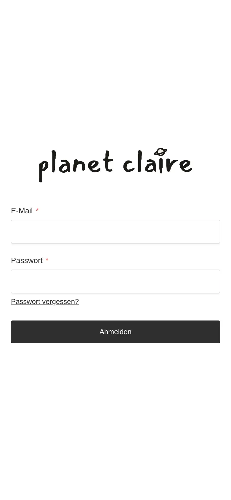

Die Verwaltung hat eine eigene, nicht öffentliche Adresse. Den genauen Pfad legen wir beim Start gemeinsam fest. Er steht
bewusst nicht in diesem Handbuch, damit ihn Fremde nicht finden. Du bekommst ihn als Lesezeichen.

**Anmelden:** E-Mail und Passwort eintippen, dann „Anmelden“. Du bleibst 7 Tage angemeldet. Tippst du das Passwort
5-mal falsch, sperrt sich die Anmeldung für 15 Minuten. Das ist Absicht und schützt dich. Danach geht es wieder.
Abmelden und Passwort ändern findest du unter „Mehr“ → „Einstellungen“ → „Konto“.

**Als App aufs Handy legen** (damit die Verwaltung ein eigenes Symbol bekommt wie eine App; Fachwort: „PWA“, eine
Webseite, die sich wie eine App benimmt):

- **iPhone (Safari):** Verwaltung öffnen → unten auf das Teilen-Symbol (Quadrat mit Pfeil) tippen → „Zum Home-Bildschirm“ →
  „Hinzufügen“.
- **Android (Chrome):** Verwaltung öffnen → oben rechts auf die drei Punkte → „App installieren“ (oder „Zum Startbildschirm
  hinzufügen“) → „Installieren“.

Das Symbol heißt „Werkstatt“. Es öffnet direkt „Heute“. Die App speichert keine Daten auf dem Handy und schickt keine
Mitteilungen; wichtige Dinge meldet die Verwaltung dir per Mail.

**Unten in der Leiste** findest du immer vier Punkte: **Heute**, **Neues Stück**, **Packen** und **Mehr**. „Mehr“ führt zu
allem anderen. Am Laptop steht dieselbe Liste als Seitenleiste links.

## 2. Heute: dein Start

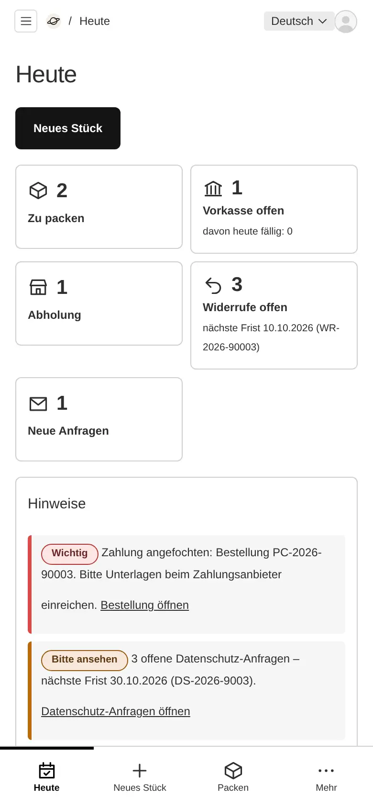

Beim Öffnen siehst du, was ansteht:

- **Kacheln:** „Zu packen“, „Vorkasse offen“, „Abholung“, „Widerrufe offen“ (mit der nächsten Frist) und „Neue Anfragen“. Tippe
  auf eine Kachel, dann bist du in der passenden Liste.
- **Hinweise:** rot heißt „bitte bald kümmern“, gelb heißt „bitte ansehen“. Jeder Hinweis hat einen Link zur Stelle, an der
  du etwas tun kannst, zum Beispiel offene Datenschutz-Anfragen, der Umsatz-Wächter, eine fehlgeschlagene Mail,
  Rechtstexte, die geprüft werden sollten, oder „Startklar-Prüfung nicht grün“.
- **Die letzten fünf Bestellungen** und der Knopf **Neues Stück**.

Wenn hier nichts Rotes steht, ist alles in Ordnung.

## 3. Neues Stück einstellen

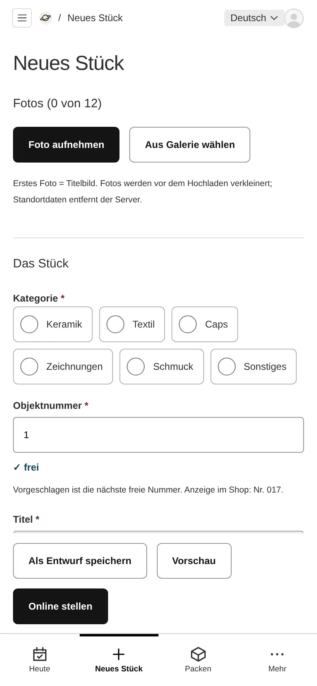

Tippe auf **Neues Stück**. Der Ablauf:

1. **Fotos:** Mach die Fotos direkt mit der Kamera oder nimm welche aus der Galerie. 1 bis 12 Fotos sind möglich, 3 bis 5
   sind ideal. Das erste Foto ist das Titelbild. Die Reihenfolge kannst du ändern. Die Verwaltung entfernt automatisch
   den Aufnahmeort aus den Fotos.
2. **Bildbeschreibung** zu jedem Foto (für Menschen, die das Bild nicht sehen können, und für Suchmaschinen). Der Knopf
   „Vorschlag“ füllt sie für dich, du kannst sie ändern.
3. **Objektnummer:** wird vorgeschlagen (die höchste vergebene plus eins). Daneben steht „frei“ oder „vergeben“. Nach dem ersten
   Online-Stellen lässt sich die Nummer nicht mehr ändern, weil sie auch im Beileger und in Bestellungen steht.
4. **Kategorie** wählen. Sie bestimmt, welche Pflichtangaben kommen (siehe unten).
5. **Titel, Beschreibung, Preis, Maße, Gewicht, Material, Warnhinweise** ausfüllen. Den Preis tippst du als „45“ oder
   „45,50“. Das Gewicht ist das Gewicht des Stücks ohne Verpackung.
6. **Eigene Figur:** Du bestätigst per Häkchen, dass das Motiv nur deine eigenen Figuren zeigt, keine geschützten
   fremden Figuren, Marken oder Logos. Das Häkchen ist nie vorausgewählt.
7. **Übersetzen → EN:** Ein Tipp auf den Knopf schlägt die englischen Texte vor. Du kannst jeden Vorschlag ändern. Ohne
   englische Texte zeigt der Shop auf Englisch die deutschen.
8. Speichern als **Entwurf**, mit **Vorschau** ansehen oder **Online stellen**.

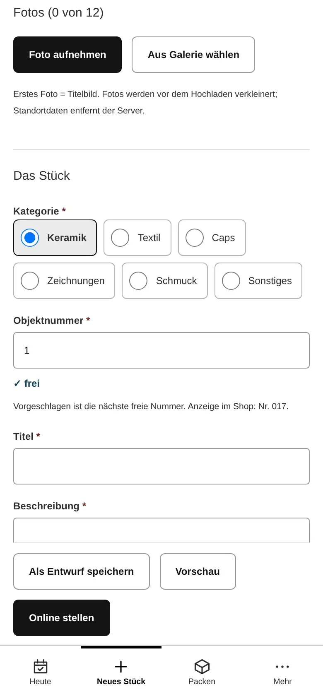

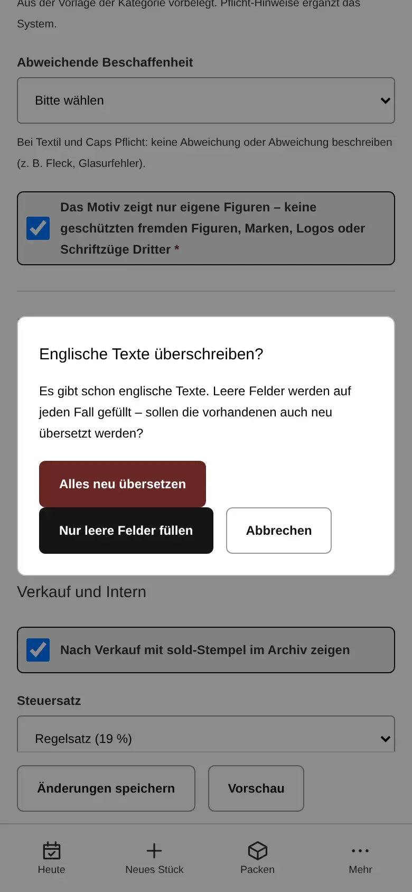

**Pflichtangaben je Kategorie.** Fehlt etwas, zeigt die Verwaltung beim Online-Stellen eine Liste „Das fehlt noch:“ und
springt zum Feld. Ohne die Angaben lässt sich nichts veröffentlichen. Das ist gewollt, weil der Shop sie gesetzlich zeigen muss.

| Kategorie | Das brauchst du zusätzlich |
|---|---|
| Keramik | „Nur Deko“ oder „lebensmittelecht“. Standard ist „Deko“. „Lebensmittelecht“ geht nur mit einer gültigen Konformitätserklärung des Herstellers. |
| Textil und Cap | Faserzusammensetzung in Prozent (immer, auch wenn das Etikett fehlt), Größe, Zustand, Entscheidung „Abweichung geprüft: keine“ oder „Abweichung beschrieben“; kein sichtbares fremdes Hersteller-Logo. |
| Schmuck | Material der Metallteile, Häkchen „nickelfrei“ **mit Nachweis-Datei**, Häkchen „Glasur bleifrei“. Der Kleinteile-Warnhinweis wird automatisch angefügt. |
| Zeichnung | „Gerahmt: ja/nein“, bei Glasrahmen kommt der Glas-Hinweis automatisch. |

**Fotos, die gut aussehen** (Hochformat 4:5, wie im Instagram-Hochformat):

- Das Stück mittig, rundum etwas Luft.
- Tageslicht am Fenster, kein Blitz.
- Heller Papier-Untergrund oder deine grüne Schneidematte, keine gemusterten Tischdecken.
- Reihenfolge: 1. ganzes Stück, 2. Detail (Strich, Glasur, Stoff), 3. Größenvergleich (Hand oder Matten-Raster), dann
  Rückseite oder Boden.
- Keine Filter, keine Schrift im Bild, keine Wasserzeichen, keine fremden Figuren, keine Gesichter anderer Menschen.

Nach dem Online-Stellen erscheint eine Erfolgsseite mit **Link kopieren** und **Kurzlink kopieren** (zum Beispiel
`…/nr/17`), praktisch für Instagram.

## 4. Meine Stücke

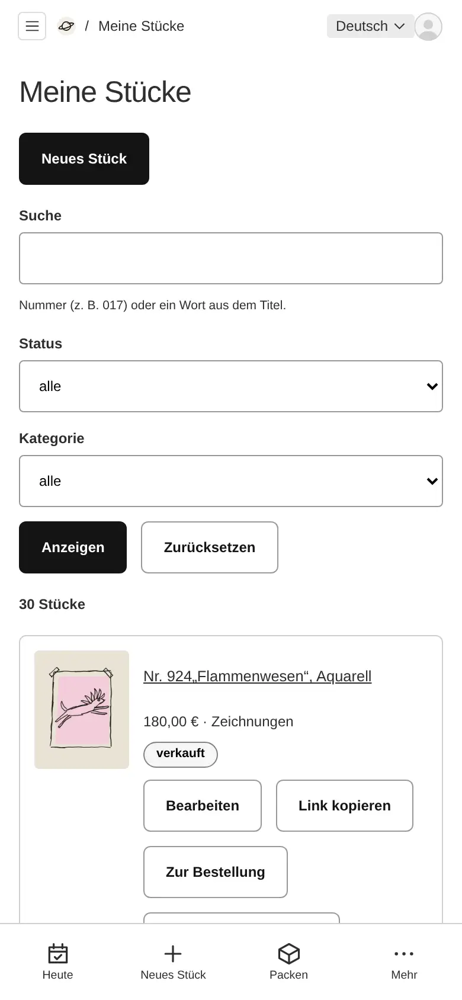

Hier sind alle deine Stücke mit Foto, Nummer, Titel, Preis und Status. Oben suchst du nach Nummer oder Titel und filterst
nach Status und Kategorie. Auf jeder Karte stehen die Knöpfe, die gerade passen:

- **Bearbeiten:** öffnet das Formular.
- **Link kopieren:** den Link zur Produktseite.
- **Ausblenden:** das Stück verschwindet aus dem Shop und bleibt in deiner Liste. Zurückholen geht jederzeit.
- **Offline nehmen:** wie Ausblenden für ein Stück, das zwar da ist, aber gerade nicht verkauft werden soll.
- **Offline verkauft:** Du hast es auf dem Flohmarkt oder über Instagram verkauft.
- **Im Archiv zeigen (Schalter):** Verkaufte Stücke bleiben standardmäßig im öffentlichen Archiv sichtbar, mit
  „verkauft“-Stempel. Mit dem Schalter nimmst du ein verkauftes Stück wieder heraus.

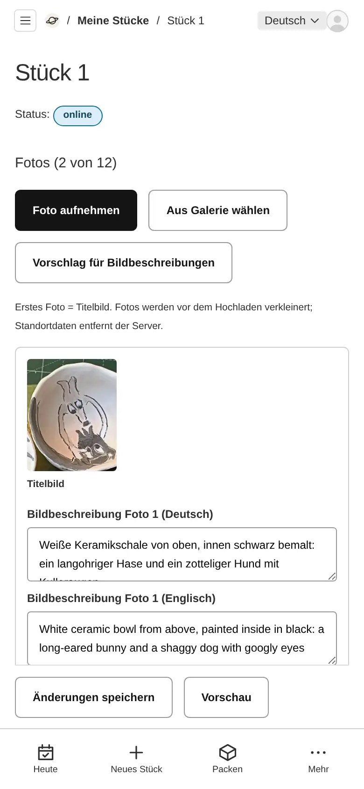

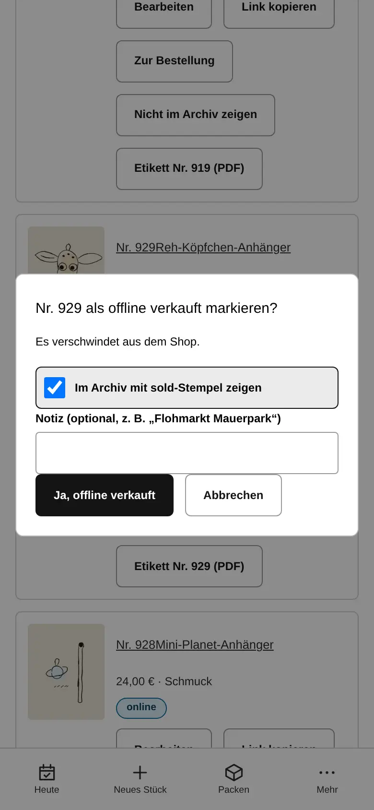

Bei **Offline verkauft** fragt die Verwaltung noch einmal nach („Nr. 17 als offline verkauft markieren? Es verschwindet aus
dem Shop.“). Wichtig: Trage das sofort ein, sobald du ein Stück offline verkauft hast. Sonst könnte es noch einmal
online gekauft werden. Ein Stück gibt es nur einmal.

Ein Stück, das gerade im Warenkorb einer Kundin liegt, ist „reserviert“ und für andere gesperrt. Die Reservierung läuft
nach kurzer Zeit von selbst ab.

## 5. Zu packen und Versendet

Sobald eine Kundin bezahlt hat, erscheint die Bestellung unter **Packen**. Die älteste steht oben. Auf der Karte siehst du
die Stücke, die Versandart und Hinweise, zum Beispiel „Keramik: Karton in Karton“.

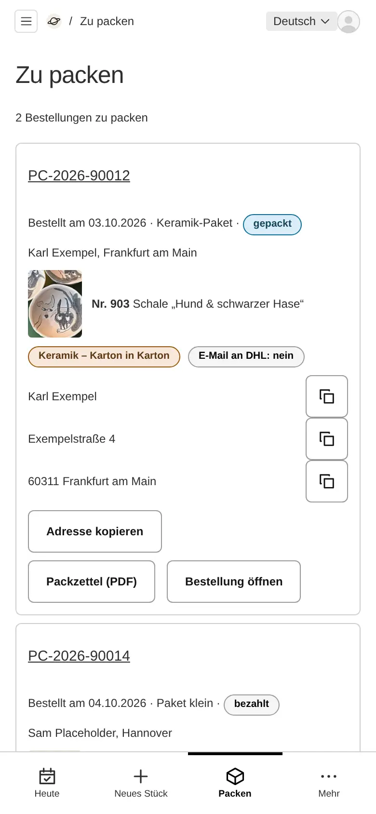

So gehst du vor:

1. **Packzettel (PDF)** öffnen und drucken. Er enthält keine Preise, aber den Beileger mit deinen Angaben und den
   Warnhinweisen. Das ist gesetzlich vorgeschrieben (Produktsicherheit).
2. **Checkliste** abhaken, während du packst. Sie ist für jede Versandart anders (Keramik: Hohlräume füllen, jedes Teil
   einzeln einwickeln, Karton in Karton, mindestens 6 cm Polster; Textil: Papier- oder Kartonversandtasche, nie Plastik).
3. **Packfotos** (bis zu 4): Sie sind freiwillig und helfen, wenn auf dem Transport etwas kaputtgeht. Bei Keramik fragt
   die Verwaltung einmal nach, wenn du ohne Foto versenden willst.
4. **Verpackung bestätigen:** Die Verwaltung schlägt Material und Gewicht vor (Papier/Pappe, Kunststoff, Sonstiges). Ändere es,
   wenn du zusätzlich etwas verwendet hast. Daraus entsteht deine Jahresmeldung für die Verpackungsabgabe (Kapitel 14).
5. **Adresse kopieren** und die Paketmarke in der Post-&-DHL-App erstellen.
6. **Sendungsnummer** eintippen oder mit der Kamera scannen. Beim Brief ist sie freiwillig, bei Paket und Keramik Pflicht.
7. **Gepackt** tippen. Die Bestellung bleibt unter „Packen“, bis du sie versendest.

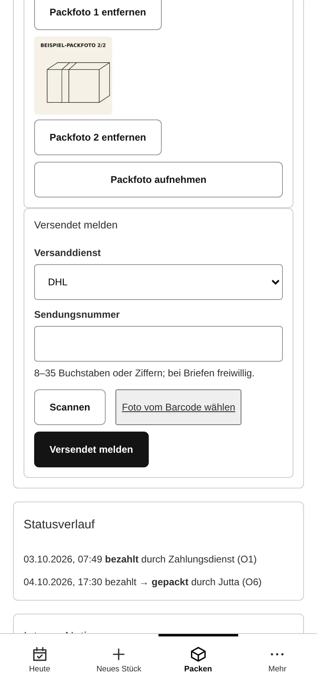

8. **Versendet melden:** Ein Fenster sagt dir: „Die Kundin bekommt eine Versandmail mit Sendungsnummer.“ Tippst du auf
   „Ja“, geht die Mail raus. Erst dann.

Steht an einer Bestellung **„Nicht mehr versenden – Widerruf!“**, hat die Kundin schon widerrufen (Kapitel 8).

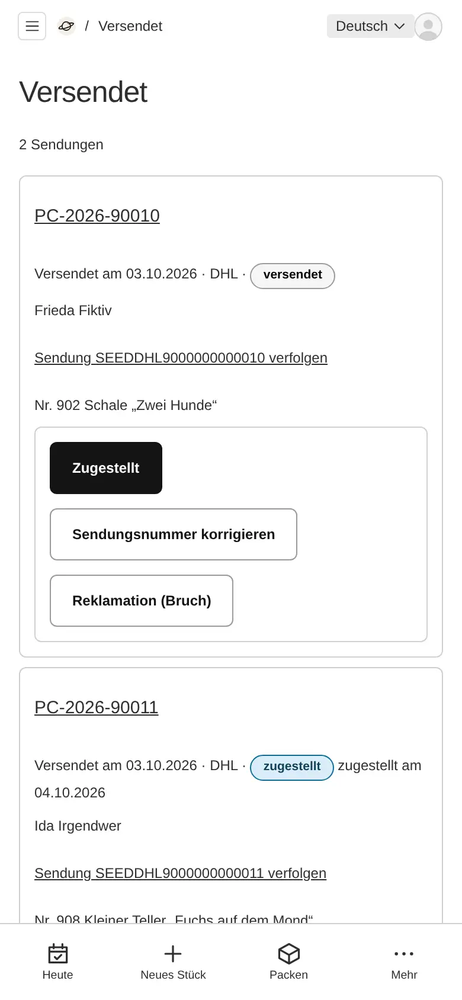

Unter **Versendet** siehst du alle Sendungen mit Sendungsnummer. „Zugestellt“ setzt der Shop nach einiger Zeit selbst
(mit dem Zusatz „geschätzt“). Du kannst es von Hand setzen. Hat sich eine Sendungsnummer als falsch erwiesen, korrigierst
du sie hier. Die Verwaltung fragt, ob die Mail noch einmal gehen soll. Ist beim Transport etwas kaputtgegangen, öffnest
du hier eine **Reklamation** und folgst den Schritten dort.

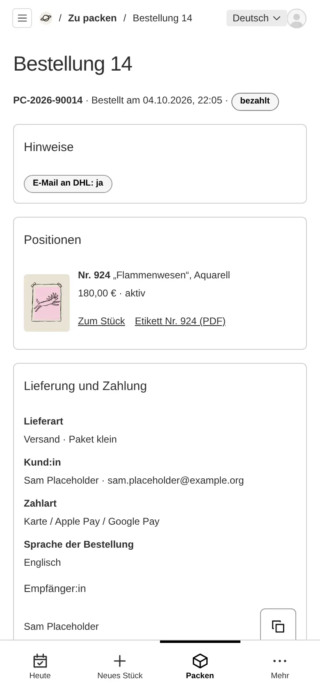

## 6. Vorkasse

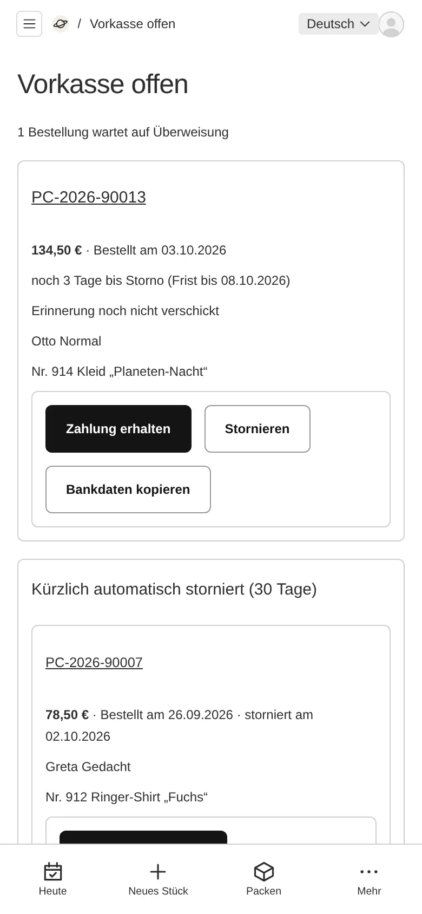

Wer per Überweisung zahlt, bekommt eine Mail mit deiner Bankverbindung und der Bestellnummer als Verwendungszweck. Das Stück
ist so lange für die Kundin reserviert. Unter **Vorkasse** siehst du die offenen Bestellungen und „noch X Tage bis Storno“.

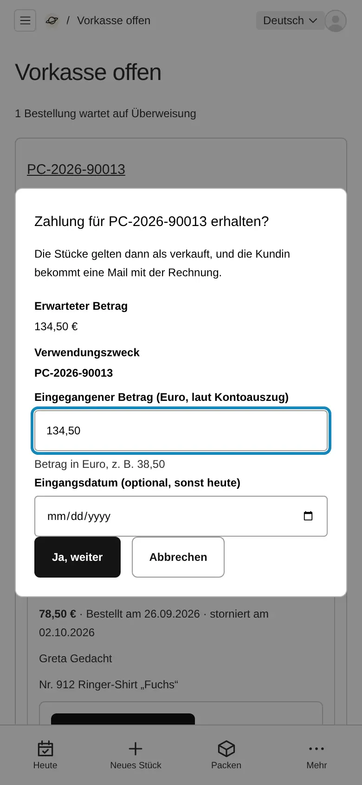

- **Zahlung erhalten:** Schau auf deinem Kontoauszug nach. Ist das Geld da, tippe auf den Knopf, trage den Betrag laut
  Kontoauszug ein (und optional das Datum) und bestätige. Dann gilt das Stück als verkauft, die Kundin bekommt die
  Rechnung per Mail, und die Bestellung rutscht in „Packen“. Weicht der Betrag ab, warnt dich die Verwaltung.
- **Stornieren:** wenn die Kundin absagt. Der Grund ist Pflicht, das Stück wird wieder frei.
- **Automatik:** Nach 3 Tagen erinnert der Shop die Kundin. Ist bis zum Ende des 5. Tages nach der Bestellung kein
  Geld da, storniert der Shop von selbst. Kommt das Geld später doch, hilft der Knopf „Nachträglich bezahlt“ unter
  „Kürzlich automatisch storniert“.

## 7. Abholung

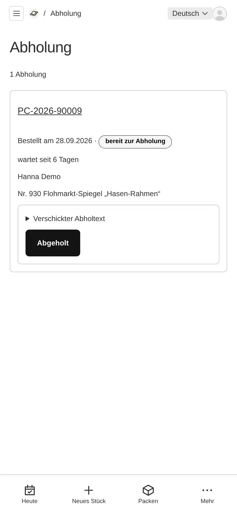

Bei Abholung zeigt die Liste, wie lange die Bestellung schon wartet. Länger als 14 Tage wird markiert.

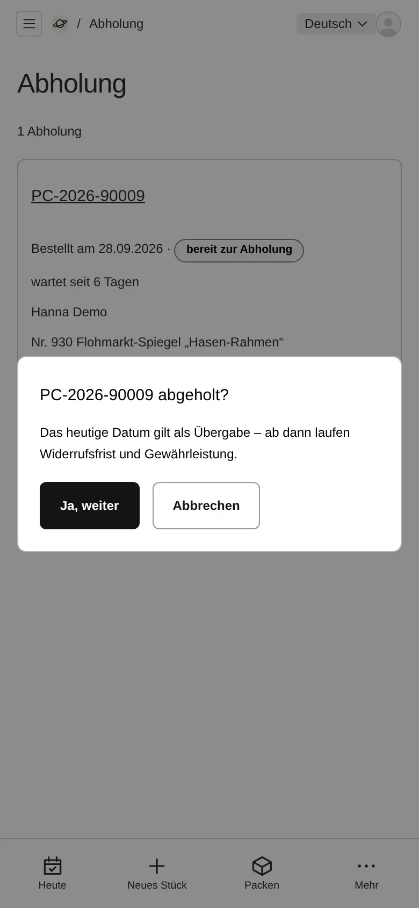

- **Bereit zur Abholung:** Du schreibst der Kundin, wann und wo sie abholen kann. Die Vorlage kommt aus den
  Einstellungen und lässt sich ändern. Die Kundin bekommt eine Mail.
- **Abgeholt:** Tippe darauf, wenn die Kundin das Stück hat. Ab diesem Tag zählen die 14 Tage Widerrufsfrist.

## 8. Widerrufe und Erstattung

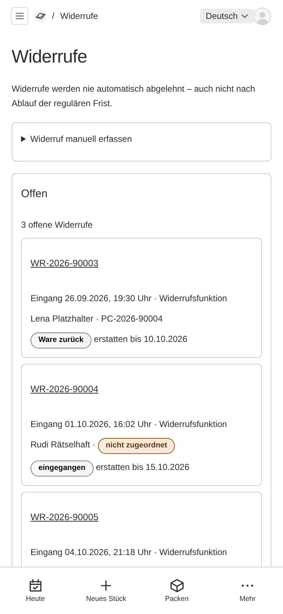

Kundinnen und Kunden dürfen online gekaufte Ware **14 Tage lang** ohne Begründung widerrufen (Fachwort: „Widerruf“ =
vom Kauf zurücktreten). Ein Widerruf geht über den Link „Vertrag widerrufen“ im Seitenfuß der Website ein. Du bekommst
eine Mail, und die Liste zeigt ihn mit der **Erstattungsfrist**: Du musst das Geld **spätestens 14 Tage nach dem Eingang des
Widerrufs** zurückzahlen. Ab Tag 10 wird die Frist rot.

**Wichtig:** Lehne einen Widerruf nie von selbst ab und ignoriere ihn nie. Bist du unsicher, ob er berechtigt ist, frag
vorher Claude oder die Kanzlei.

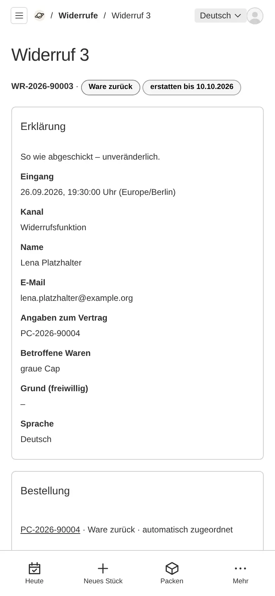

So gehst du vor:

1. Widerruf öffnen: Dort steht die Erklärung unverändert, dazu die zugeordnete Bestellung. Passt keine Bestellung, nutze
   „Bestellung zuordnen“. Kam der Widerruf per Mail oder Brief, erfasst du ihn mit „Widerruf manuell erfassen“.
2. Die Ware kommt zurück: Prüfe sie und tippe auf **Ware ist zurück**. Eine kurze Notiz zum Zustand hilft später.
3. **Erstatten:** Die Verwaltung rechnet den Betrag nach den gesetzlichen Regeln vor (Kaufpreis und, bei vollständigem Widerruf, der Standardversand). Du kannst ihn erhöhen, mit Notiz.
   Bei Kartenzahlung läuft die Rückzahlung automatisch über den Zahlungsanbieter. Bei Vorkasse überweist du das Geld
   selbst und bestätigst es dann.

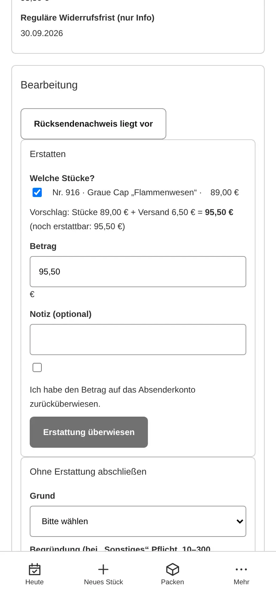

4. Danach entscheidest du, ob das Stück wieder in den Verkauf geht oder ausgeblendet wird (zum Beispiel bei einem Schaden).

Die Verwaltung erinnert dich vor Ablauf der Frist an offene Erstattungen.

## 9. Anfragen für Auftragsarbeiten

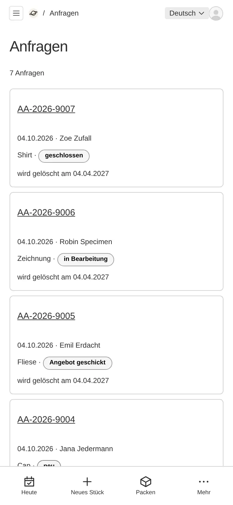

Über das Formular auf der Seite „Auftragsarbeiten“ können Menschen eine Idee schicken (mit bis zu 5 Bildern). Du bekommst
eine kurze Mail mit der Nummer, ohne Namen und ohne Inhalt. Den Inhalt siehst du nur in der Verwaltung, geschützt.

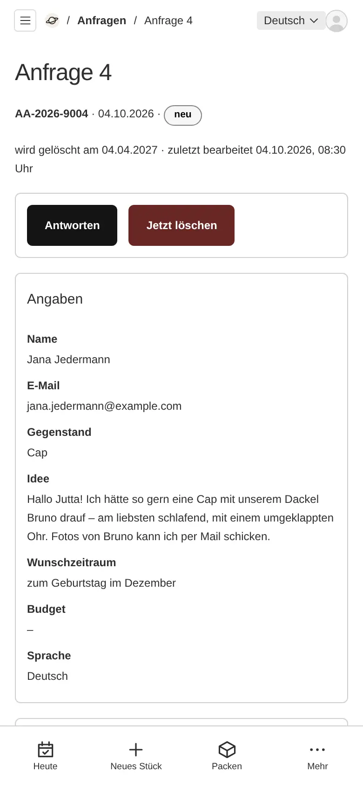

- **Antworten:** Öffnet dein Mailprogramm mit einer vorbereiteten Antwort. Du antwortest aus deinem normalen Postfach.
- **Status** setzen, damit du den Überblick behältst, und **Notizen** schreiben (nur für dich).
- **Jetzt löschen:** löscht Anfrage und Bilder sofort.
- Ohne dein Zutun löscht der Shop jede Anfrage **6 Monate nach Eingang**. Das steht auch so in der Datenschutzerklärung.

Eine Anfrage ist noch kein Vertrag, und der Preis steht nirgends fest. Du sagst in deiner Antwort, was du anbietest.

## 10. Tattoo: Flash und Galerie

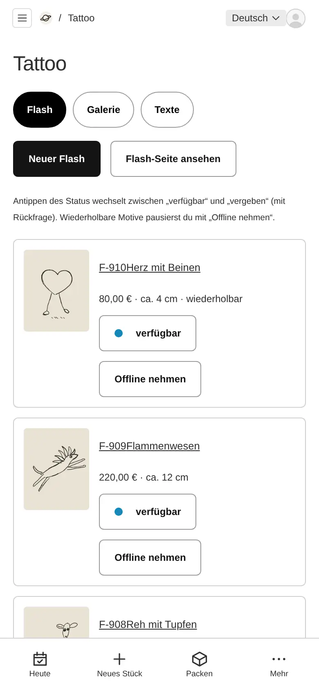

**Flash** sind Motive, die du zu einem festen Preis stichst. Außerdem pflegst du hier deine Markttermine („Planet Claire on Tour“) und die Galerie. Du findest die Reiter Flash, Termine, Galerie und Texte:

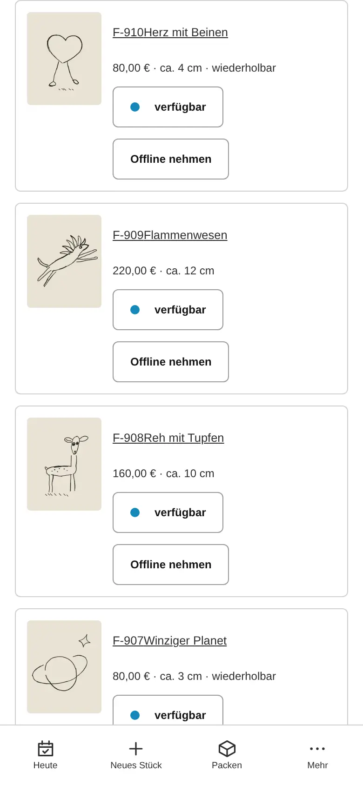

- **Flash:** Ein einmaliges Motiv wechselst du mit zwei Tipps zwischen „verfügbar“ und „vergeben“. Ein wiederholbares
  Motiv pausierst du mit „Offline nehmen“. Ein neues Motiv brauchst du nur mit Bild, Titel, Größe und Festpreis.
  „Übersetzen“ gibt es auch hier.

- **Termine – „Planet Claire on Tour“:** Hier trägst du Märkte, Flohmärkte und Kunstmärkte ein. Auf der Startseite stehen
  sie in der rechten Spalte (am Handy darunter): kommende Termine oben, vergangene eingeklappt. Tippe auf „Neuer Termin“
  und fülle aus: Name des Marktes, Ort oder Bezirk, Datum von–bis (bei einem Tag das Enddatum leer lassen), Uhrzeiten,
  Adresse des Marktes, Standnummer, eine kurze Notiz (zum Beispiel „Coco ist dabei“) und – wenn du magst – einen Link zur
  Seite des Marktes und ein Foto von deinem Stand. Es gibt keine Karte, nur Text. Bitte nie die Adresse deines
  Privatstudios eintragen, die Verwaltung lehnt sie ab. Fällt ein Markt aus, tippst du bei dem Termin auf „Absagen“: Er
  steht dann durchgestrichen mit dem Hinweis „abgesagt“ auf der Seite. „Vorbei“ musst du nicht setzen, das passiert nach
  dem Datum von selbst. „Übersetzen“ füllt die englischen Texte vor. Die Beispiel-Termine verschwinden mit den übrigen
  [Beispieldaten](#18-beispieldaten).

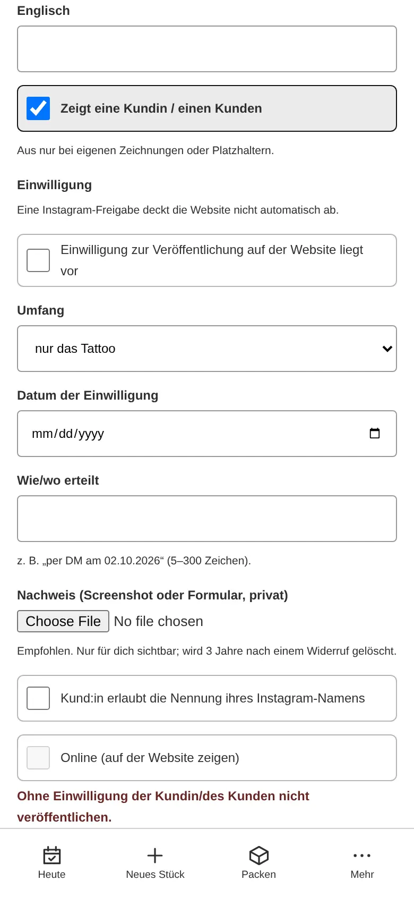

- **Galerie – nur mit Einwilligung:** Fotos von Tattoos zeigen Haut und oft Menschen. Du darfst ein Foto nur
  veröffentlichen, wenn die Person **vorher ausdrücklich zugestimmt hat**. Trage dann Datum und eine kurze Notiz ein
  und lade, wenn du magst, den Nachweis hoch (zum Beispiel die Nachricht). Fehlt die Einwilligung, lässt sich das Foto nicht
  veröffentlichen, die Verwaltung sagt dir: „Ohne Einwilligung der Kundin/des Kunden nicht veröffentlichen“. Widerruft
  jemand, tippst du auf „Einwilligung widerrufen“, und das Foto ist sofort offline. Eine Vorlage für die Einwilligung
  findest du in den [Anleitungen](ANLEITUNGEN.md#e1).

Preise, Ablauf, Pflegehinweise und häufige Fragen bearbeitest du unter „Texte“ (nächstes Kapitel).

## 11. Texte bearbeiten

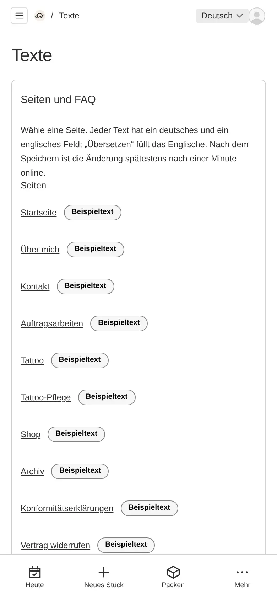

Hier änderst du, was auf der Website steht: Startseite, „Über mich & Coco“, Auftragsarbeiten, Kontakt, Tattoo,
Pflegehinweise, häufige Fragen und die Texte zu Bestellung und Widerruf. Jeder Text hat eine deutsche und eine englische
Fassung, mit einem Übersetzen-Knopf wie beim Stück.

**Rechtstexte** (Impressum, Datenschutzerklärung, Geschäftsbedingungen, Widerrufsbelehrung, Widerrufsformular, Versand
und Zahlung) sind etwas Besonderes:

- Jede Änderung ist eine **neue Fassung**. Die bisherige bleibt als Beleg gespeichert, damit man später nachweisen kann, was
  zum Zeitpunkt einer Bestellung galt. Aktive Fassungen kannst du nicht nachträglich ändern.
- **Texte von der Kanzlei** trägst du als „Kanzlei“ ein. Alles andere zeigt auf der Seite den Streifen
  „PLATZHALTER – nicht rechtsverbindlich“.
- In den Texten stehen Platzhalter wie `{{name}}` oder `{{withdrawalUrl}}`. Die Verwaltung ersetzt sie selbst. Ein
  unbekannter Platzhalter verhindert das Veröffentlichen, damit nie ein Fehler online geht.
- Die Verwaltung erinnert dich einmal im Jahr, die Rechtstexte prüfen zu lassen. Nach der Prüfung tippst du „geprüft,
  keine Änderung“.

Schreibe in Rechtstexten nie selbst um, was die Kanzlei geliefert hat.

## 12. Einstellungen

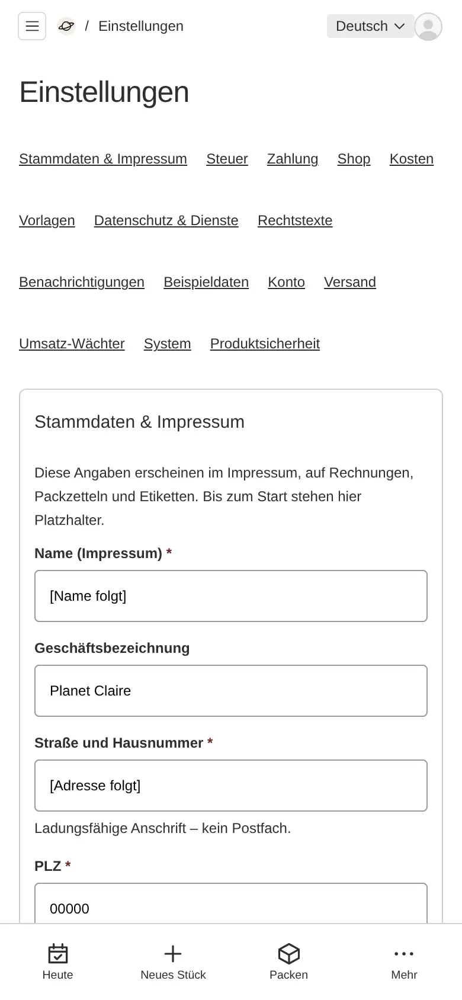

Alles, was selten geändert wird, liegt hier. Die wichtigsten Bereiche:

- **Stammdaten & Impressum:** Name, Anschrift, E-Mail, Telefon, Steuernummer. Die Steuernummer erscheint nie öffentlich.
- **Steuer:** Solange du Kleinunternehmerin bist, schreibt der Shop „Kein Ausweis von Umsatzsteuer“. Den Modus änderst du
  nur nach Rücksprache mit der Steuerberatung.
- **Versand:** Preise, Lieferzeit, Lieferländer und Abholung. Es ist erst einmal nur Deutschland eingeschaltet.

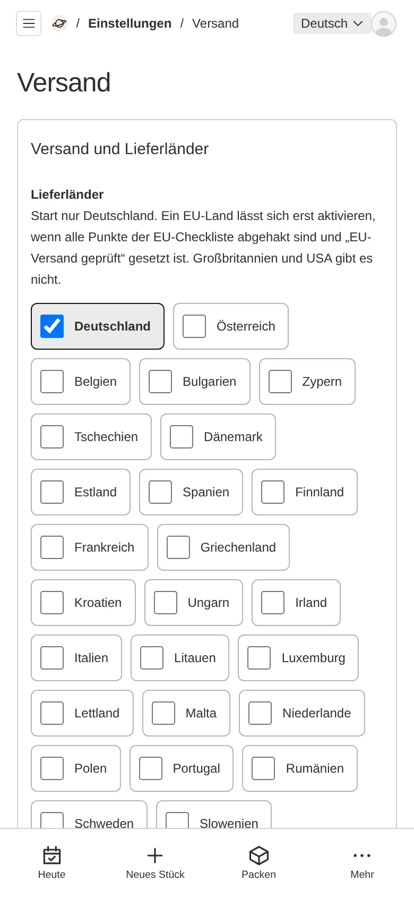

- **Produktsicherheit:** Vorlagen für Warn- und Pflegehinweise je Kategorie.

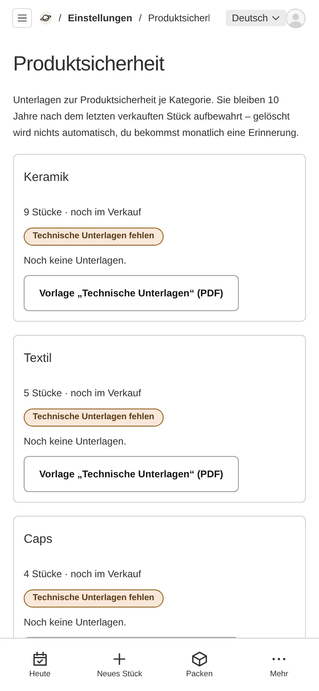

- **Verpackung:** Vorlagen und Standardgewichte, LUCID-Nummer und duales System (Kapitel 14).
- **Zahlung:** Vorkasse, Kontoinhaberin, IBAN, Reservierungsdauer.
- **Shop geöffnet:** der Schalter für eine Pause (zum Beispiel im Urlaub): Dann sind „In den Korb“ und „Zur Kasse“ gesperrt,
  und ein Pausen-Text erscheint. Einschalten kann man den Shop erst, wenn die Startklar-Prüfung grün ist (Kapitel 17).
- **Benachrichtigungen:** an welche Adresse die Verwaltung dir schreibt.
- **Datenschutz & Dienste:** die Verträge mit Dienstleistern und die Statistik-Entscheidung.
- **System:** zeigt, ob Aufgaben im Hintergrund laufen, fehlgeschlagene Mails (mit „erneut senden“) und die Startklar-Prüfung.

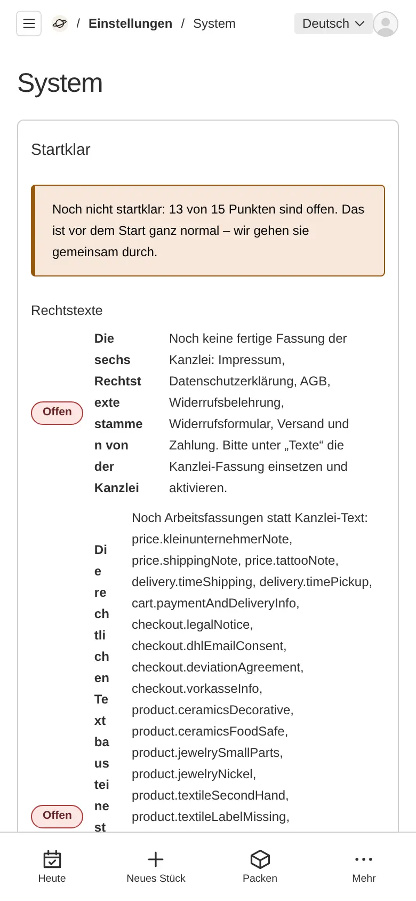

- **Konto:** Passwort ändern, Abmelden.

## 13. Umsatz-Wächter

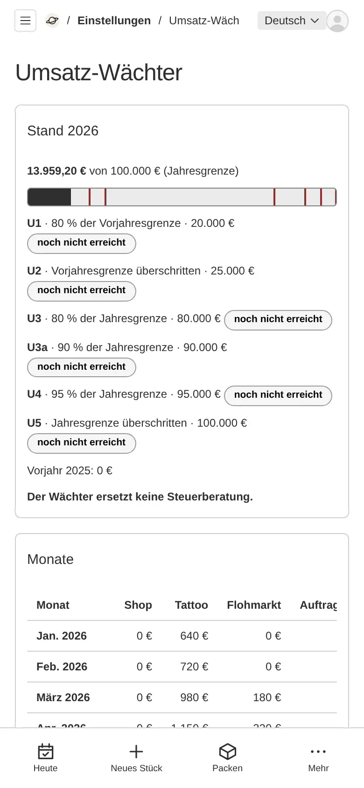

Als Kleinunternehmerin darfst du bestimmte Umsatzgrenzen im Jahr nicht überschreiten, sonst ändert sich die Steuer.
Der Wächter rechnet **alles** zusammen, nicht nur den Shop: Tattoo, Flohmarkt, Auftragsarbeiten und Sonstiges.

- **Jeden Monat** trägst du die Einnahmen außerhalb des Shops ein (Tattoo, Flohmarkt, Auftragsarbeiten, Sonstiges). Den
  Shop-Umsatz kennt die Verwaltung selbst.
- Zu Jahresbeginn gibst du den **Umsatz des Vorjahres** ein, falls der Shop später startet.
- Erreicht die Summe eine Stufe, zeigt „Heute“ einen gelben oder roten Hinweis, und du bekommst eine Mail. Dann sprichst
  du mit der Steuerberatung. Der Shop sperrt sich nicht von allein. Die Entscheidung bleibt bei dir und deiner
  Steuerberatung.

## 14. Monatsexport und Verpackungsmengen

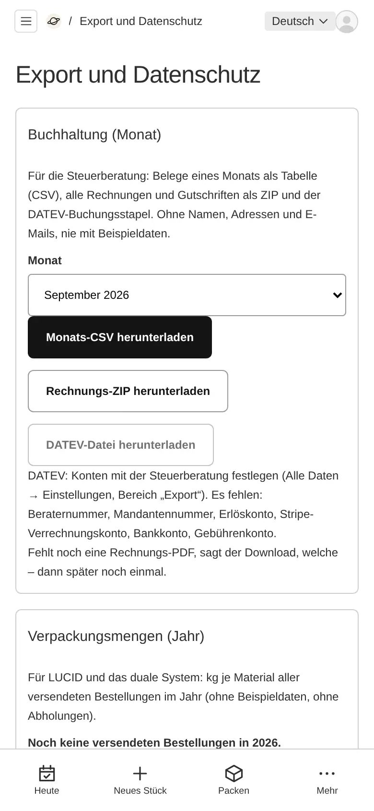

**Monatsexport für die Buchhaltung:** Monat wählen, dann „Herunterladen“. Du bekommst eine Tabelle (CSV-Datei, öffnet sich
in Excel oder Numbers) mit allen Rechnungen, Gutschriften, Zahlungen und Gebühren des Monats, ohne Namen und Adressen.
Dazu gibt es alle Rechnungen als ZIP-Datei. Beides schickst du an deine Buchhaltung. Beispieldaten sind nie enthalten.

**Verpackungsmengen** (für das Verpackungsregister LUCID und dein duales System, siehe [Anleitungen](ANLEITUNGEN.md#l1)):
Jahr wählen und herunterladen. Du meldest die Mengen des Vorjahres bis zum **1. Juni**.

## 15. Datenschutz-Anfragen

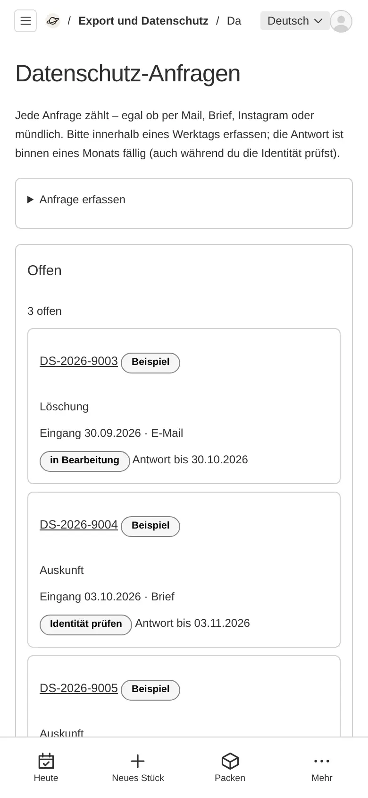

Menschen dürfen fragen, welche Daten du von ihnen hast, und verlangen, dass du sie löschst oder berichtigst. Das ist ein
Recht aus der Datenschutz-Grundverordnung (DSGVO). Du hast **einen Monat** Zeit zu antworten. Nach dem Eingang einer Anfrage
erfasst du sie hier. Die Verwaltung rechnet die Frist aus und erinnert dich 7 Tage und 1 Tag vorher.

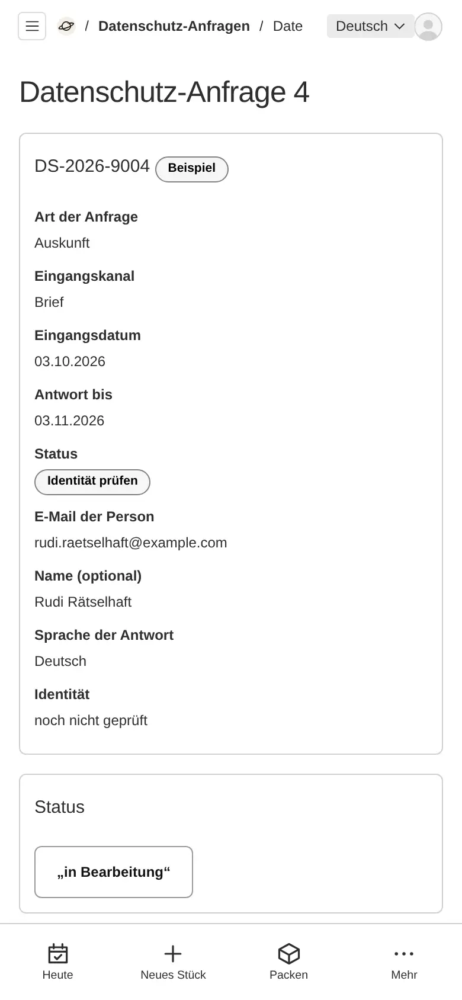

1. **Anfrage erfassen:** Art (Auskunft, Löschung …) und Eingangsdatum.
2. **Identität prüfen:** Antworte nur an die Person, die ihre Daten verlangt. Im Zweifel frag nach.
3. **Auskunft:** Die Verwaltung sucht über E-Mail, Name oder Bestellnummer alle Daten und erstellt eine ZIP-Datei. Sie wird
   privat gespeichert und 30 Tage nach dem Versand der Antwort gelöscht.
4. **Löschung:** Die Verwaltung zeigt dir je Datensatz, was gelöscht wird. Rechnungen musst du **steuerlich aufbewahren**.
   Sie bleiben erhalten, werden aber für andere Zwecke gesperrt. Das erklärt die Verwaltung bei jedem Datensatz.
5. **Einwilligung widerrufen** (zum Beispiel für Tattoo-Fotos oder die Weitergabe der E-Mail an DHL): ein Knopf, wirkt
   sofort.

Unter „Protokolle“ findest du, welche Mails verschickt und welche Einwilligungen erteilt wurden.

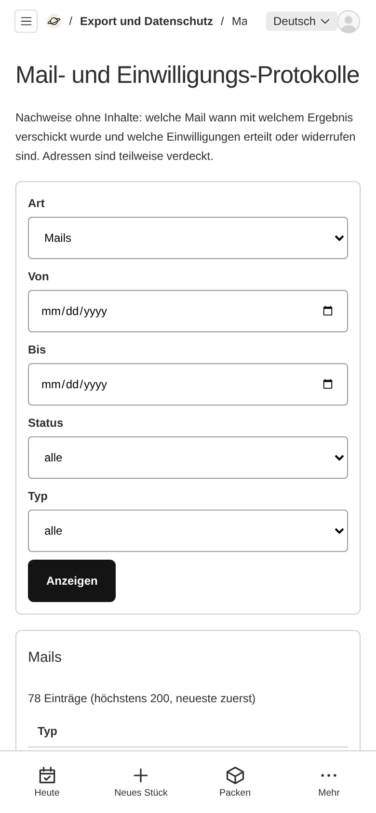

## 16. Datenpanne: was tun im Ernstfall

Eine **Datenpanne** ist alles, wodurch Daten von Kundinnen in falsche Hände geraten oder verloren gehen können: ein
verlorenes Handy mit angemeldeter Verwaltung, eine Mail mit Namen an die falsche Person, ein gehacktes Konto oder
eine Meldung eines Dienstleisters über einen Vorfall.

**Die Uhr läuft ab dem Moment, in dem du es bemerkst: Du hast 72 Stunden (auch am Wochenende), um es zu melden,
wenn Menschen dadurch ein Risiko haben.**

Bleib ruhig, geh der Reihe nach vor:

1. **Schaden stoppen.** Ändere sofort das Passwort der betroffenen Anmeldung (Verwaltung, E-Mail oder Dienst). Ist das
   Handy weg, ändere das Passwort an einem anderen Gerät. Mehr zum Notfallablauf macht Claude für dich, siehe Schritt 3.
2. **Aufschreiben.** Wann ist es passiert, wann hast du es bemerkt, was ist passiert, wessen Daten sind betroffen? Nutze
   die **Vorlage „Vorfallprotokoll“** in [docs/RUNBOOK.md](../RUNBOOK.md#13-vorfallprotokoll-vorlage). Mach Bildschirmfotos,
   aber **ohne Passwörter**.
3. **Claude holen.** Starte eine Session (Kapitel 20) und schreibe: „Es gibt vielleicht eine Datenpanne. Bitte geh nach
   docs/RUNBOOK.md Abschnitt 9 vor.“ Nenne dort nur Nummern und Zeitpunkte, keine Namen von Kundinnen.
4. **Risiko einschätzen.** Sind Namen, Adressen, E-Mail-Adressen, Bestellungen, Anfragen, Bankdaten oder Fotos von
   Personen betroffen und könnte jemand dadurch Schaden haben (Betrug, Bloßstellung)? Wenn ja, **melden**. Im Zweifel
   melden. Eine Meldung ist keine Strafe, sie darf auch unvollständig sein („Erstmeldung“, Rest folgt).
5. **Melden** an die **Berliner Beauftragte für Datenschutz und Informationsfreiheit** über das Online-Formular für
   Datenpannen auf deren Website (www.datenschutz-berlin.de, dort „Datenpanne melden“ suchen). Die Antworten, die das
   Formular braucht, stehen fertig in der Vorlage im RUNBOOK (Abschnitt 9.6). Speichere die Bestätigung.
6. **Betroffene informieren**, wenn das Risiko **hoch** ist (zum Beispiel wenn Adress- oder Bankdaten oder Fotos
   in falsche Hände gelangt sein können): kurze, ehrliche Mail, was passiert ist, welche Daten betroffen sind, was du getan hast und
   was die Person tun kann (zum Beispiel Passwort ändern). Die Vorlage steht im RUNBOOK. Keine Werbung, kein Beschönigen.
7. **Dienstleister ansprechen:** Die Kontaktliste steht im RUNBOOK, Abschnitt 9.7.

Auch wenn du **nichts melden musst**, schreibst du den Vorfall ins Protokoll. Die Kanzlei kann dir bei den Worten helfen,
aber sie darf die Frist nicht verzögern.

## 17. Startklar-Prüfung

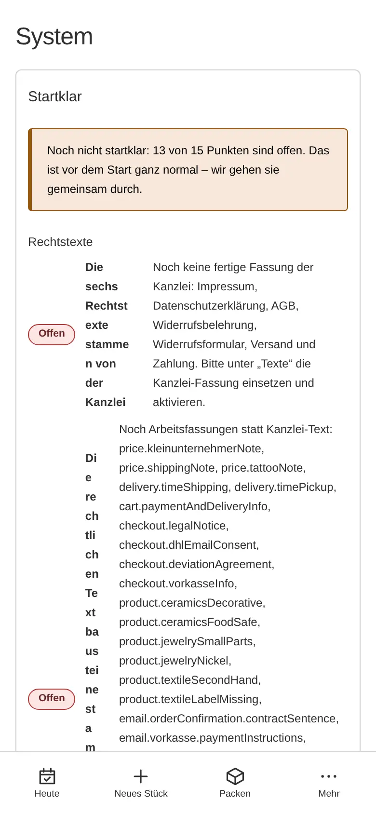

Die Startklar-Prüfung ist eine Liste mit grünen und roten Punkten (Einstellungen → System). Sie sagt dir, **ob der Shop
öffnen darf**. Rot ist am Anfang normal. Beispiele für rote Punkte: Rechtstexte der Kanzlei fehlen noch, Impressum
ist unvollständig, Beispiel-IBAN statt echter IBAN, Verträge mit Dienstleistern fehlen, Beispieldaten sind noch da.
Jeder rote Punkt hat einen Satz, was zu tun ist.

- Der Schalter **„Shop öffnen“** (Einstellungen) bleibt im echten Betrieb gesperrt, bis alles grün ist. Versuchst du
  es trotzdem, zeigt dir die Verwaltung die offenen Punkte.
- Beim Start tragen wir die Punkte gemeinsam ein. Das Ziel ist ein komplett grüner Bildschirm (siehe
  [Aufgaben, A41](AUFGABEN.md)).

## 18. Beispieldaten

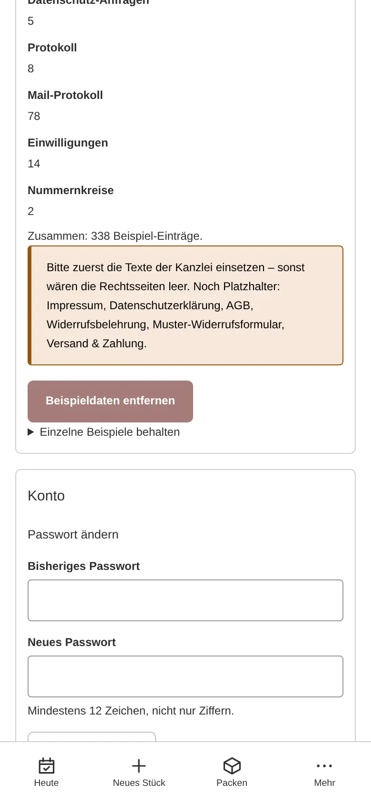

Zum Ausprobieren enthält die Verwaltung erfundene Stücke, Bestellungen und Fotos („Beispieldaten“). Sie sind überall
gekennzeichnet. Unter „Heute“ weist ein Hinweis darauf hin, solange sie vorhanden sind.

- Der Knopf **„Beispieldaten entfernen“** (Einstellungen) löscht sie. Vorher nennt ein Fenster, was alles gelöscht
  wird. Im Beispielbestand ist der Knopf ausgegraut, weil die Beispiel-Bestellungen wie echte aussehen. Der Hinweis darüber
  erklärt, was zuerst weg muss.
- Die Objektnummern **901 bis 999** sind für Beispieldaten reserviert. Deine echten Stücke bekommen niedrigere Nummern.
- Beispieldaten erscheinen nie in Exporten für die Buchhaltung.
- Im echten Betrieb löschst du sie **vor dem ersten echten Auftrag**. Beim Start machen wir das gemeinsam.

## 19. Die Vorschau-Datei und ein Hinweis zur Barrierefreiheit

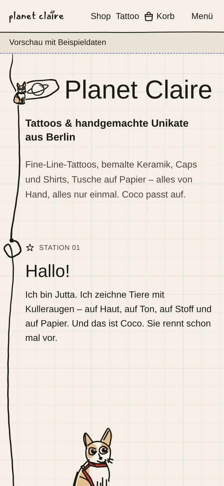

**Vorschau-Datei:** Die ganze Website steckt als **eine einzige Datei** (`planet-claire-vorschau.html`), die du ohne Internet
im Browser öffnest. Dort blätterst du durch alle Seiten, siehst die Verwaltung als Bilder und kannst nichts kaufen.

- Die fertige Vorschau liegt unter `https://github.com/mvheinz/planetclairetattoos/releases/tag/vorschau-p10` (erscheint automatisch nach dem Merge, P10.21).
- Herunterladen: [Anleitung G7](ANLEITUNGEN.md#g7) (fertige Fassung) und [G6](ANLEITUNGEN.md#g6) (Zwischenstände).
- Öffnen: [Anleitung V1](ANLEITUNGEN.md#v1), worauf du achten kannst: [V2](ANLEITUNGEN.md#v2).
- **Nur für dich.** Die Datei enthält Beispieldaten und Fotos, die noch nicht freigegeben sind. Gib sie nicht
  weiter und lade sie nirgends hoch ([Anleitung V1](ANLEITUNGEN.md#v1)).

**Barrierefreiheit:** Für einen Shop wie deinen besteht **keine gesetzliche Pflicht** zur Barrierefreiheit. Sie entsteht
erst ab **10 Beschäftigten** oder mehr als **2 Millionen Euro** Umsatz oder Bilanzsumme im Jahr. Wir bemühen uns trotzdem um
gut lesbare Seiten (Kontrast, Tastaturbedienung, Bildbeschreibungen). **Schreibe aber nirgends, die Seite sei
„barrierefrei“, erfülle eine bestimmte Norm oder sei geprüft oder ausgezeichnet.** Solche Aussagen kann man abmahnen. Gute
Bildbeschreibungen bei jedem Foto sind der einfachste Beitrag.

## 20. Notfall und Hilfe

**Etwas funktioniert nicht, oder du weißt nicht weiter:** Starte eine Claude-Session. Das geht so:

1. Öffne im Browser claude.ai/code und melde dich mit deinem Konto an (siehe [Anleitungen](ANLEITUNGEN.md)).
2. Wähle das Repository `planetclairetattoos`, den Zweig `main` und die Umgebung `planetclaire`.
3. Beschreibe in einem oder zwei Sätzen, was du siehst („Das Foto lässt sich nicht hochladen, Stück Nr. 17“). Nenne
   Nummern und Uhrzeiten, keine Passwörter und keine Kundendaten.

Claude schaut nach, behebt Fehler und meldet sich bei dir. Es arbeitet immer nur eine Session am Projekt.

**Wen du fragst:**

| Problem | Wer hilft |
|---|---|
| Fehler, Technik, Seite nicht erreichbar | Claude-Session (oben); Alarmmails von Sentry oder Vercel leitest du dorthin weiter |
| Rechtsfragen (Widerruf unklar, Abmahnung, Texte) | die Kanzlei |
| Steuer, Umsatzgrenze, Rechnungen | die Steuerberatung |
| Ausgesperrt aus der Verwaltung | warte 15 Minuten; hilft das nicht, Claude-Session |
| Verdacht auf Datenpanne | Kapitel 16, sofort |

**Für die Technik** gibt es das Betriebshandbuch [docs/RUNBOOK.md](../RUNBOOK.md) mit allen Alarmen (M-01 bis M-12) und
Wiederherstellungs-Schritten. Du musst es nicht lesen. Claude und eine technisch versierte Vertrauensperson nutzen es. Der
Plan für den Start steht in [docs/GO-LIVE.md](../GO-LIVE.md).

Viel Freude mit der Werkstatt!
